# Three Sum

Given an integer array nums, return all the triplets [nums[i], nums[j], nums[k]] such that i != j, i != k, and j != k,
and nums[i] + nums[j] + nums[k] == 0.

Notice that the solution set must not contain duplicate triplets.

```plain
Example 1:
Input: nums = [-1,0,1,2,-1,-4]
Output: [[-1,-1,2],[-1,0,1]]
Explanation:
nums[0] + nums[1] + nums[2] = (-1) + 0 + 1 = 0.
nums[1] + nums[2] + nums[4] = 0 + 1 + (-1) = 0.
nums[0] + nums[3] + nums[4] = (-1) + 2 + (-1) = 0.
The distinct triplets are [-1,0,1] and [-1,-1,2].
```
> Notice that the order of the output and the order of the triplets does not matter.

```plain
Example 2:

Input: nums = [0,1,1]
Output: []
Explanation: The only possible triplet does not sum up to 0.
```

```plain
Example 3:

Input: nums = [0,0,0]
Output: [[0,0,0]]
Explanation: The only possible triplet sums up to 0.
```

## Solution

We can leverage the two-pointer technique to solve this problem by first sorting the array. We can then iterate through
each element in the array. The problem then reduces to finding two numbers in the rest of the array that sum to the
negative of the current element, which follows the same logic as the Two Sum (Sorted Array) problem.

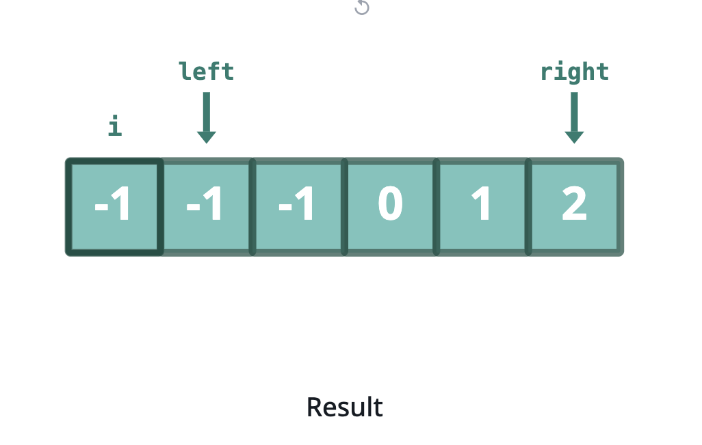

Since our first triplet sums to 0, we can add it to our result set.

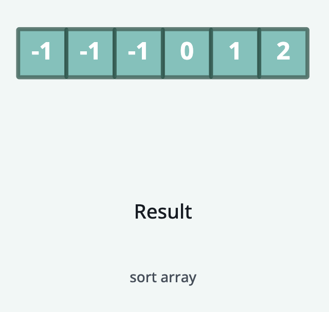
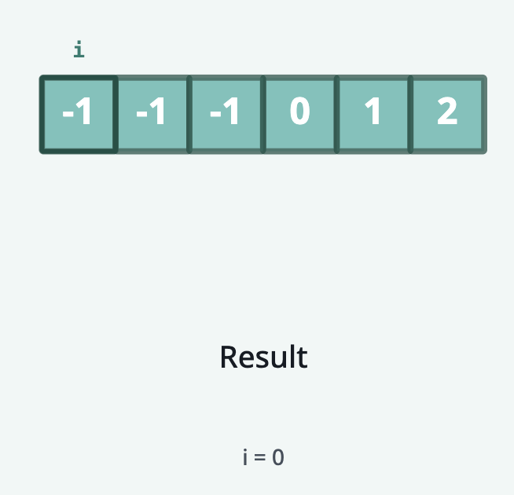
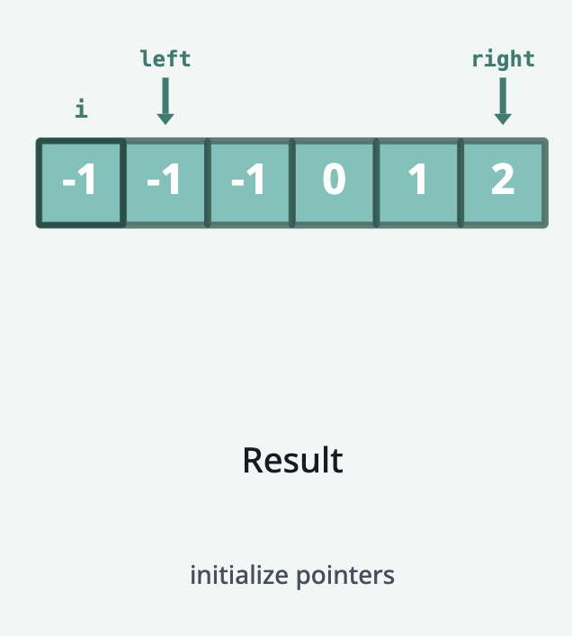
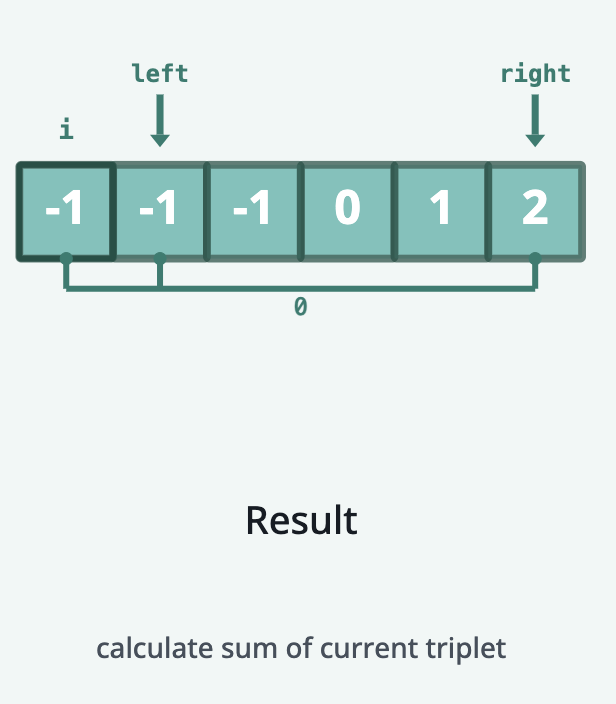
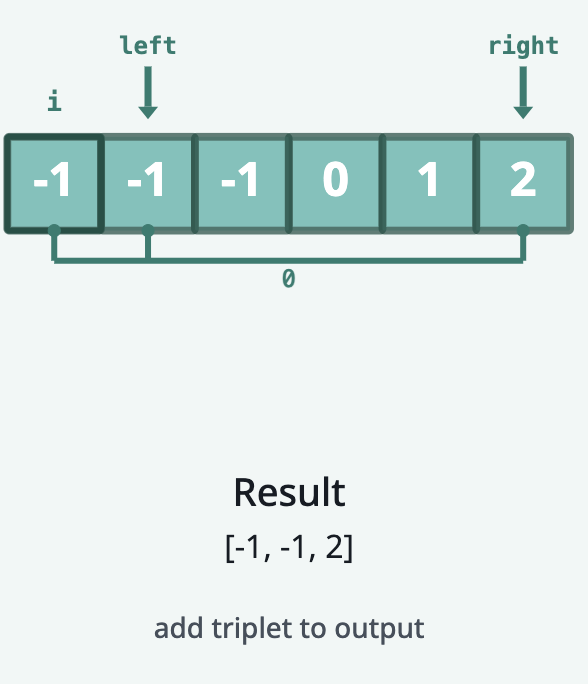

### Avoiding Duplicates

As soon as we find a triplet that sums to 0, we can add it to our result set. We then have to move our left and right
pointers to look for the next triplet while avoiding duplicate triplets. We can do this by moving the left and right
pointers until they point to different numbers than the ones they were pointing to before.
Here we move the left pointer once until it reaches the last -1 in the array. Then, we can move both the left and right
pointers so that they both point to new numbers.

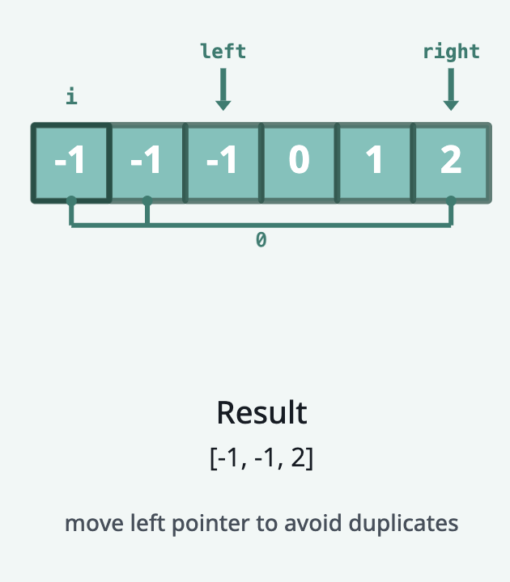
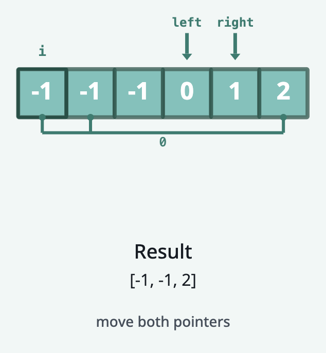

Here we can do another iteration of the Two Sum problem using the new positions of the left and right pointers.

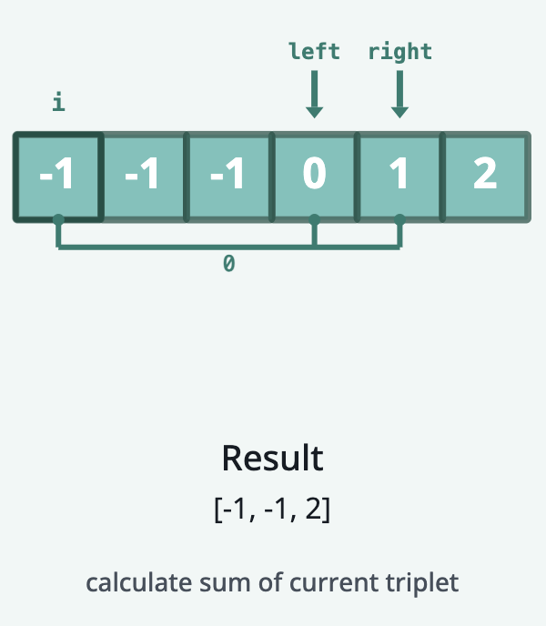
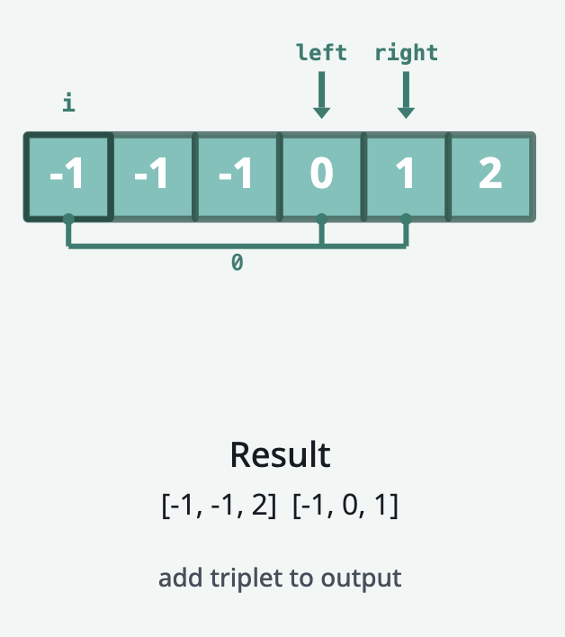
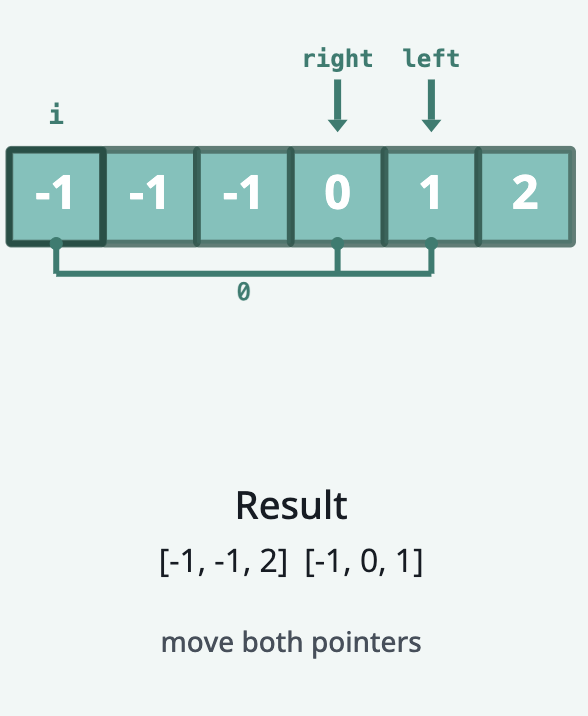

At this point our left and right pointers have crossed, so we can move our iterator to the next number in the array.

### Avoiding Duplicates II

In this case, since the next number in the array is the same as the previous number, we can skip it. We can do this by
moving our iterator until it points to a new number.

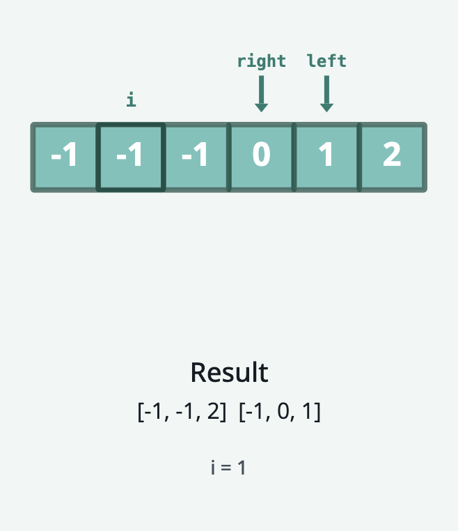
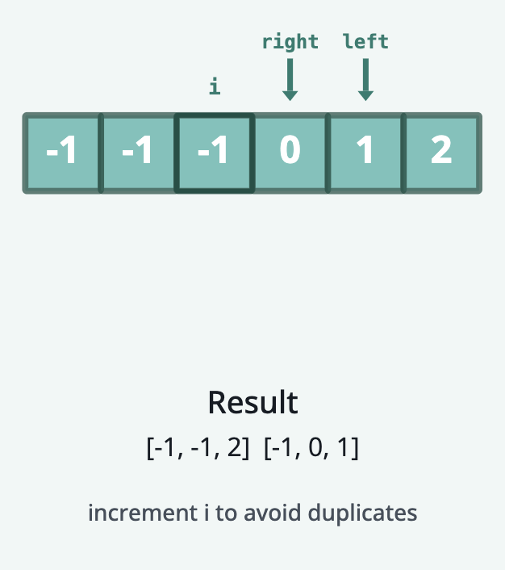
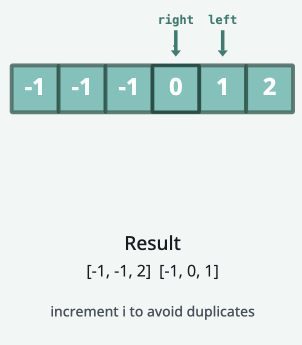

And we're ready to start the Two Sum algorithm again, so we reset our left and right pointers, and start the algorithm.

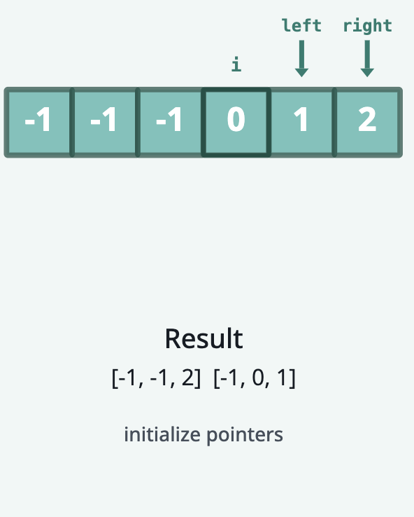
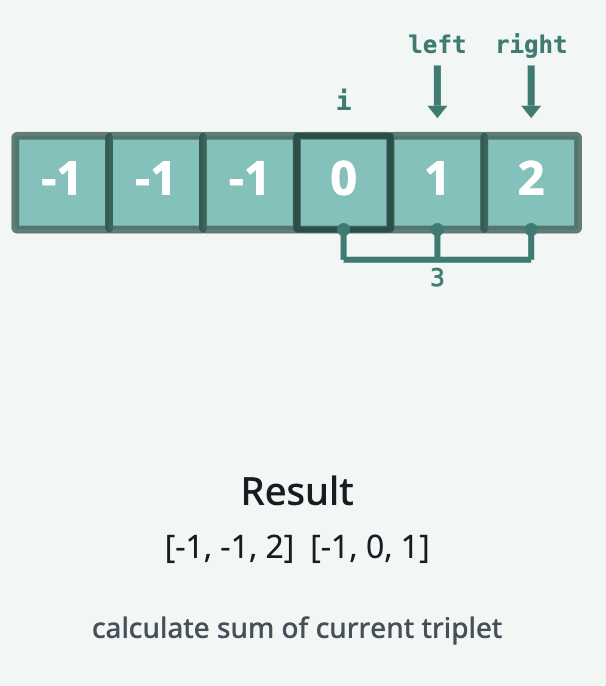
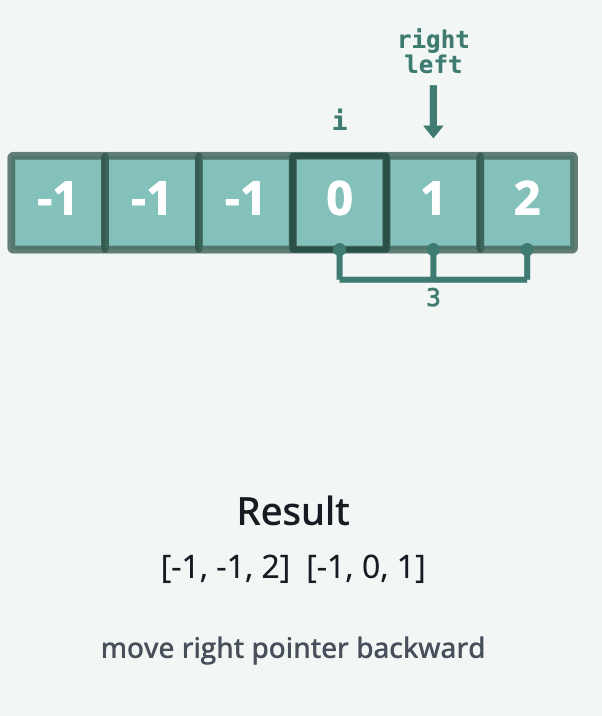

### Termination

Our algorithm terminates when i reaches the 3rd to last element in the array (i.e., i < n - 2). This is because we need
at least 2 more elements after i for left and right to form a triplet.

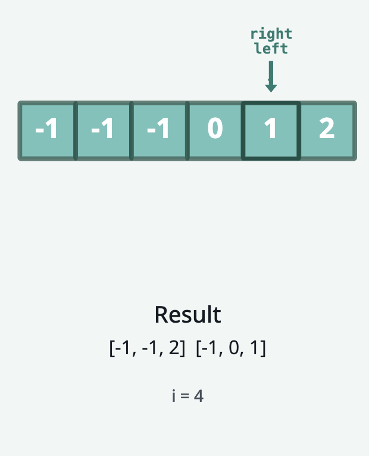
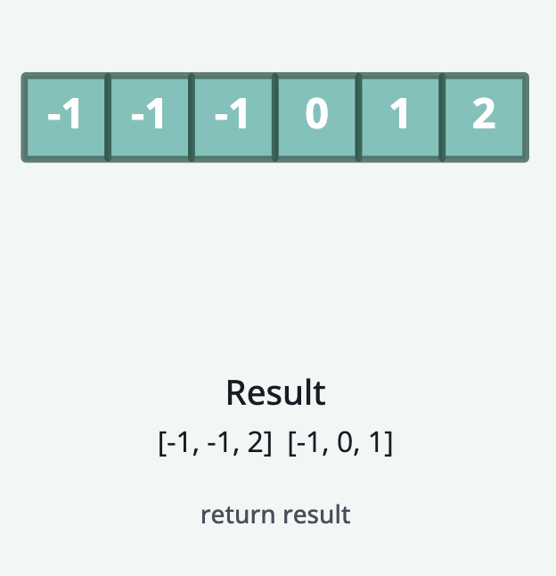

---

# Three Number Sum

Write a function that takes in a non-empty array of distinct integers and an
integer representing a target sum. The function should find all triplets in
the array that sum up to the target sum and return a two-dimensional array of
all these triplets. The numbers in each triplet should be ordered in ascending
order, and the triplets themselves should be ordered in ascending order with
respect to the numbers they hold.

If no three numbers sum up to the target sum, the function should return an
empty array.

## Examples

Example 1

```text
array = [12, 3, 1, 2, -6, 5, -8, 6]
targetSum = 0
[[-8, 2, 6], [-8, 3, 5], [-6, 1, 5]]
```

## Hints

- Using three for loops to calculate the sums of all possible triplets in the array would generate an algorithm that runs 
  in O(n^3) time, where n is the length of the input array. Can you come up with something faster using only two for loops?
- Try sorting the array and traversing it once. At each number, place a left pointer on the number immediately to the
  right of your current number and a right pointer on the final number in the array. Check if the current number, the
  left number, and the right number sum up to the target sum. How can you proceed from there, remembering the fact that
  you sorted the array?
- Since the array is now sorted (see Hint #2), you know that moving the left pointer mentioned in Hint #2 one place to
  the right will lead to a greater left number and thus a greater sum. Similarly, you know that moving the right pointer
  one place to the left will lead to a smaller right number and thus a smaller sum. This means that, depending on the
  size of each triplet's (current number, left number, right number) sum relative to the target sum, you should either
  move the left pointer, the right pointer, or both to obtain a potentially valid triplet.

> The solution here will be the same as the Three Sum problem above, with the only difference being the targetSum is not
> 0 and has been provided as an input