# Triangle Numbers

Write a function to count the number of triplets in an integer array nums that could form the sides of a triangle. For
three sides to form a valid triangle, the sum of any two sides must be greater than the third side. The triplets do not
need to be unique.

## Examples

```text
Input:
nums = [11,4,9,6,15,18]

Output:
10

Explanation: Valid combinations are...

4, 15, 18
6, 15, 18
9, 15, 18
11, 15, 18
9, 11, 18
6, 11, 15
9, 11, 15
4, 6, 9     
```

## Solution

In order for a triplet to be valid lengths of a triangle, the sum of any two sides must be greater than the third side. 
By sorting the array, we can leverage the two-pointer technique to count all valid triplets in O(n2) time and O(1) space.
The key to this question is realizing that if we sort three numbers from smallest to largest (say a ≤ b ≤ c), we only
need to check if a + b > c. If this condition holds, the other two conditions (a + c > b and b + c > a) are automatically
satisfied because c ≥ b and b ≥ a. For example, with 4, 8, 9, if 4 + 8 > 9 is true, then we have a valid triplet.


But not only that, triplets where the smallest number is between 4 and 8 are also valid triplets.

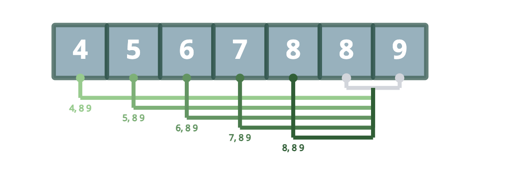

This means that if we sort the input array, and then iterate from the end of the array to the beginning, we can use the
two-pointer technique to efficiently count all valid triplets.

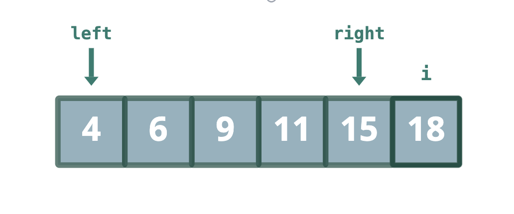

The pointers i, left, and right represent the current triplet we are considering. If nums[left] + nums[right] > nums[i]
then we know there are a total of right - left valid triplets, since all triplets between left and right are also valid
triplets. We can then decrement right to check for the valid triplets that can be made by decreasing the middle value.

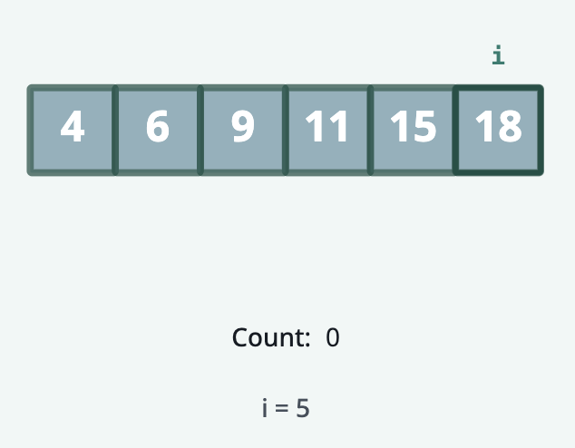
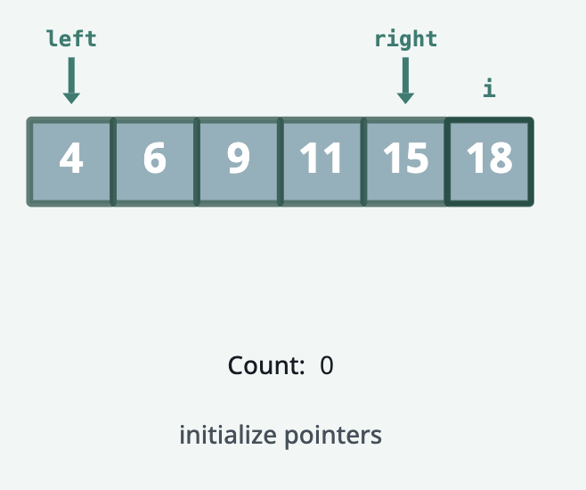
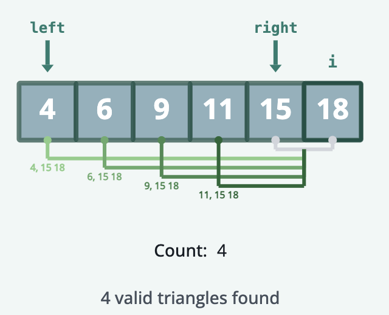
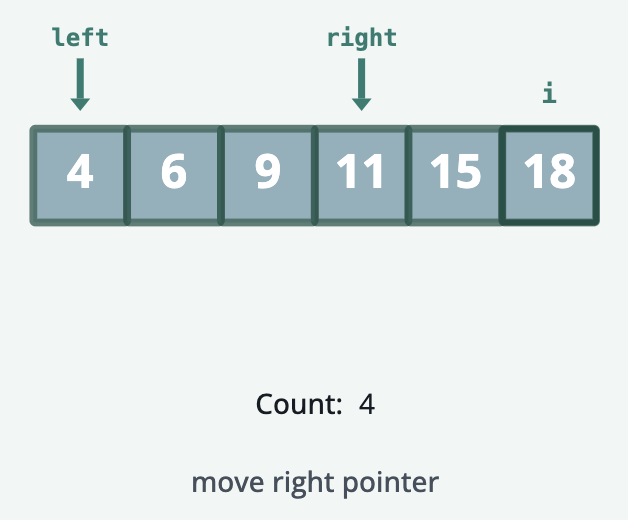

When nums[left] + nums[right] < nums[i], we know that all triplets between left and right are also invalid, so we
increment left to look for a larger smallest value.

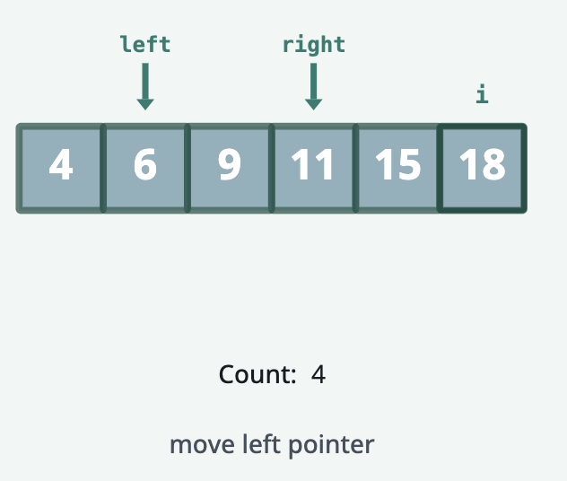

Each time left and right cross, we decrement i and reset left and right to their positions at opposite ends of the array.
This happens until i is less than 2, at which point we have counted all valid triplets.

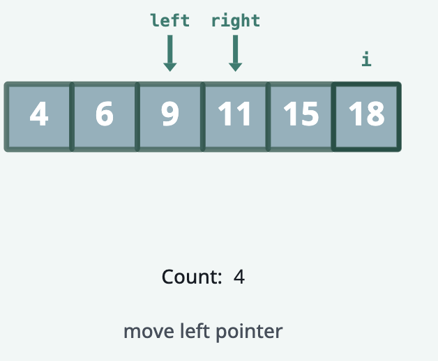
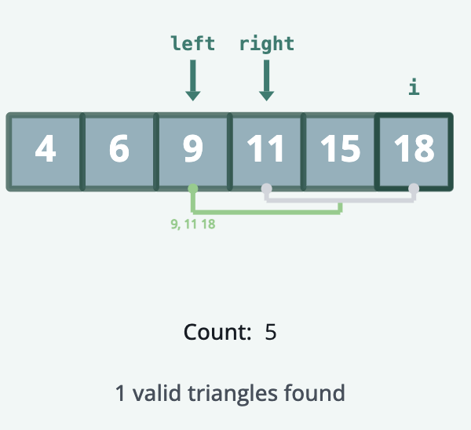
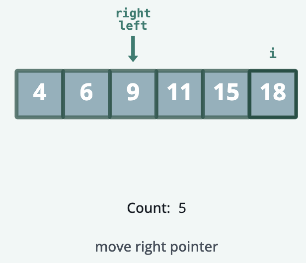
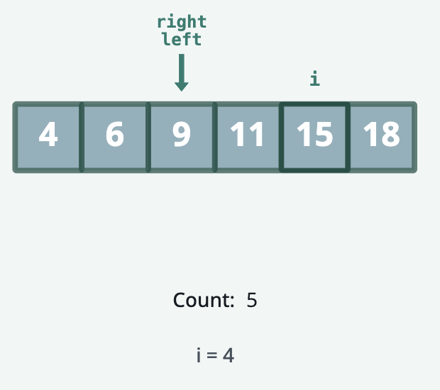
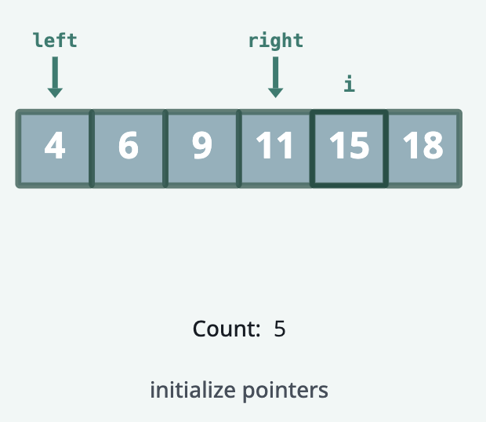
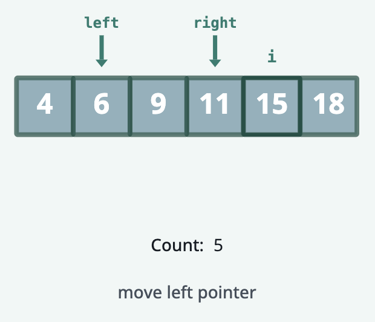
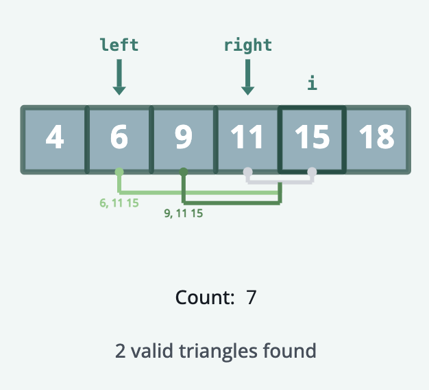
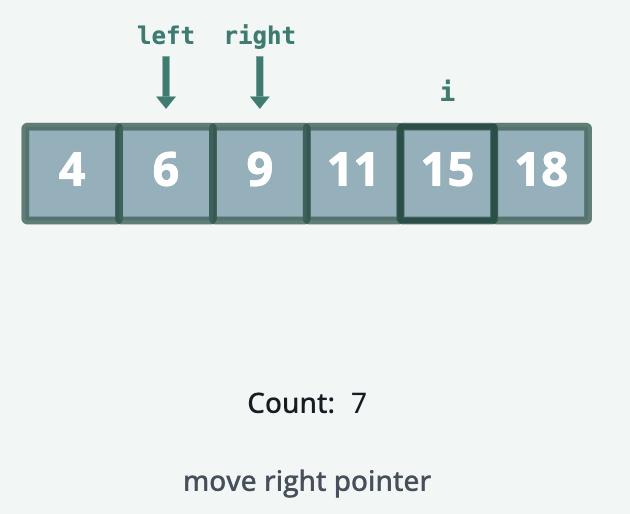

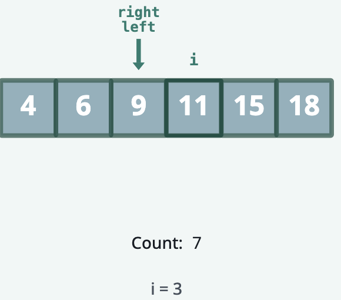
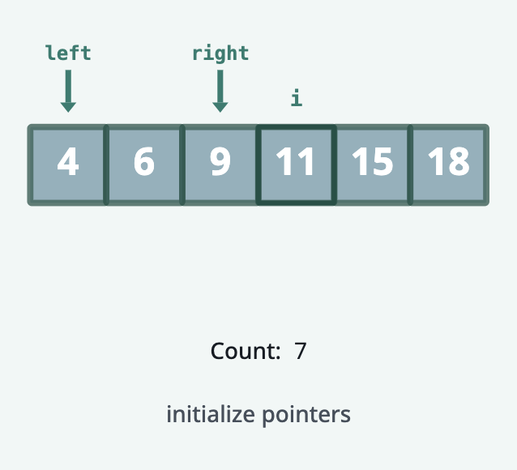
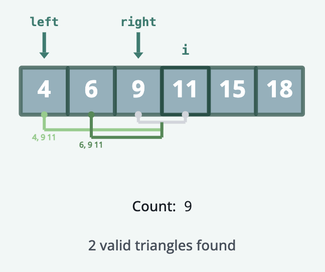
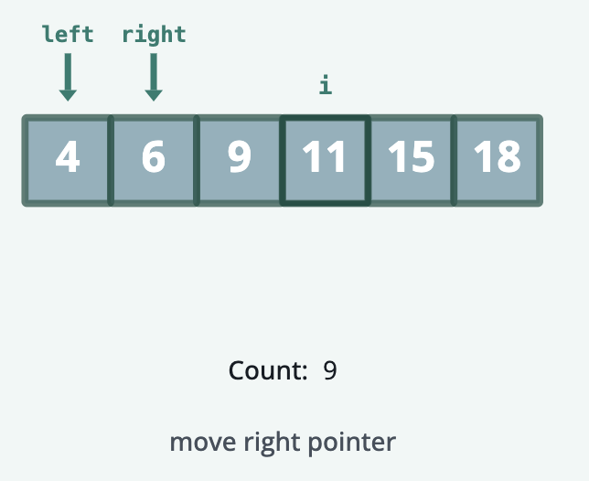
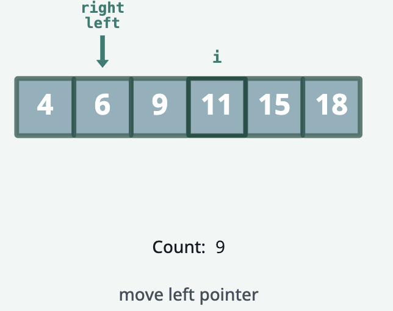
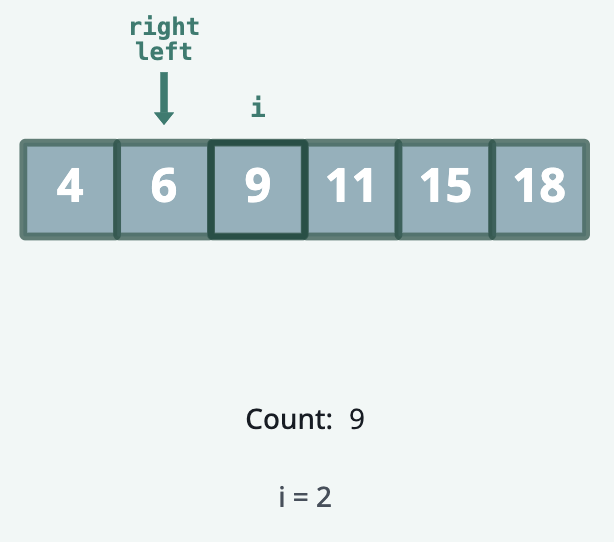
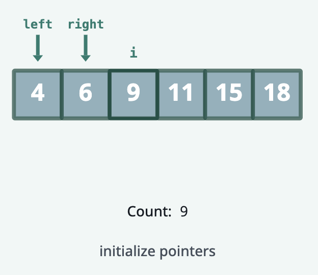

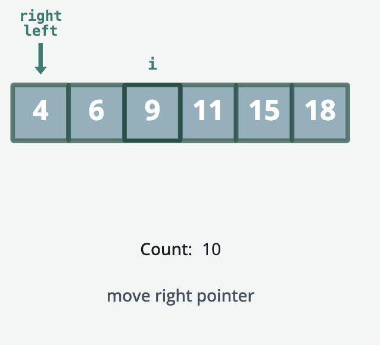
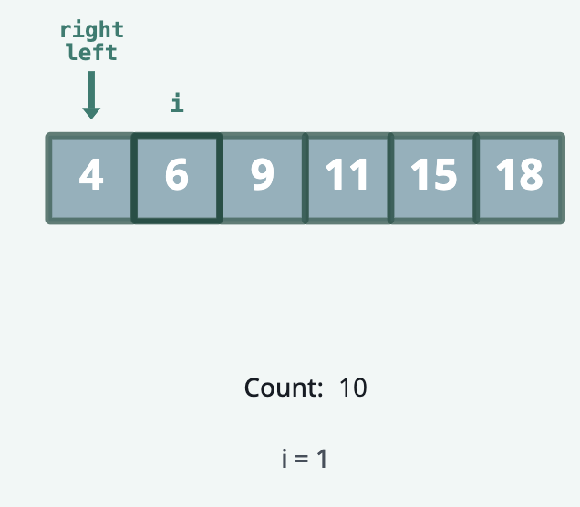
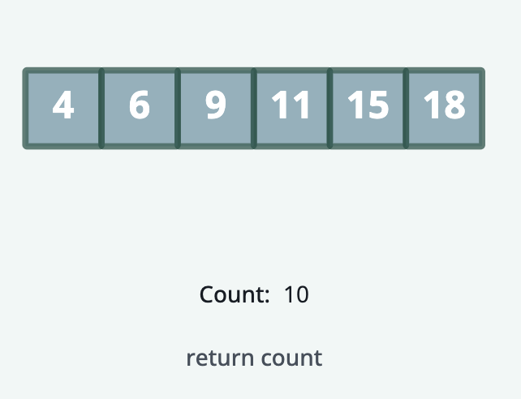
