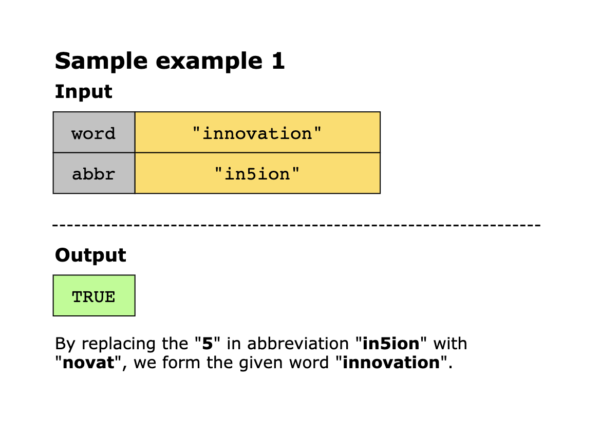
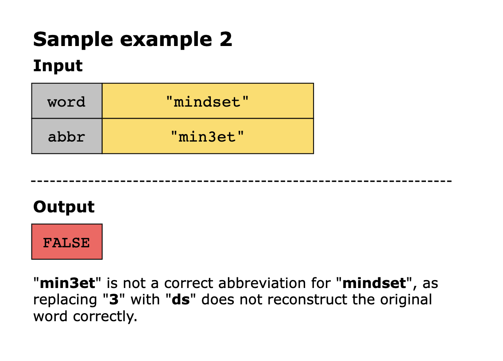
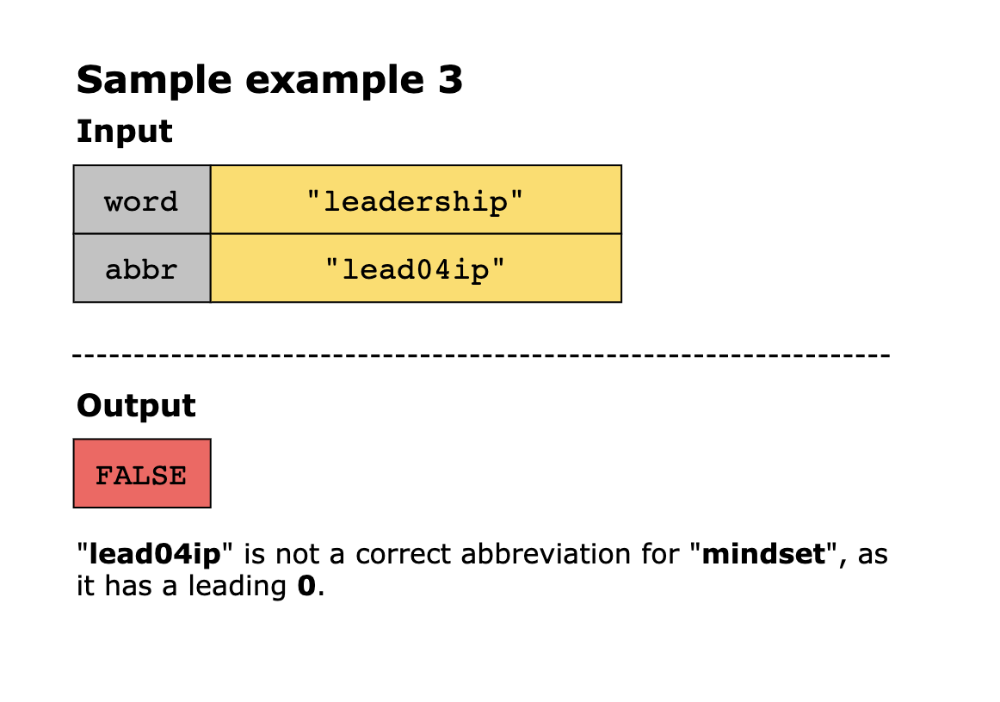
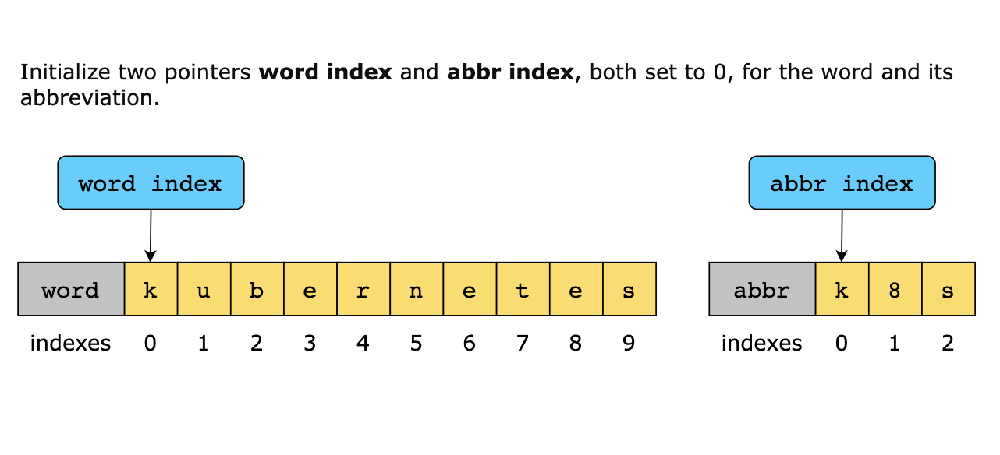
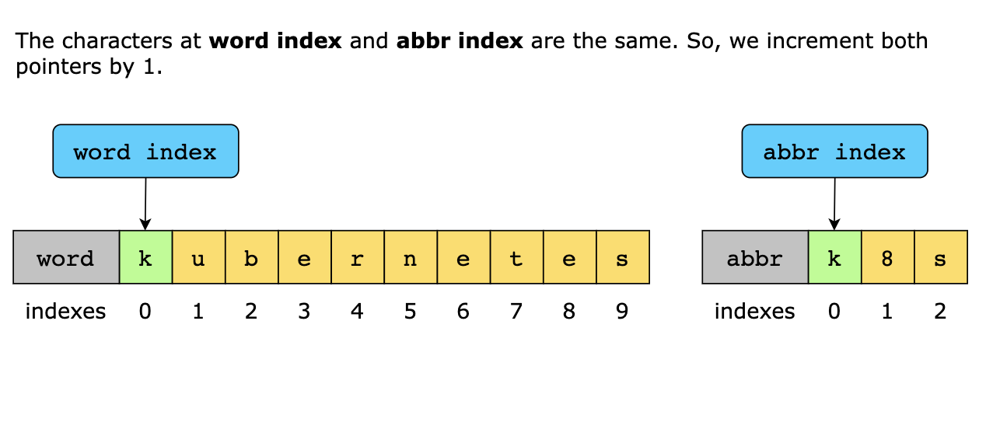
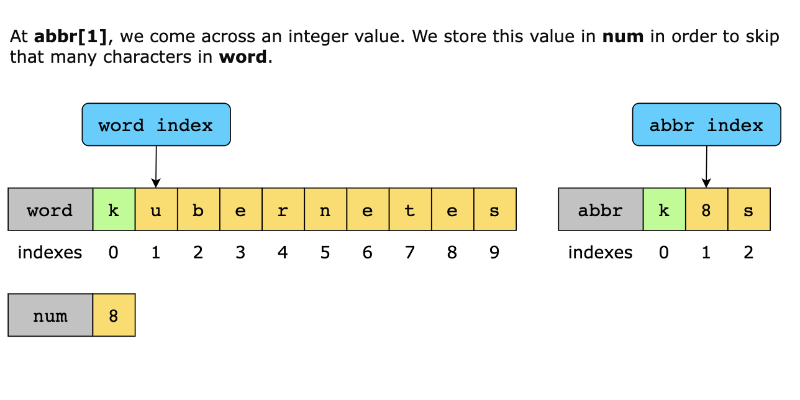
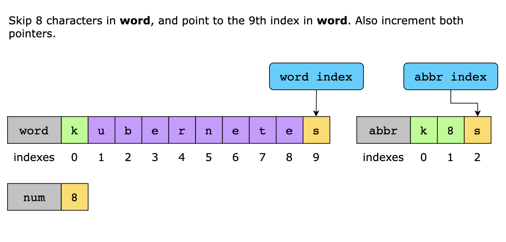
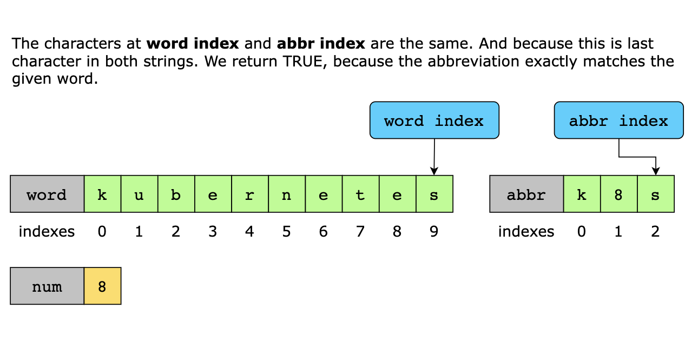

# Valid Word Abbreviation

Given a string, word, and abbreviation, abbr, return TRUE if the abbreviation matches the given string. Otherwise,
return FALSE. An abbreviation can replace any non-adjacent, non-empty substrings of the original word with their lengths.
Replacement lengths must not contain leading zeros.

A certain word, "calendar", can be abbreviated as follows:

- "cal3ar" ("cal + end [length = 3] + ar" skipping three characters "end" from the word "calendar" still matches the
  provided abbreviation)
- "c6r" ("c + alenda [length = 6] + r" skipping six characters "alenda" from the word "calendar" still matches the 
  provided abbreviation)

The word "internationalization" can also be abbreviated as "i18n" (the abbreviation comes from skipping 18 characters in
"internationalization" leaving the first and last letters "i" and "n").

The following are not valid abbreviations:

- "c06r" (Has leading zeroes)
- "cale0ndar" (Replaces an empty string)
- "c24r" ("c al enda r" the replaced substrings are adjacent)

## Constraints:

- 1 ≤ `word.length` ≤ 20
- The word consists of only lowercase English letters.
- 1 ≤ `abbr.length` ≤ 10
- `abbr` consists of lowercase English letters and digits.
- All the integers in abbr will fit in a 32–bit integer.

## Examples

## Solution

This problem aims to verify that the abbreviation correctly corresponds to the given word by matching letters directly
and properly interpreting numbers as skipped characters. The two pointers technique can be useful here, where we
initialize one pointer at the start of the word and another at the start of the abbreviation. Next, we will
incrementally iterate over both strings simultaneously to verify that the character matches at each step. When
encountering a number in the abbreviation, we skip the exact count of characters in the word while ensuring that this
count has no leading zeros. By maintaining these checks and iterating over both strings, we can ensure that the
abbreviation correctly represents the word.

Having said this, here’s the algorithm that we’ll use to solve the given problem:

- We create two pointers: word_index and abbr_index, both initialized to 0.
- Next, we iterate through the abbreviations string while abbr_index is less than the length of abbr:
  - If a digit is encountered at abbr[abbr_index]:
    - We then check if that digit is a leading zero. If it is, we return FALSE.
    - Next, we calculate the number from abbr and skip that many characters in word.
  - In case the value at index abbr[abbr_index] is a letter:
    - We then check for characters that match with word[word_index]. If the characters don’t match in both strings, we
      return FALSE.
    - Next, we increment both word_index and abbr_index by 1
- Finally, we ensure whether both pointers, word_index and abbr_index, have reached the end of their strings. If they
  have, we return TRUE. Otherwise, we return FALSE.

### Time Complexity

The time complexity of the solution above is O(n), where n is the length of the abbreviation string abbr. This is
because the solution processes each character of abbr exactly once.

### Space Complexity

The space complexity is O(1) because the algorithm uses constant extra space regardless of the input size.
