# Number of 1 Bits

Write a function that takes a 32-bit binary representation of an unsigned integer n and returns the count of its 1 bits.

The binary representation of an unsigned integer is a sequence of 0s and 1s that represents the integer's value using
base-2 notation. An example of the 32-bit binary representation of an unsigned integer 13 is 00000000000000000000000000001101.

## Constraint

- The input must be a 32-bit binary representation of an unsigned integer.

> Note: The input is passed to the function as an unsigned integer variable. In this lesson, we have displayed it as a
> string of binary numbers solely for visualization purposes.

## Solution

The first attempt to solve this would be to iterate over each bit in the 32-bit representation and keep increasing the
count, representing the number of 1 bits, every time we encounter the digit 1. This is the correct way to solve this
problem, and it even takes constant time and space complexity. However, this approach requires us to perform 32
iterations regardless of the number of 1 bits, which makes it a less efficient approach, specifically for integers with
a small number of 1 bits. For example, there are only three 1 bits in the unsigned integer 13, but we'll have to iterate
the entire 32 times to get to this number.
To avoid any unnecessary iterations, we can use bitwise manipulation to efficiently count the number of 1 bits in the
given unsigned integer. Here, we'll iterate through the bits of the binary representation that are actually 1s. This
means it only performs iterations equal to the number of 1 bits in the binary representation of the integer. For example,
if the given integer is 12 with the binary representation of 00000000000000000000000000001100, the loop will iterate only
twice, which is highly efficient.

First, we'll initialize a counter, count, to keep track of the number of 1 bits in the 32-bit binary representation of
an unsigned integer. Then, we'll start a loop that continues as long as the integer n is not zero, i.e., there is no 1 bit
left in the integer. This loop will iterate through each bit of the binary representation of n, starting from the least
significant bit. In each iteration:

> The least significant bit is the rightmost bit in the binary representation of a number.

- Check whether the least significant bit of n is equal to 1 using the bitwise AND operation.
  - If the last bit is 1, increment the count by 1.
  - Otherwise, continue with the loop.
- Once we are done checking the current bit, right-shift n by one position using the right bitwise shift operator. This
  operation effectively shifts all bits one place to the right, discarding the last bit and making the next bit the new
  least significant bit.

Eventually, count will have the total number of 1 bits, so we'll return it as the final result.

Let’s look at the following illustration to get a better understanding of the solution:

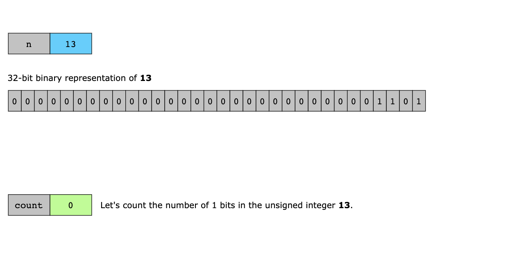
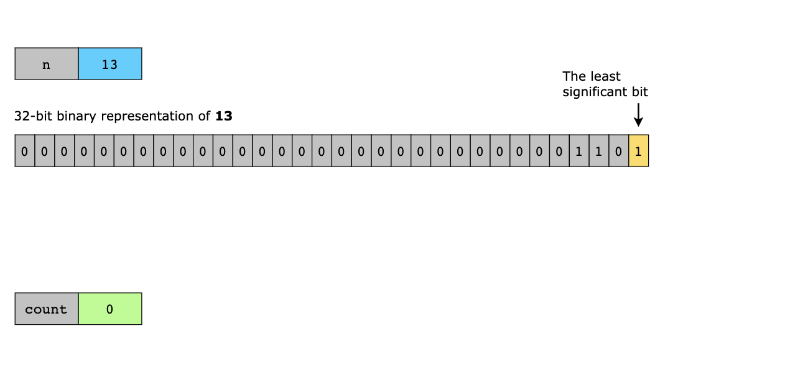
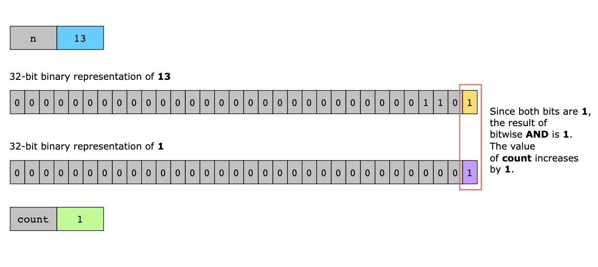
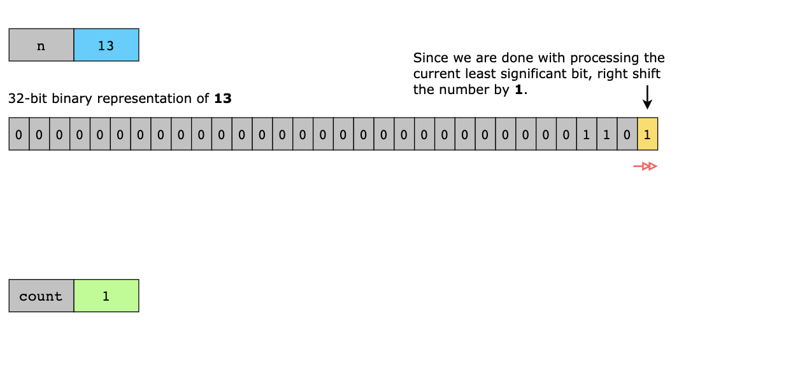
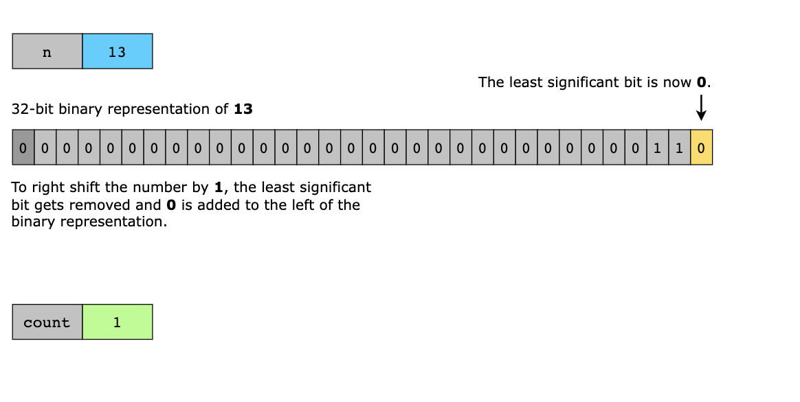
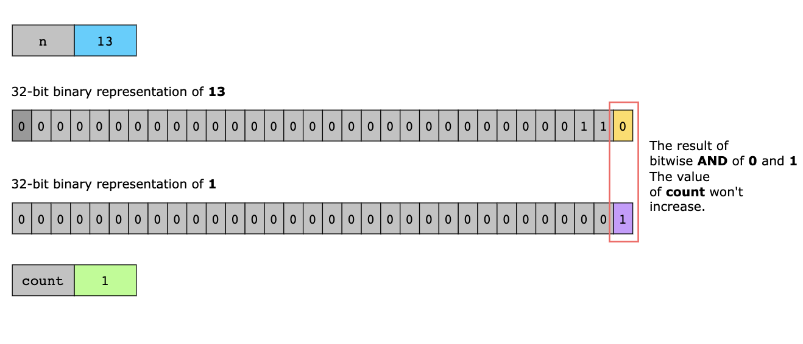
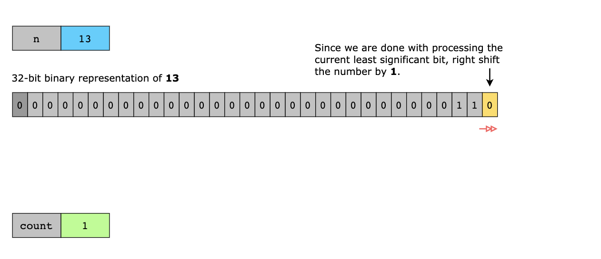
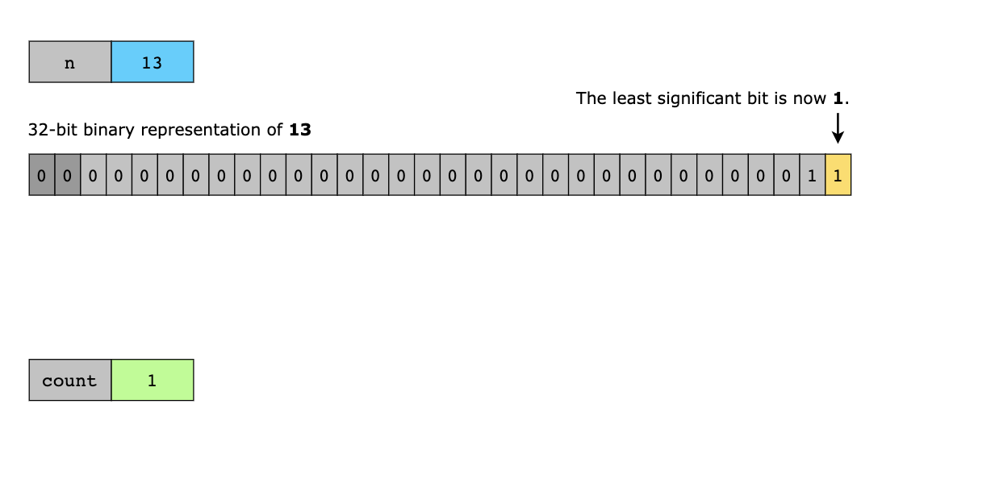
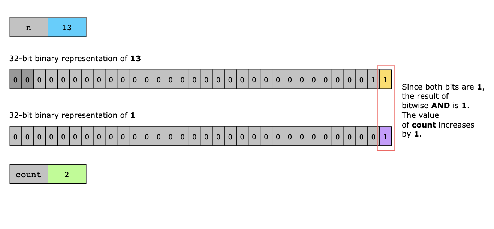
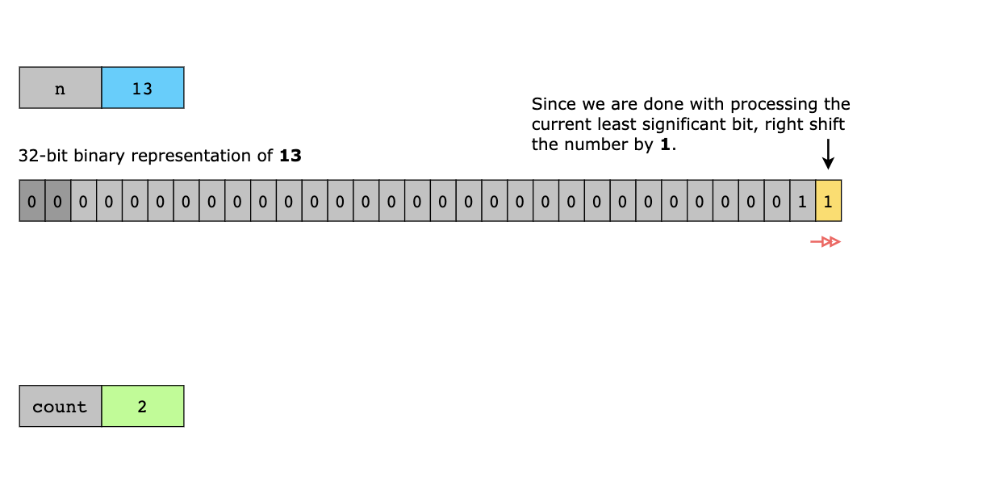
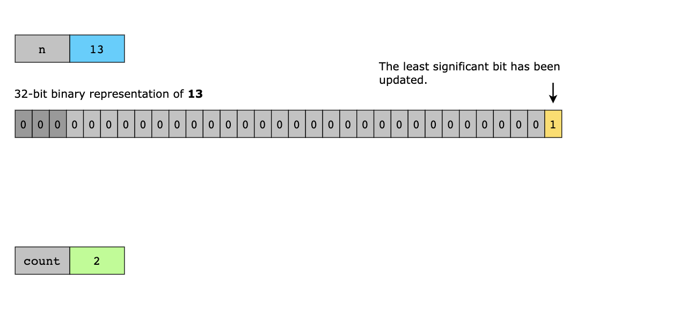
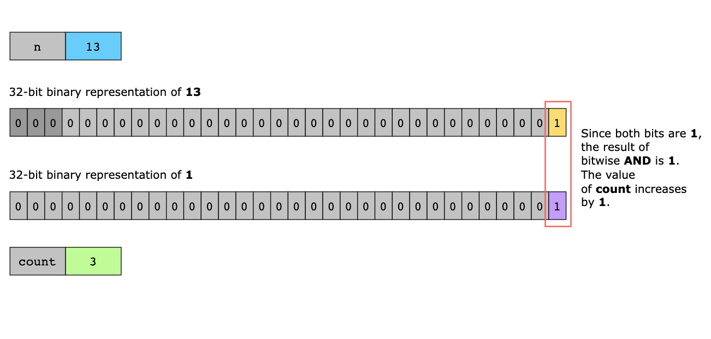
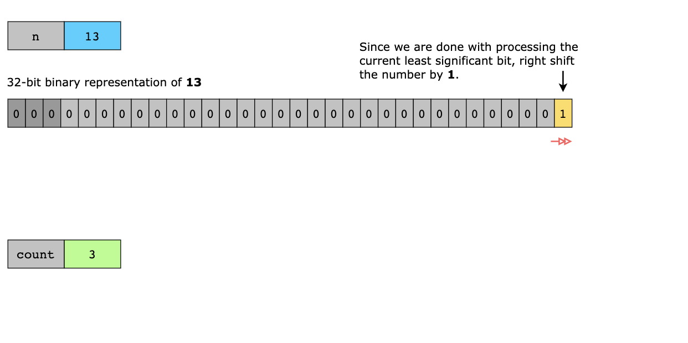
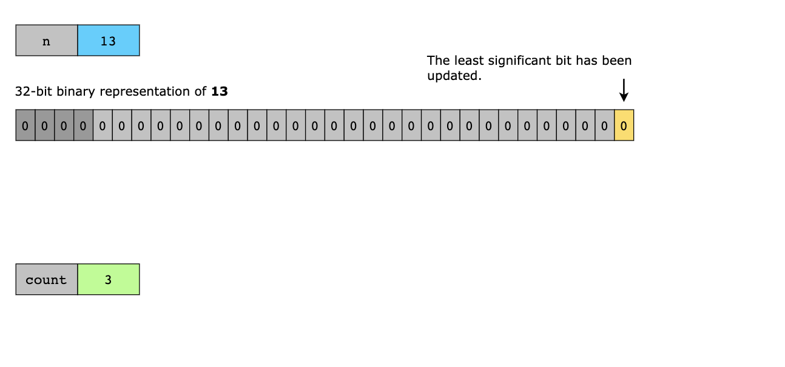
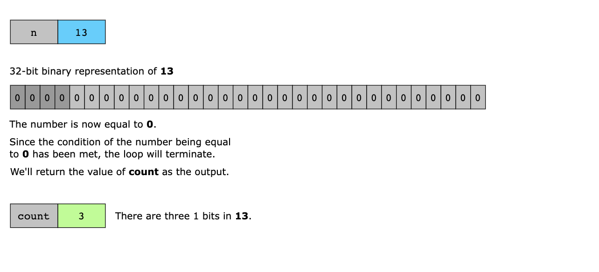

### Time Complexity

In the worst case, the number of iterations in the loop can go up to 32, which is a fixed number. Therefore, the overall
time complexity for this solution is O(1).

### Space Complexity

The space complexity of this solution is O(1).