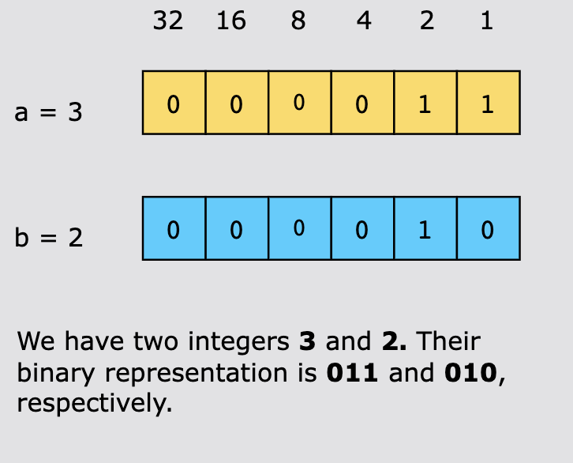
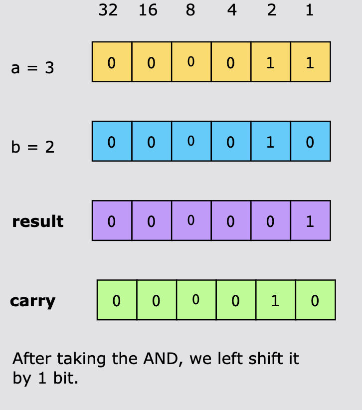
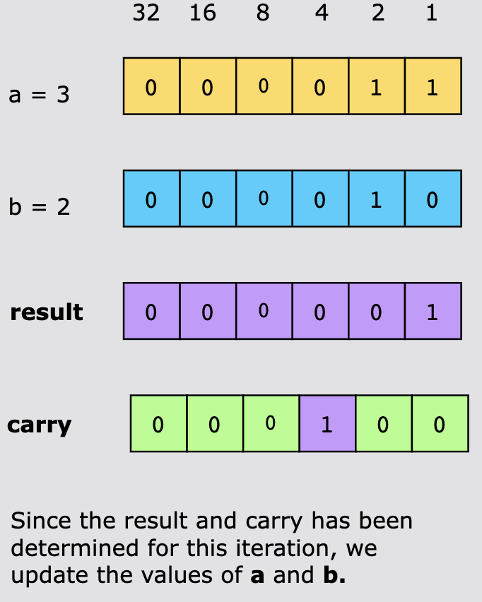
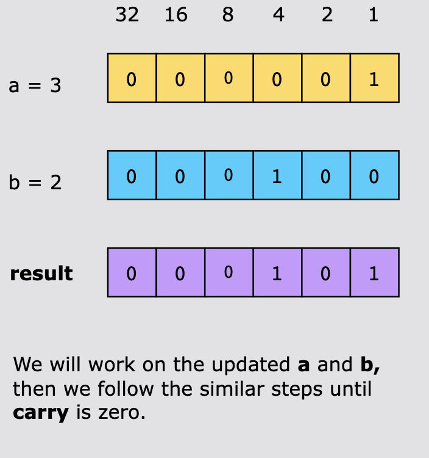
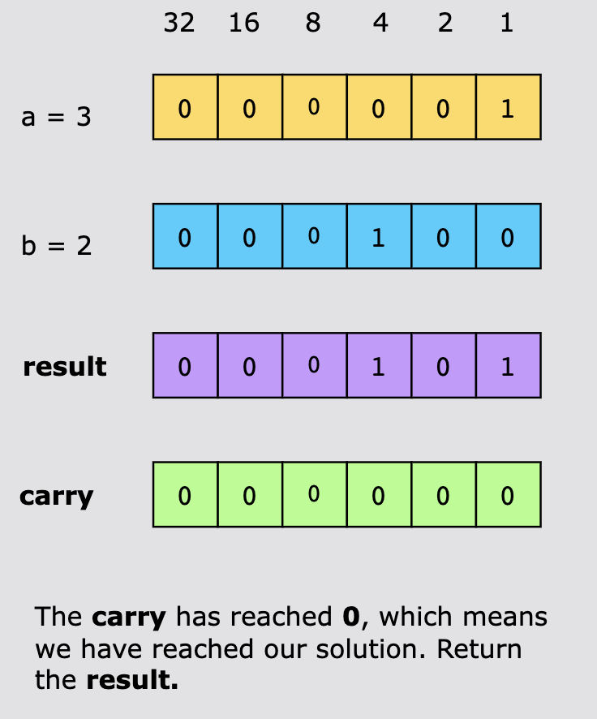
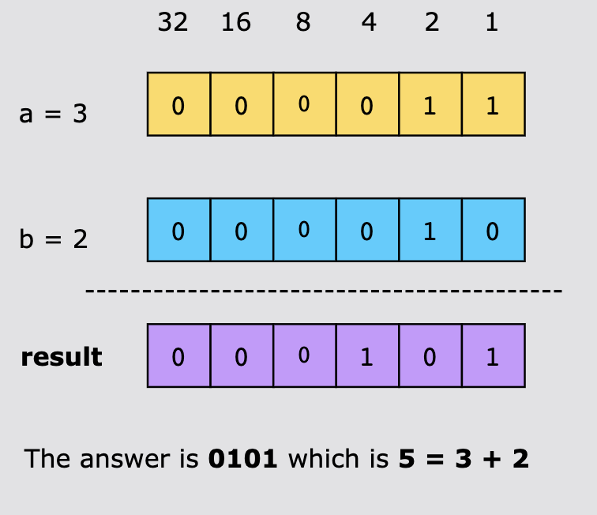

# Sum of Two Integers

Given two integers a and b, return the sum of the two integers without using the operators + and -.

 
## Examples

Example 1:
```text
Input: a = 1, b = 2
Output: 3
```

Example 2:
```text
Input: a = 2, b = 3
Output: 5
```

## Constraints

- -1000 <= a, b <= 1000

## Topics

- Math
- Bit Manipulation

## Solution

We will use the bitwise manipulation pattern to calculate the sum of two integers without using the arithmetic operators.
To calculate the desired sum, we'll use the bitwise operations.

Let's dive into the logic to get a better idea of how to use bitwise operations for this task:

- Bitwise XOR (`^`) operation: This operation allows us to calculate the sum of corresponding bits in a and b without
  considering the carry (if any).

- Bitwise AND (`&`) operation: The AND operation will help us determine where carry propagation is necessary. By applying
  this operation to a and b, we can identify which bit positions require carry consideration.

- Iterative Process: The algorithm functions iteratively, much like how binary addition is carried out. We will start
  with the least significant bits and advance toward the most significant bits of a and b. At each bit position, we
  calculate the sum while considering the carry from the previous bit's addition. This ensures that any carry is
  appropriately propagated throughout the process.

The algorithm to obtain the sum of the given integers is as follows:

1. To limit the result to 32-bits, we set a mask variable to `0xFFFFFFFF`.
2. Start a loop that continues while b is not equal to 0. We calculate the sum of the two integers without carrying, by
   taking XOR and then AND the result with the mask.
3. For calculating the carry which needs to be added to the next pair of integers, we take the AND of a and b,
   leftshifting the result by 1-bit, and then AND this result with the mask.
4. We update a and b with the new values for the next iteration, which are the result and carry calculated in steps 2
   and 3, respectively.
5. At the end, to handle overflow when performing the addition of two integers, we have a condition that checks if the
   result exceeds the maximum value of a signed 32-bit integer. If it does, we return the two’s complement of the result
   to ensure that the returned value remains within the valid range.









### Time Complexity

The time complexity of this solution is O(1), because the while loop runs for a maximum of 32 times, since the integers
are represented by 32−bits. Each iteration does bitwise operations, which takes constant O(1), time hence making the
total time complexity as O(1)*O(32) = O(32), which is equivalent to O(1).

### Space Complexity

The solution uses fixed numbers of variables to compute the result. Hence the space complexity is constant. O(1).