# Contains Duplicates

## Contains Duplicates I

Given an integer array nums, return true if any value appears at least twice in the array, and return false if every element is distinct.

Example 1:

Input: nums = [1,2,3,1]
Output: true
Example 2:

Input: nums = [1,2,3,4]
Output: false
Example 3:

Input: nums = [1,1,1,3,3,4,3,2,4,2]
Output: true

---

## Contains Duplicates II

Given an integer array nums and an integer k, return true if there are two distinct indices i and j in the array such 
that nums[i] == nums[j] and abs(i - j) <= k.

Constrains:

- 1 <= nums.length <= 10^3
- -10^3 <= nums[i] <= 10^3
- 0 <= k <= 10^4

Example 1:

Input: nums = [1,2,3,1], k = 3
Output: true
Example 2:

Input: nums = [1,0,1,1], k = 1
Output: true
Example 3:

Input: nums = [1,2,3,1,2,3], k = 2
Output: false

### Solution

The core intuition of solving this problem is maintaining a sliding window of size k to track elements within a limited 
range using a set. As we iterate through the array, we check if the current element already exists in the set, 
indicating a duplicate within the range. If it exists, we return TRUE. Otherwise, the element is added to the set. 
If the set size exceeds k, we remove the oldest element to ensure that the set only contains elements within the valid 
range at any time.

Using the above intuition, the solution can be implemented as follows:

1. Create a set, `seen`, to track elements within the sliding window of size `k`.
2. Loop through each index `i` of the array `nums`.
   - If the current element, `nums[i]`, already exists in the set, a duplicate exists within a range of `k` indices. 
     Therefore, we return TRUE.
   - Add the current element to the set.
   - If the set’s size exceeds `k`, remove the oldest element in the window (`nums[i - k]`) to maintain the window’s size. 
     This ensures only elements within the range k are tracked.

3. If the loop completes without finding duplicates, we return FALSE.

Let’s look at the following illustration to get a better understanding of the solution:

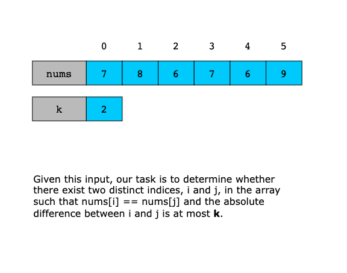
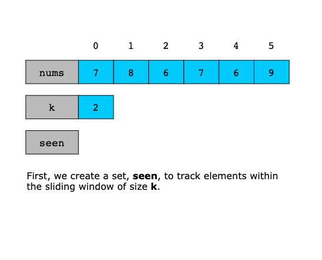
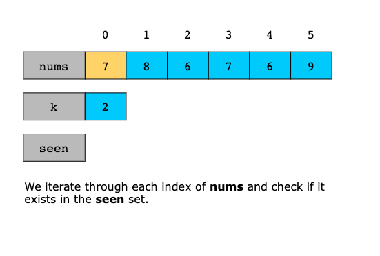
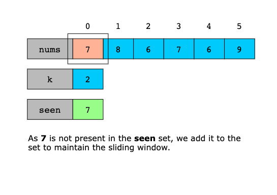
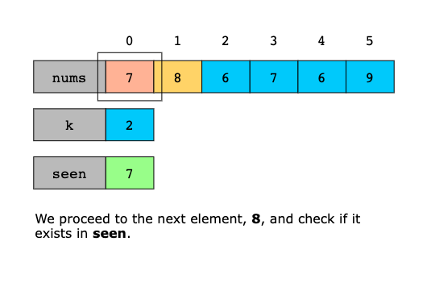
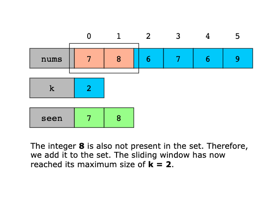
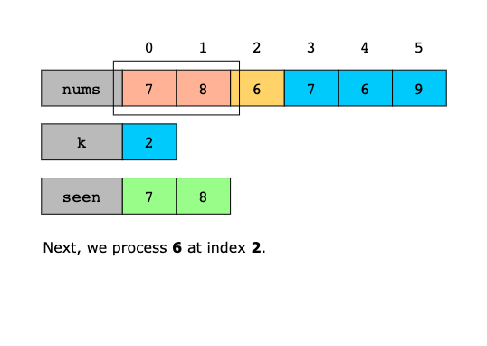
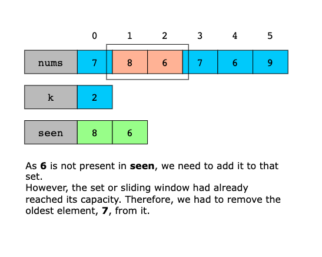
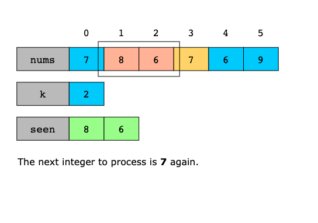
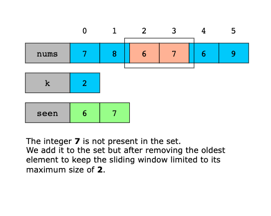
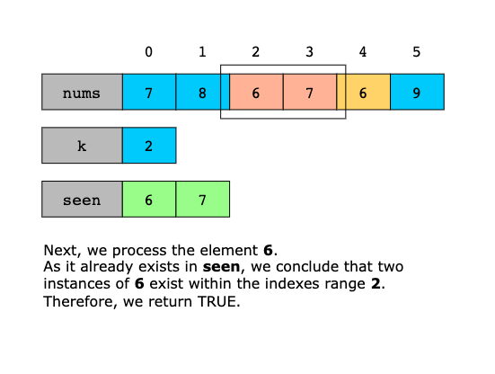

#### Time Complexity

The time complexity of the solution is O(n), where n is the length of the input array `nums`. 
This is because we iterate through the array once, performing constant-time operations for each element.

#### Space Complexity

The space complexity of the solution is O(min(n, k)), where n is the length of the input array `nums` and k is the 
maximum number of steps between duplicate elements. This is because we use a set to store the elements within the 
sliding window of size `k`, and the maximum size of the set is limited by the minimum of `n` and `k`.

---

## Contains Duplicate III

Given an integer array nums and two integers k and t, return true if there are two distinct indices i and j in the array
such that abs(nums[i] - nums[j]) <= t and abs(i - j) <= k.

Example 1:

Input: nums = [1,2,3,1], k = 3, t = 0 Output: true Example 2:

Input: nums = [1,0,1,1], k = 1, t = 2 Output: true Example 3:

Input: nums = [1,5,9,1,5,9], k = 2, t = 3 Output: false
