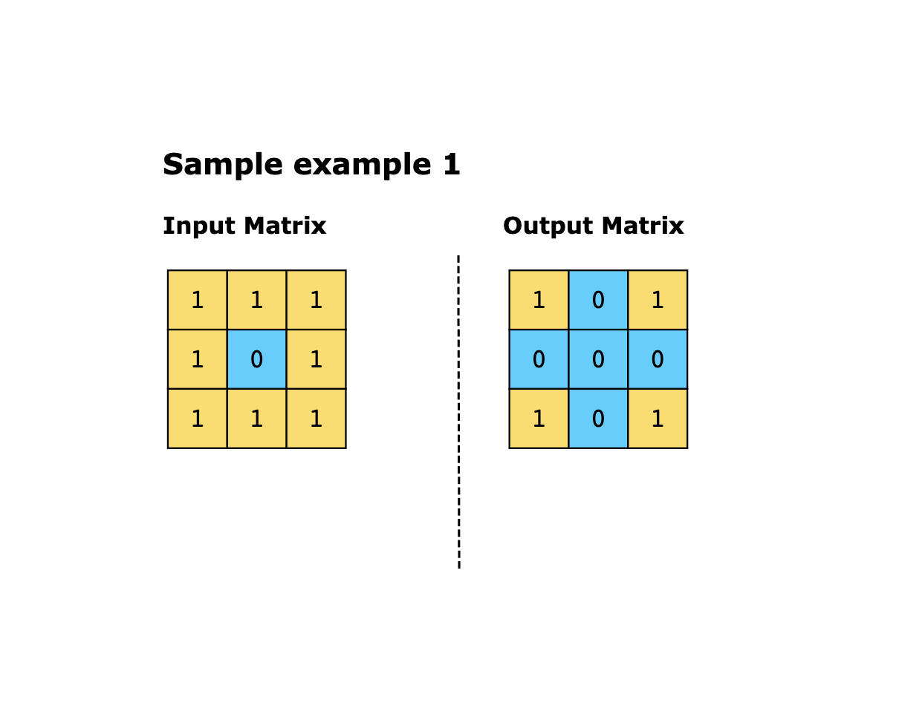
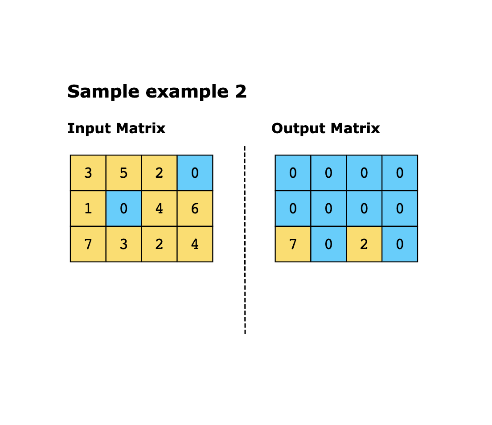
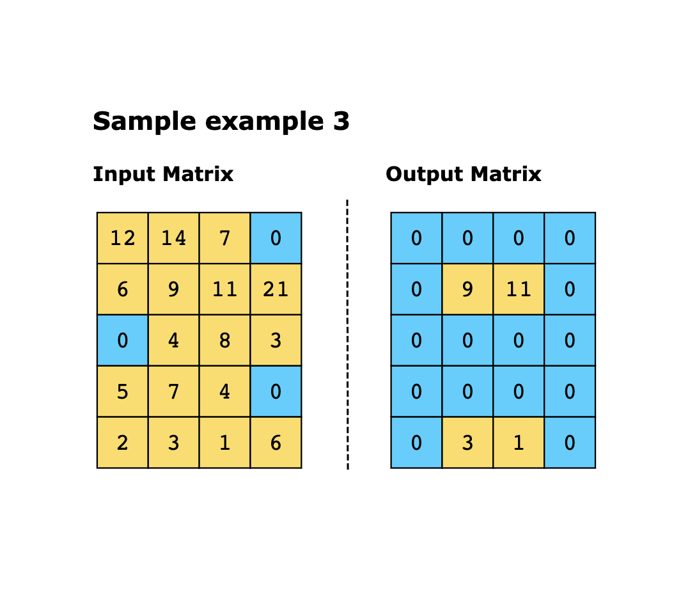

# Set Matrix Zero

Given a matrix, mat, if any element within the matrix is zero, set that row and column to zero. The performed operations 
should be in place, i.e., the given matrix is modified directly without allocating another matrix.

Constraints:

Let `mat` be the matrix given as input for the zeroing operation.

- 1 <= `mat.row`, `mat.col` <= 20
- -2^31 <= `mat[i][j]` <= 2^31-1

## Examples

