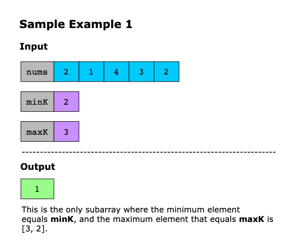
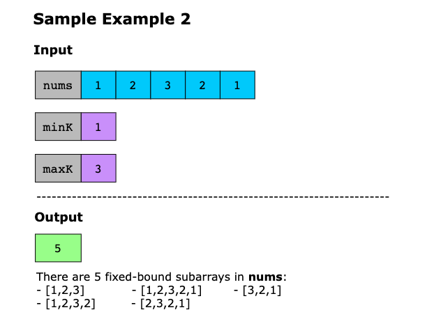
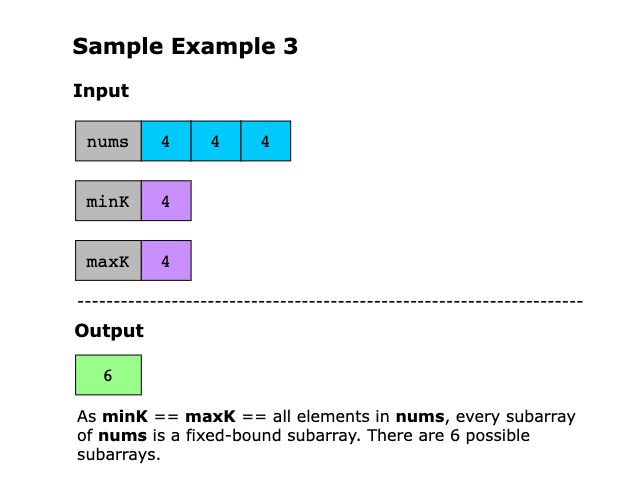
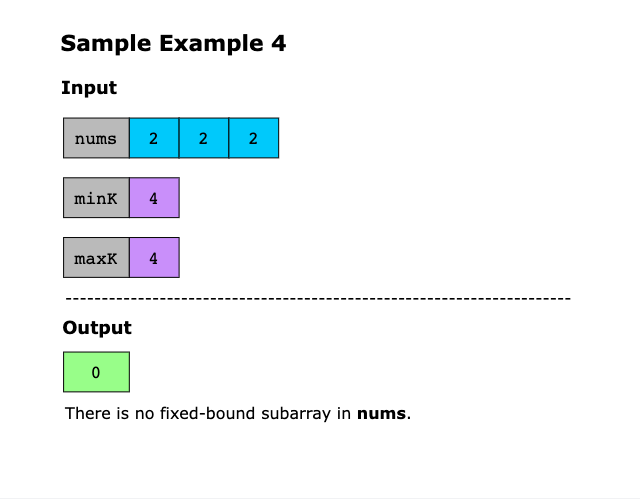

# Count Subarrays with Fixed Bounds

Given an integer array, nums, and two integers minK and maxK, return the number of fixed-bound subarrays.

A subarray in nums is called a fixed-bound subarray if it satisfies the following conditions:

1. The smallest value in the subarray equals `minK`.
2. The largest value in the subarray equals `maxK`.

> Note: A subarray is a contiguous sequence of elements within an array.

Constraints:

- 2 ≤ nums.length ≤ 10^3
- 1 ≤ nums[i], minK, maxK ≤ 10^3

## Examples

