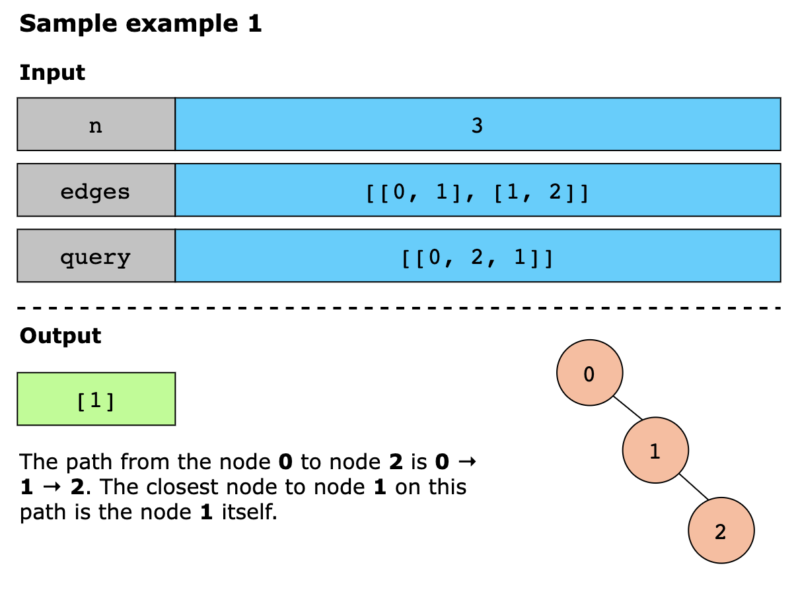
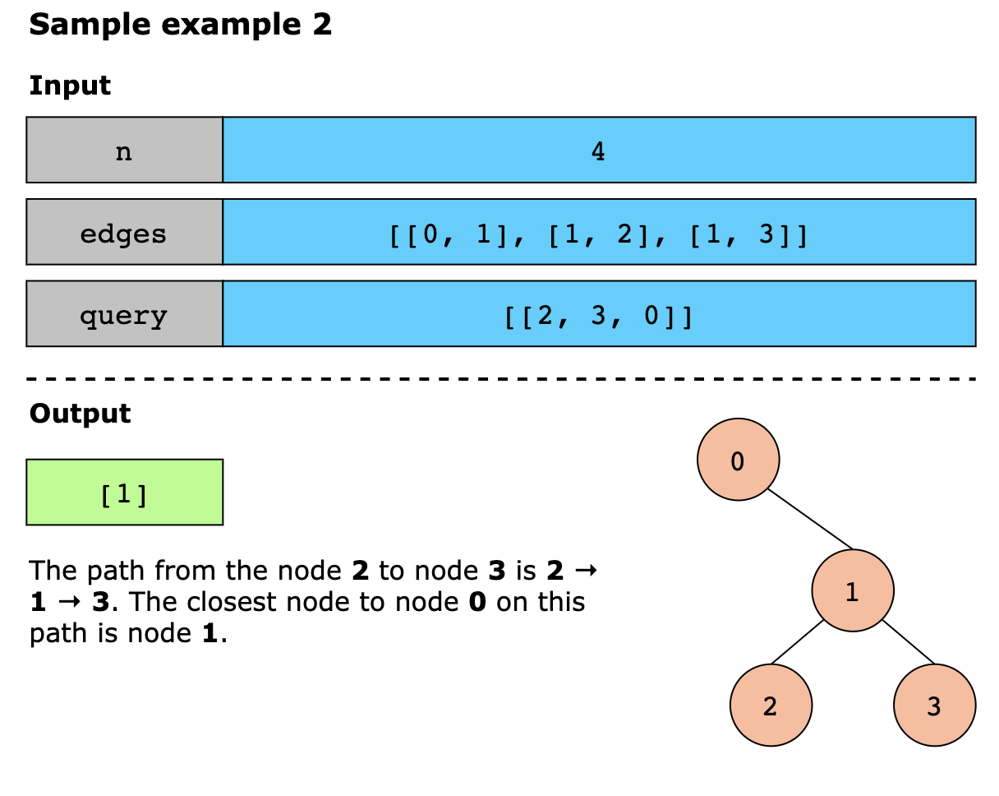
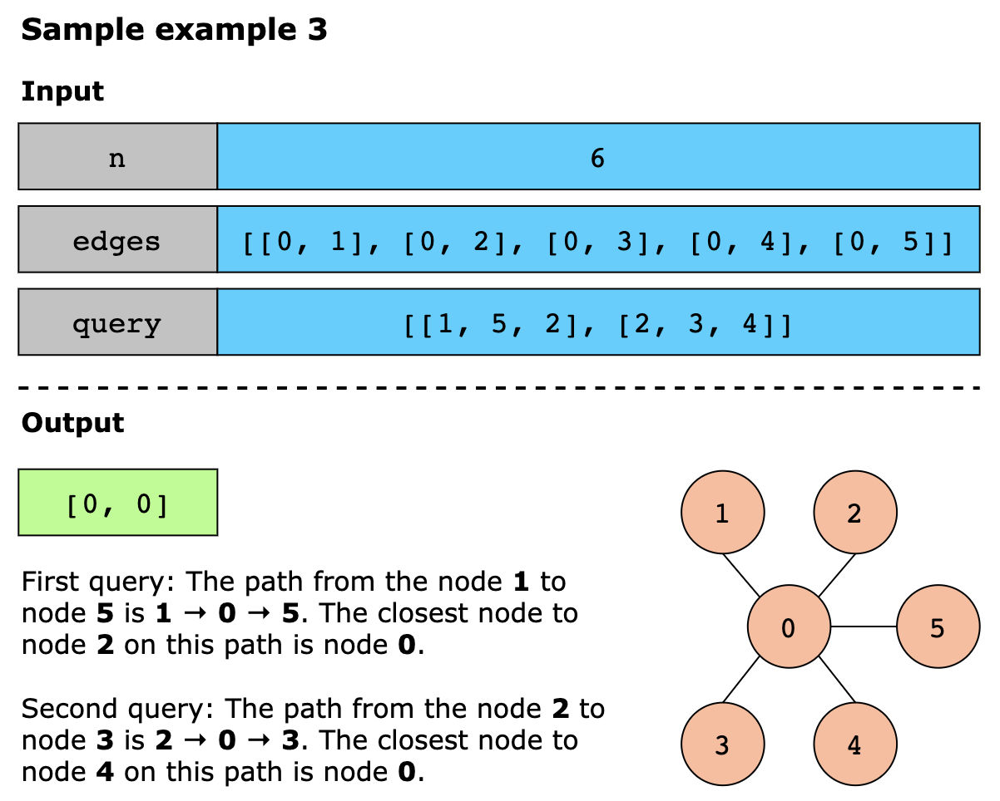

# Undirected Graph

## Closest Node to Path in Tree

You are given a positive integer, n, representing the number of nodes in a tree, numbered from `0 to n−1`. You are also 
given a 2D integer array edges of length `n−1`, where `edges[i] = [ui, vi]` indicates that there is a bidirectional edge 
connecting nodes `ui` and `vi`.

You are also given a 2D integer array query of length `m`, where `query[i]=[starti ,endi ,nodei]`. For each query i, 
find the node on the path between `starti` and `endi` that is closest to `nodei` in terms of the number of edges.

Return an integer array where the value at index `i` corresponds to the answer for the `ith` query.

> Note: If there are multiple such nodes at the same minimum distance, return the one with the smallest index.

Constraints
- `1 ≤ n ≤ 1000`
- `edges.length == n-1`
- `edges[i].length == 2`
- `0 ≤ ui, vi ≤ n-1`
- `ui != vi`
- `1 ≤ query.length ≤ 1000`
- `query[i].length == 3`
- `0 ≤ starti, endi, nodei ≤ n-1`
- `the graph is a tree`

### Examples

