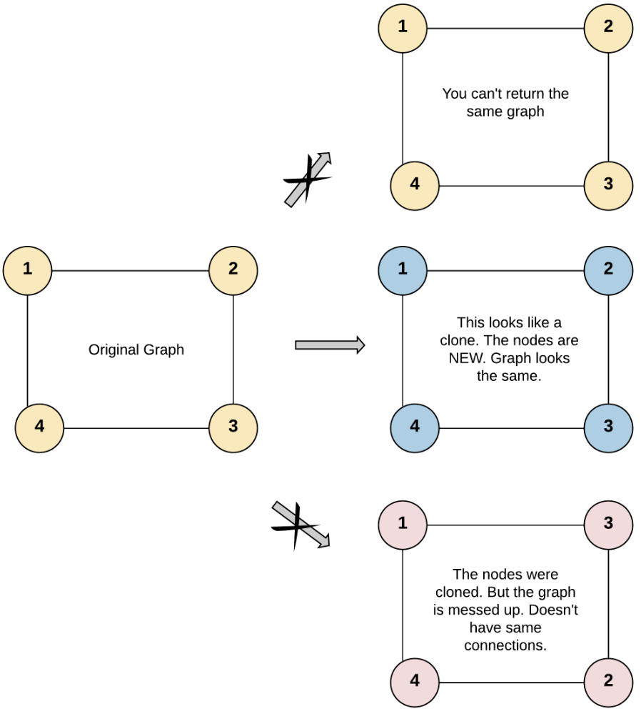
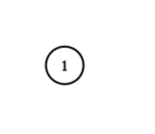
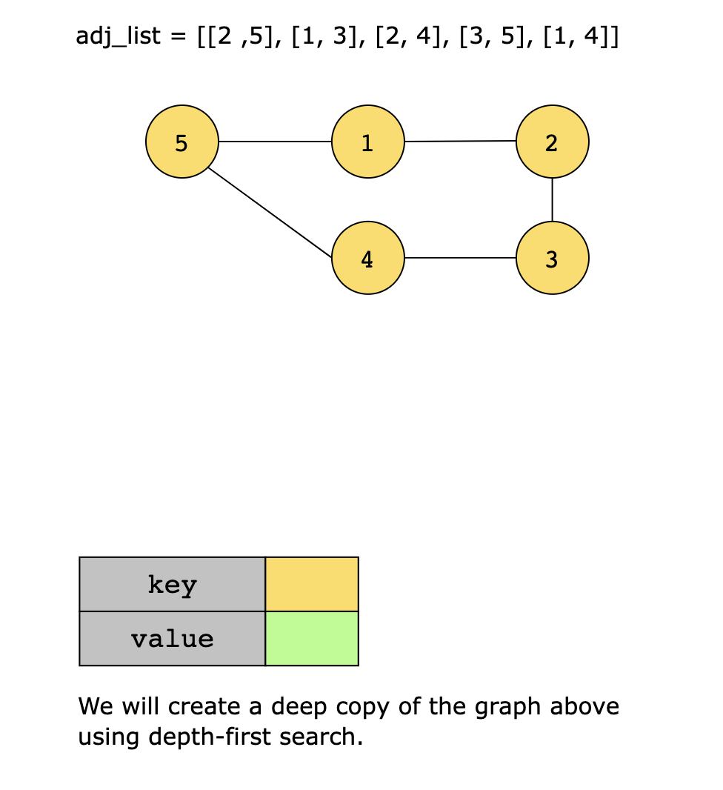
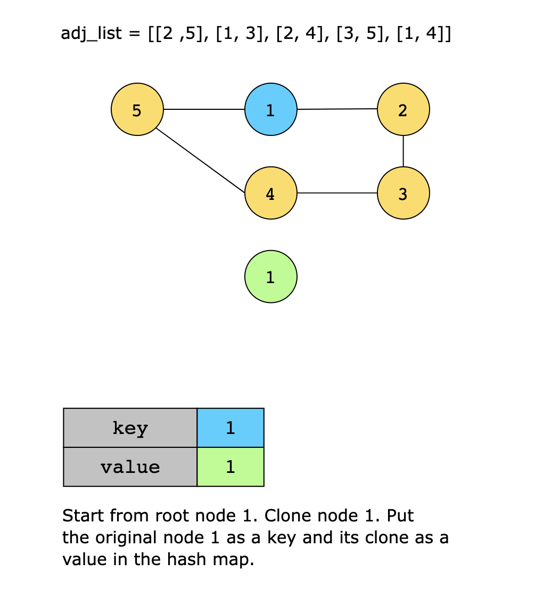
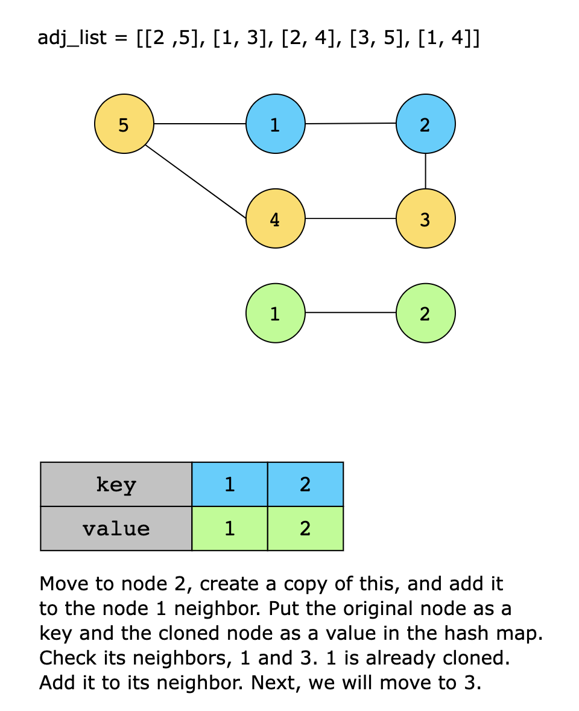
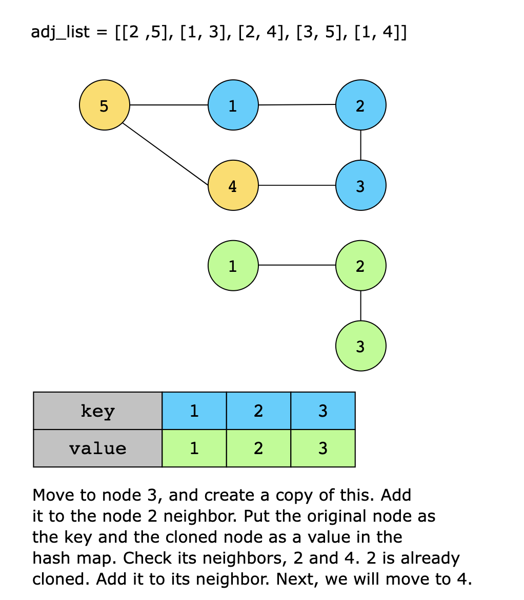
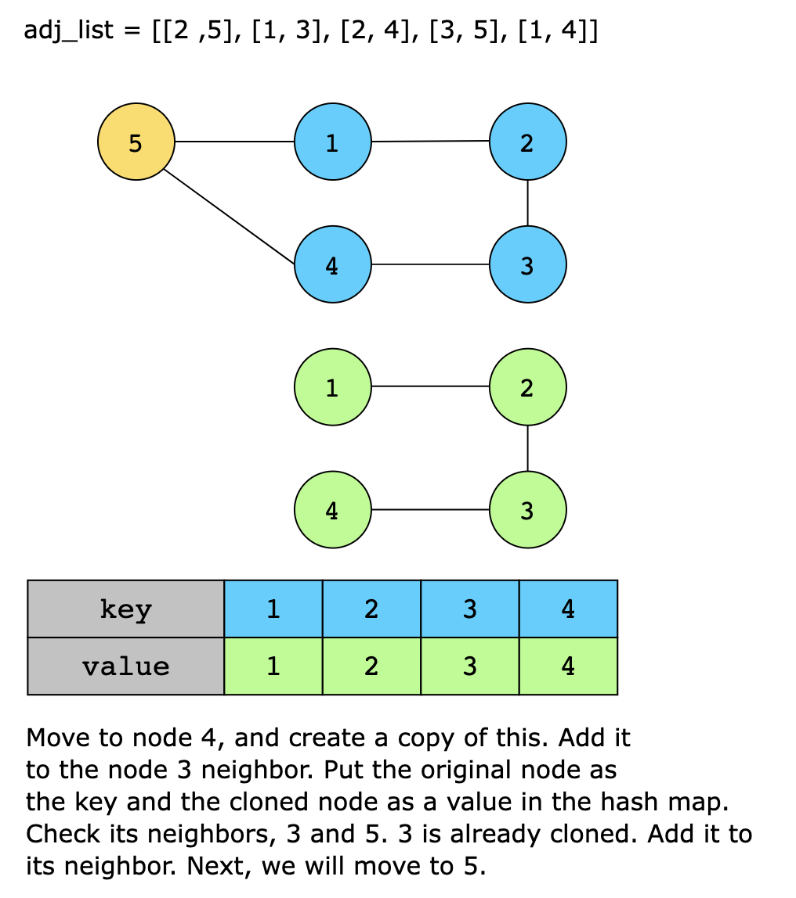
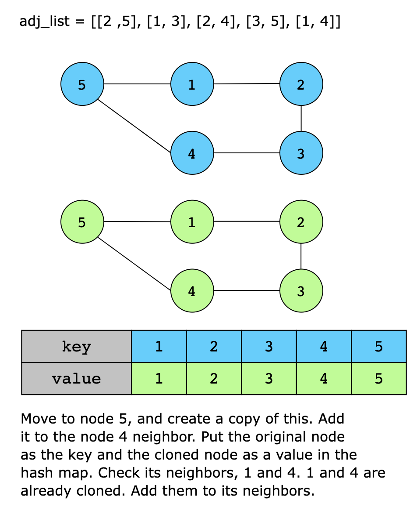

# Clone Graph

You are given a reference to a single node in an undirected, connected graph. Your task is to create a deep copy of the
graph starting from the given node. A deep copy means creating a new instance of every node in the graph with the same
data and edges as the original graph, such that changes in the copied graph do not affect the original graph.

Each node in the graph contains two properties:

- `data`: The value of the node, which is the same as its index in the adjacency list. 
- `neighbors`: A list of connected nodes, representing all the nodes directly linked to this node.

However, in the test cases, a graph is represented as an adjacency list to understand node relationships, where each
index in the list represents a node (using 1-based indexing). For example, for [[2,3],[1,3],[1,2]], there are three
nodes in the graph:

1st node (data = 1): Neighbors are 2nd node (data = 2) and 3rd node (data = 3).
2nd node (data = 2): Neighbors are 1st node (data = 1) and 3rd node (data = 3).
3rd node (data = 3): Neighbors are 1st node (data = 1) and 2nd node (data = 2).

The adjacency list will be converted to a graph at the backend and the first node of the graph will be passed to your
code.

## Constraints

- 0 ≤ Number of nodes ≤ 100
- 1 ≤ Node.data ≤ 100
- Node.data is unique for each node.
- The graph is undirected, i.e., there are no self-loops or repeated edges. 
- The graph is connected, i.e., any node can be visited from a given node.

## Topics

- Hash Table
- Depth-First Search
- Breadth-First Search
- Graph Theory

## Examples

> Input: adjList = [[2,4],[1,3],[2,4],[1,3]]
> Output: [[2,4],[1,3],[2,4],[1,3]]
> Explanation: There are 4 nodes in the graph.
> 1st node (val = 1)'s neighbors are 2nd node (val = 2) and 4th node (val = 4).
> 2nd node (val = 2)'s neighbors are 1st node (val = 1) and 3rd node (val = 3).
> 3rd node (val = 3)'s neighbors are 2nd node (val = 2) and 4th node (val = 4).
> 4th node (val = 4)'s neighbors are 1st node (val = 1) and 3rd node (val = 3).

> Input: adjList = [[]]
> Output: [[]]
> Explanation: Note that the input contains one empty list. The graph consists of only one node with val = 1 and it does
> not have any neighbors.

> Example 3
> Input: adjList = []
> Output: []
> Explanation: This an empty graph, it does not have any nodes.

## Solution

We use depth-first traversal and create a copy of each node while traversing the graph. We use a hash map to store each
visited node to avoid getting stuck in cycles. We do not revisit nodes that exist in the hash map. The hash map key is
a node in the original graph, and its value is the corresponding node in the cloned graph.

In order to solve this problem using the methodology discussed above, we create a recursive function, clone_helper, that
takes two arguments: the current node being cloned and a hash map. The steps of this recursive function are given below:

1. If graph is empty, return NULL. This will also work as a base case for our recursive function.
2. If the current node is not NULL, create a new Node with the same data as the current node, and add the current node
   as key and its clone as value to the hash map.
3. Iterate through all the neighbors of the current node. For each neighbor, check if the neighbor is already cloned by
   looking up the neighbor in the hash map:
   - If the neighbor is not cloned yet, recursively call the function with the neighbor as the current node. 
   - If the neighbor is already cloned, add the cloned neighbor to the new node’s neighbors.
4. Finally, return the new node.

The clone function is the main function that creates a deep copy of the graph. It takes a single argument, which is a
reference to the root node of the graph. The function creates an empty hash map to keep track of nodes that have already
been cloned. Then it calls the clone_helper function, passing in the root node and the hash map.

### Time Complexity

The time complexity of this code is O(n+m), where n is the number of nodes, and m is the number of edges.

### Space Complexity

The space complexity of this code is O(n), where n is the number of nodes in the dictionary.

> Note: We can also solve this problem using BFS.

