# HashMap Design

Design a HashMap without using any built-in hash table libraries.

Implement the HashMap class:

- HashMap() initializes the object with an empty map.
- void `set(int key, int value)` inserts a (key, value) pair into the HashMap. If the key already exists in the map,
  update the corresponding value.
- `int get(int key)` returns the value to which the specified key is mapped, or -1 if this map contains no mapping for
  the key.
- `void remove(key)` removes the key and its corresponding value if the map contains the mapping for the key.

## Example

Example 1:

```text
Input
["MyHashMap", "put", "put", "get", "get", "put", "get", "remove", "get"]
[[], [1, 1], [2, 2], [1], [3], [2, 1], [2], [2], [2]]
Output
[null, null, null, 1, -1, null, 1, null, -1]

Explanation
MyHashMap myHashMap = new MyHashMap();
myHashMap.put(1, 1); // The map is now [[1,1]]
myHashMap.put(2, 2); // The map is now [[1,1], [2,2]]
myHashMap.get(1);    // return 1, The map is now [[1,1], [2,2]]
myHashMap.get(3);    // return -1 (i.e., not found), The map is now [[1,1], [2,2]]
myHashMap.put(2, 1); // The map is now [[1,1], [2,1]] (i.e., update the existing value)
myHashMap.get(2);    // return 1, The map is now [[1,1], [2,1]]
myHashMap.remove(2); // remove the mapping for 2, The map is now [[1,1]]
myHashMap.get(2);    // return -1 (i.e., not found), The map is now [[1,1]]
```

## Constraints

- 0 <= key, value <= 106
- At most 104 calls will be made to put, get, and remove.

## Topics

- Array
- Hash Table
- Linked List
- Design
- Hash Function

## Solution

A hash map is a fundamental data structure found in various programming languages. Its key feature is facilitating fast
access to a value associated with a given key. Designing an efficient hash map involves addressing two main challenges:

1. **Hash function design**: The hash function serves to map a key to a location in the storage space. A good hash
   function ensures that keys are evenly distributed across the storage space, preventing the clustering of keys in
   certain locations. This even distribution helps maintain efficient access to stored values.

2. **Collision handling**: Despite efforts to evenly distribute keys, collisions—where two distinct keys map to the same
   storage location—are inevitable due to the finite nature of the storage space compared to the potentially infinite
   key space. Effective collision-handling strategies are crucial to ensure data integrity and efficient retrieval. To
   deal with collisions, we can use methods like chaining, where we link multiple values together at that location, or
   open addressing, where we find another empty location for the key.

### Step-by-step solution construction

The first step is to design a hash function using the modulo operator, particularly suitable for integer-type keys.
The modulo operator, denoted by %, is a mathematical operation that returns the remainder of dividing one number by
another. When selecting a modulo base, it’s advisable to choose a prime number. This is because choosing a prime number
as the modulo base helps minimize collisions. Since prime numbers offer better distribution of hash codes, reducing the
likelihood of collisions (where two different keys hash to the same value).

Here’s the implementation of a hash function using a prime number, 2069, as the modulo base. This particular prime number
is likely chosen because it is relatively large, offering a wide range of possible hash codes and reducing the chance
of collisions.

```python
def calculate_hash(key):
    key_base = 2069
    return key % key_base

def main():
    # Example usage:
    keys = [1, 2068, 2070]
    i = 0
    for key in keys:
        i+=1
        hashed_value = calculate_hash(key)
        print(i, ".\tKey:", key)
        print("\tHashed value:", hashed_value)

main()
```

```text
1 .	Key: 1 
    Hashed value: 1

2 .	Key: 2068
	Hashed value: 2068
 
3 .	Key: 2070
	Hashed value: 1
```

In the code provided above, collisions occur because when taking the modulo of keys with the base value of 2069, both
keys 1 and 2070 yield the same hash value of 1, leading to a collision.

Now, let’s look at a visual representation of hash collision:

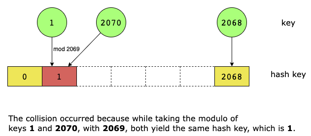

In the scenario illustrated in the diagram above, when two distinct keys are assigned to the same address, it results in
a collision. Therefore, the second step is to handle collision by using a storage space where each element is indexed by
the output of the hash function. To address this, we use a container, bucket, designed to store all values that are
assigned the same hash value by the hash function.

Let’s look at the diagram below to visualize collision handling through the use of buckets:

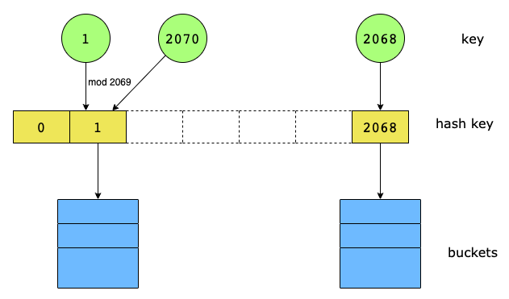

Now, let’s design a Bucket for collision handling supporting primary operations: Get, Update, and Remove. These operations
allow for efficient management of key-value pairs within each bucket, accommodating cases where multiple keys hash to
the same index.

- **Get(key)**: Searches the bucket for a key-value pair where the key matches the provided argument. If such a pair is
  found, the method returns the corresponding value. If the key does not exist within the bucket, the method returns 
  −1. This functionality is crucial for retrieval operations in a hash table, allowing for efficient access to stored
  data based on keys.
- **Update(key, value)**: Looks for the specified key in the bucket. If the key is found, the method updates the existing
  key-value pair with the new value provided. If the key is not found, the method adds a new key-value pair to the bucket.
  This dual functionality ensures that the bucket can dynamically adjust to changes in data, either by updating existing
  entries or adding new ones to accommodate new keys.
- **Remove(key)**: Searches the bucket for a key-value pair matching the specified key. If such a pair is found, the
  method removes it from the bucket, effectively handling the deletion of entries.

Collision handling occurs implicitly within the Update function of the Bucket. It effectively handles collisions by
allowing multiple key-value pairs with the same hash value (i.e., the same bucket index) to coexist within the bucket.

Moving forward, the third step involves designing a hash map by utilizing the hash function and the Bucket designed earlier.

To design a hash map, the core operation involves locating stored values by key. Therefore, for each hash map method—
Get, Put, and Remove—the primary task revolves around locating stored values by key. This process involves two steps:

1. Applying the hash function to generate a hash key for a given key value, determining the address in the main storage
   and finding the corresponding bucket.
2. Iterating through the bucket to check if the desired key-value pair exists.

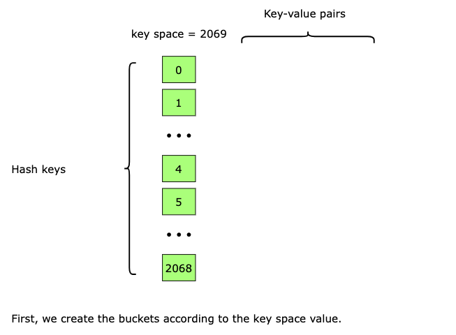
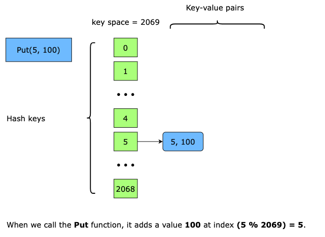
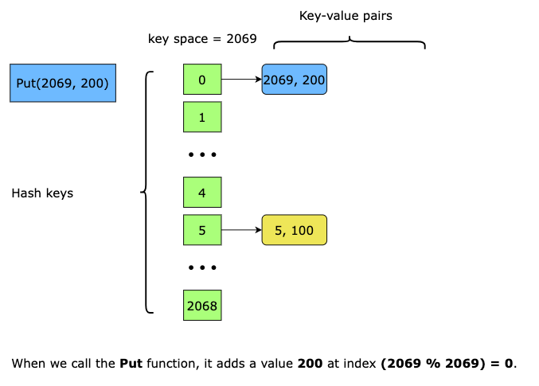
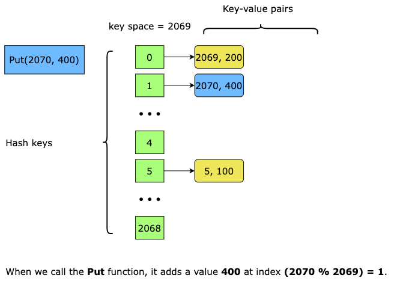
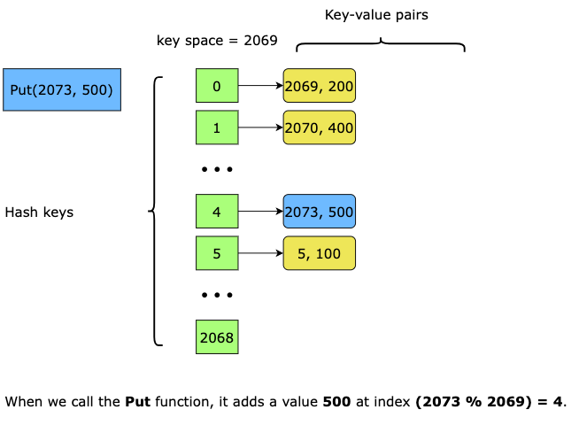
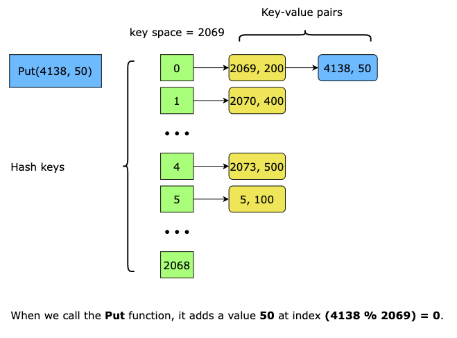
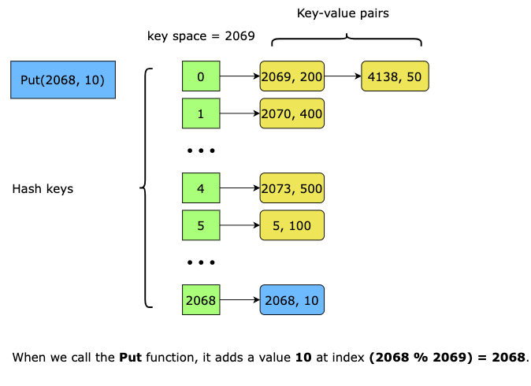
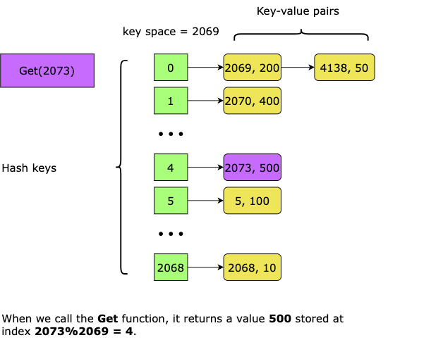
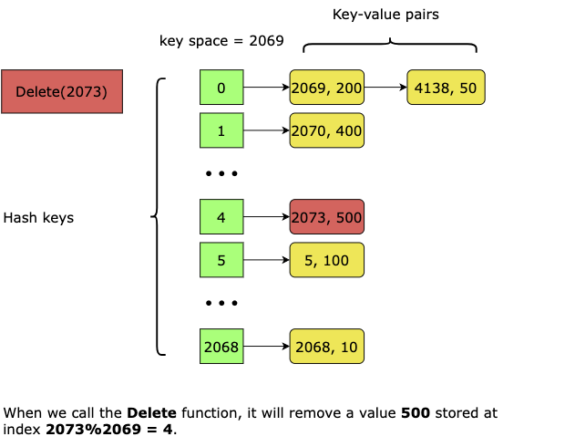
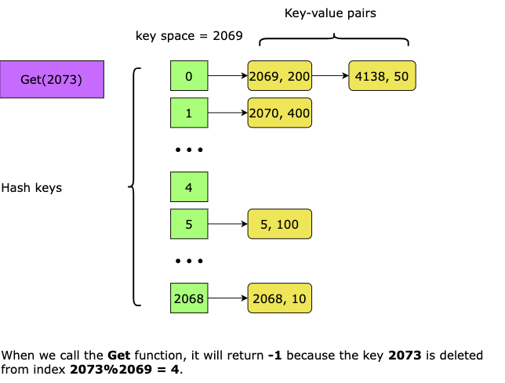
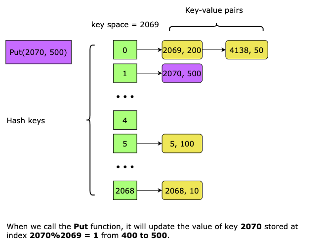

### Solution Summary

1. Choose a prime number for the key space size (preferably a large one). 
2. Create an array and initialize it with empty buckets equal to the key space size. 
3. Generate a hash key by taking the modulus of the input key with the key space size. 
4. Implement the following functions:
   - Put(key, value): Inserts the value into the bucket at the computed hash key index 
   - Get(key): Searches for the key in the bucket and returns the associated value 
   - Remove(key): Deletes the element at the specified key from the bucket and the hash map

### Time Complexity

Each method of the hash map has a time complexity of O(N/K), where N represents the total number of possible keys, and
K represents the key space size, which in our case is 2069.

In an ideal scenario with evenly distributed keys, the average size of each bucket can be considered as N/K. However, in
the worst-case scenario, we may need to iterate through an entire bucket to find the desired value, resulting in a time
complexity of O(N) for each method.

### Space Complexity

The space complexity is O(K+M), where K denotes the key space size, and M represents the number of unique keys that have
been inserted into the hashmap.
