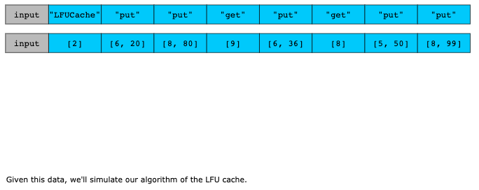
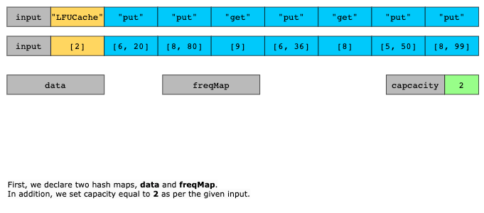
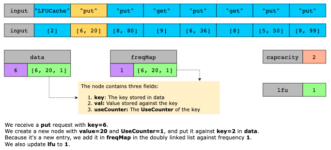
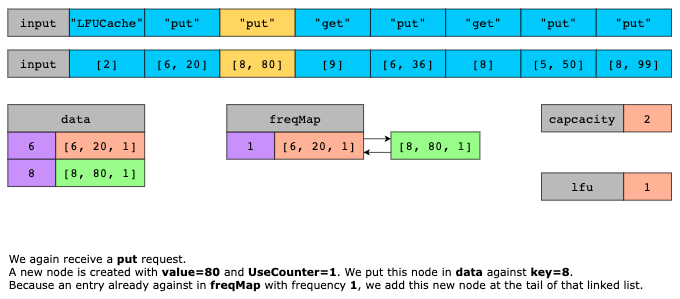
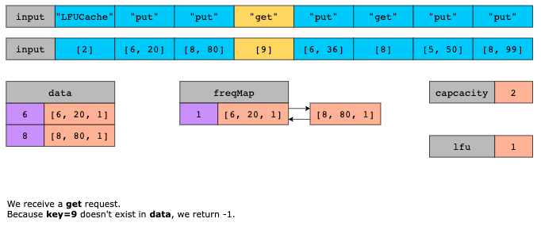
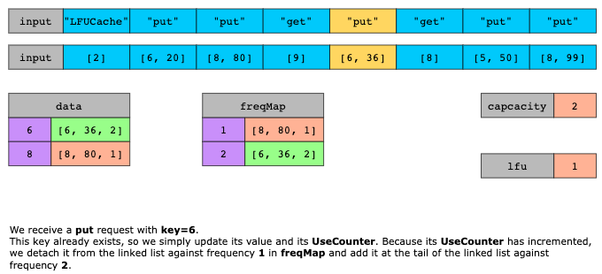
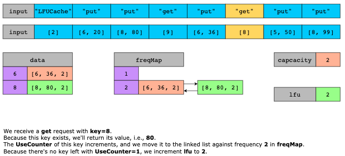
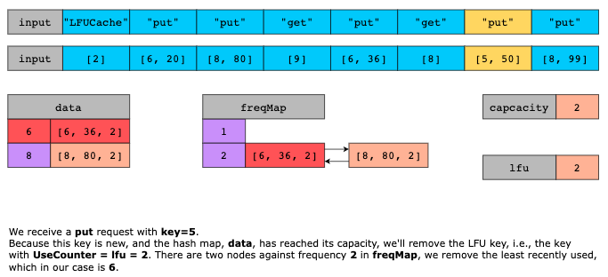
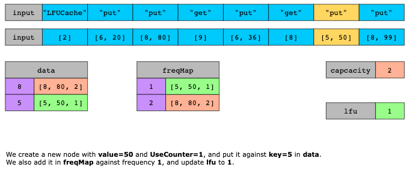
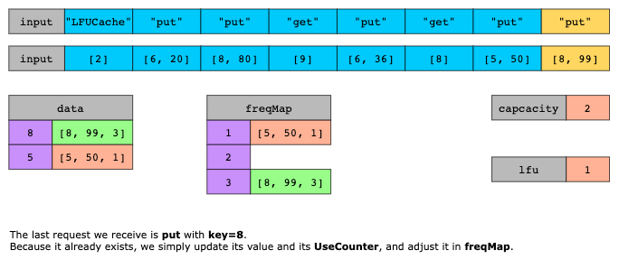

# LFU Cache

Design and implement a data structure for a Least Frequently Used (LFU) cache.

Implement the LFUCache class:

LFUCache(int capacity) Initializes the object with the capacity of the data structure.
int get(int key) Gets the value of the key if the key exists in the cache.
Otherwise, returns -1.

void put(int key, int value) Update the value of the key if present, or inserts the key if not already present.
When the cache reaches its capacity, it should invalidate and remove the least frequently used key before inserting a
new item. For this problem, when there is a tie (i.e., two or more keys with the same frequency),
he least recently used key would be invalidated.

To determine the least frequently used key, a use counter is maintained for each key in the cache. The key with the
smallest use counter is the least frequently used key.

When a key is first inserted into the cache, its use counter is set to 1 (due to the put operation). The use counter
for a key in the cache is incremented either a get or put operation is called on it.

## Solution

The LFU cache algorithm tracks how often each key is accessed to determine which keys to remove when the cache is full.
It uses one hash map to store key-value pairs and another to group keys by their access frequency. Each group in this
frequency hash map contains nodes arranged in a doubly linked list. Additionally, it keeps track of the current least
frequency to quickly identify the least used keys. When the cache reaches its limit, the key with the lowest frequency
is removed first, specifically from the head of the corresponding linked list.

Each time a key is accessed, its frequency increases, and its position in the frequency hash map is updated, ensuring
that the least used keys are prioritized for removal. This is where the doubly linked list is helpful, as the node being
updated might be located somewhere in the middle of the list. Shifting the node to the next frequency level can be done
in constant time, making the update process efficient.

Let’s discuss the algorithm of the LFU cache data structure in detail. We maintain two hash maps, `lookup` and `frequencyMap`,
and an integer, `minimum_frequency`, as follows:

- `lookup` keeps the key-node pairs. 
  - The node contains three values: `key`, `value`, and `frequency`.

- `frequencyMap` maintains doubly linked lists against every frequency existing in the data. 
  - For example, all the keys that have been accessed only once reside in the double linked list stored at `frequencyMap[1]`,
    all the keys that have been accessed twice reside in the double linked list stored at `frequencyMap[2]`, and so on.

- `minimum_frequency` keeps the frequency of the least frequently used key.

Apart from the required functions i.e., Get and Put, we implement a helper function, `PromoteKey` that helps us maintain
the order of the keys with respect to the frequency of their use. This function is implemented as follows:

- First, retrieve the node associated with the key.
- If node's `frequency` is 0, the key is new. We simply increment its `frequency` and insert it at the tail of the
  linked list corresponding to the frequency 1
- Otherwise, detach the `node` from its corresponding linked list. 
  - If the corresponding linked list becomes empty after detaching the node, and the node’s `frequency` equals `minimum_frequency`, 
    there's no key left with a frequency equal to `minimum_frequency`. Hence, increment `minimum_frequency`.
- Increment `frequency` of the key
- Insert node at the tail of the linked list associated with the frequency corresponding to the updated `frequency`.
  - Before inserting it, check if the linked list exists. Suppose it doesn’t, create one.

After implementing `PromoteKey()`, the LFU cache functions are implemented as follows:
- `Get`: We check if the key exists in the cache. 
  - If it doesn't, we return `None`
  - Otherwise, we promote the key using `PromoteKey()` function and return the value associated with the key.
- `Put`: We check if the key exists in the cache. 
  - If it doesn't, we must add this (key, value) pair to our cache. 
    - Before adding it, we check if the cache has already reached capacity. If it has, we remove the LFU key. To do that,
      we remove the head node of the linked list accociated with the frequency equal to `minimum_frequency`. 
    - If it does, we simply update key with the value. 
    - At the end of both steps, we adjust the frequency order of the key using `PromoteKey()`.

### Time Complexity

The time complexity of `PromoteKey()` is `O(1)` because the time taken to detach a node from a doubly linked list and
insert a node at the tail of a linked list is `O(1)`. The time complexity of both Put and Get functions is `O(1)` because
they utilize `PromoteKey()` and some other constant time operations.

### Space Complexity

The space complexity of this algorithm is linear, `O(n)`, where `n` refers to the capacity of the data structure. This
is the space occupied by the hash maps.
