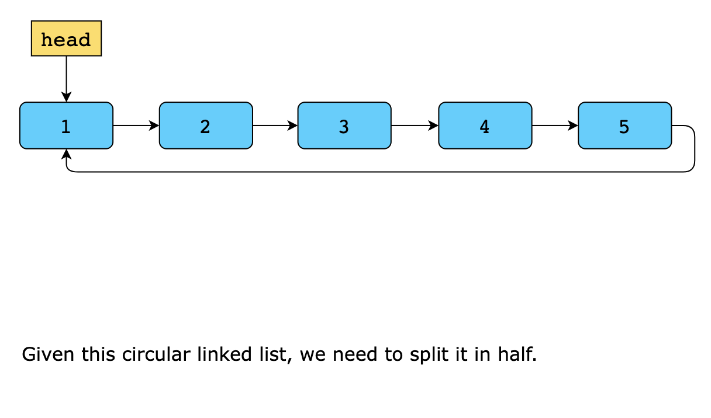
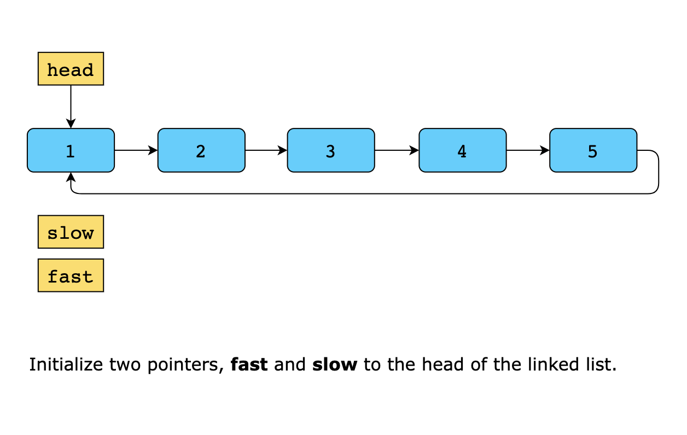
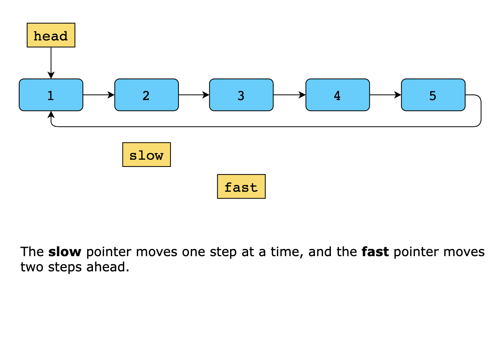
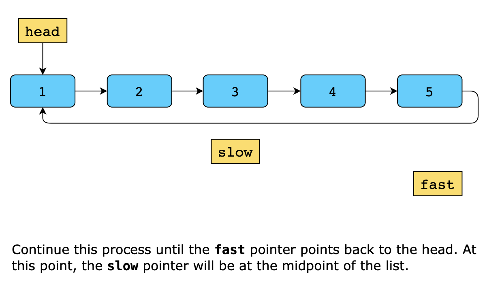
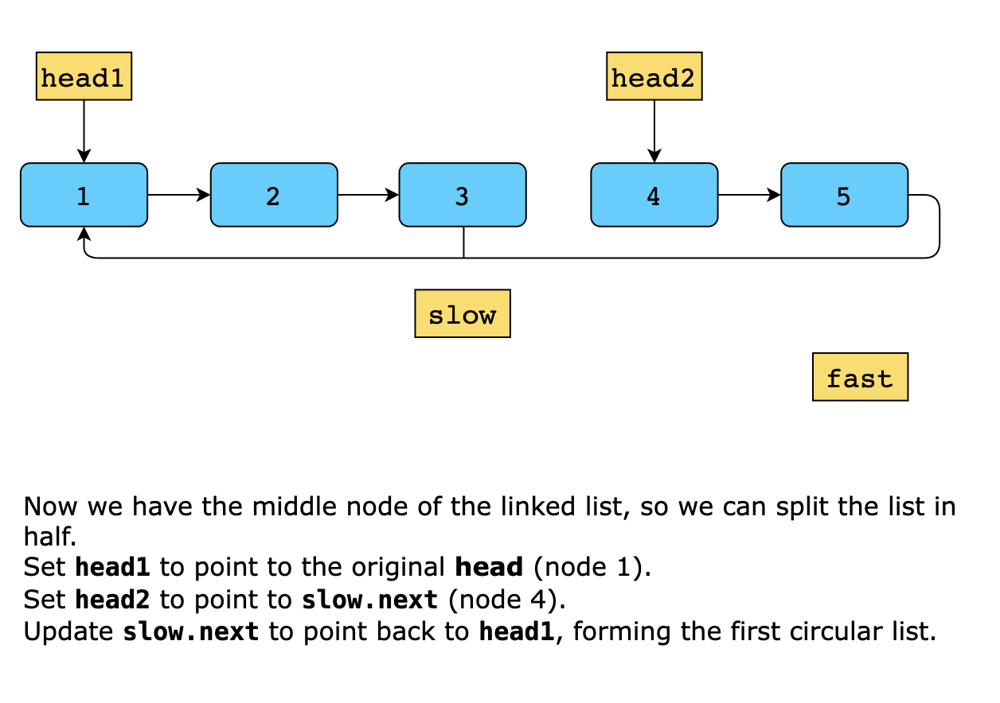
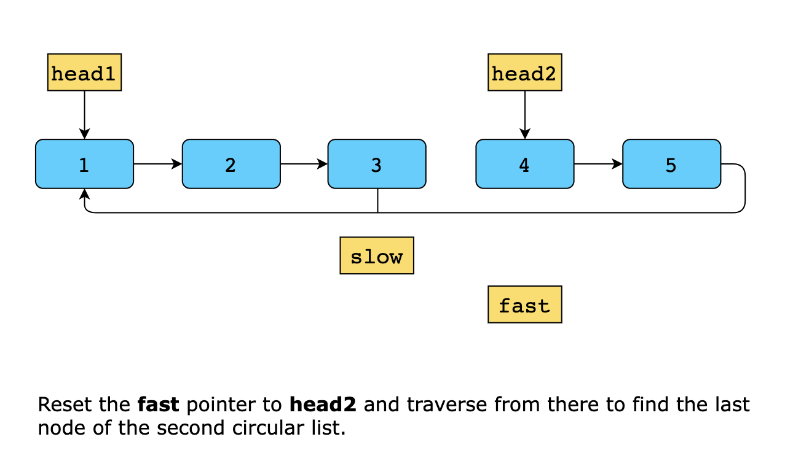
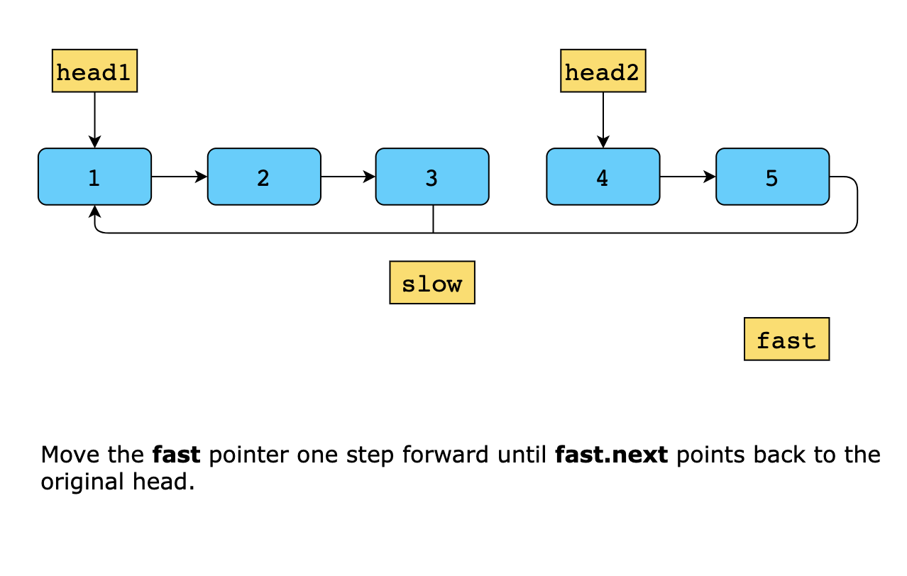
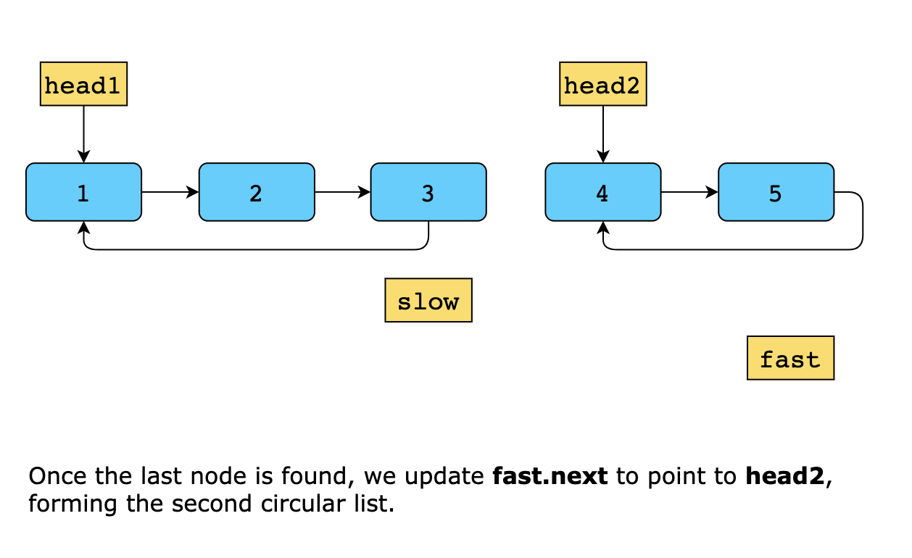

# Circular Linked List

A circular linked list is a linked list with a cycle such that the tail node points back to the head node forming a complete
cycle.

---

## Split a Circular Linked List

Given a circular linked list, list, of positive integers, split it into two circular linked lists. The first circular
linked list should contain the first half of the nodes (exactly ⌈list.length / 2⌉ nodes) in the same order they appeared
in the original list, while the second circular linked list should include the remaining nodes in the same order.

Return an array, answer, of length 2, where:

- answer[0] is the head of the circular linked list representing the first half.
- answer[1] is the head of the circular linked list representing the second half.

> Note: A circular linked list is a standard linked list where the last node points back to the first node.

### Constraints

Constraints:

Let n be the number of nodes in a linked list.

- 2 ≤ `n` ≤ 10^3
- 0 ≤ `Node.value` ≤ 10^5
- `LastNode.next = FirstNode` where `LastNode` is the last node of the list and `FirstNode` is the first one

### Solution

The core idea is to use the slow and fast pointer approach, a well-known technique for finding the middle of a linked
list in an optimized manner. The slow pointer moves one step at a time, while the fast pointer moves two steps,
ensuring that when the fast pointer completes its traversal, the slow pointer will be at the midpoint. Once the middle
is found, we break the circular connection at this midpoint, forming two separate lists. The first half starts from the
head and extends up to the slow pointer, with its last node pointing back to the head to maintain the circular structure.
The second half begins from the next node after the slow pointer and extends to the original last node, which is then
linked back to this second half’s new head, ensuring both resulting lists remain circular. Finally, the two newly formed
circular linked lists are returned as separate head pointers representing the start of each half.

Now, let’s walk through the steps of the solution:

1. We initialize the slow and fast pointers to the head of the list. The slow pointer moves one node at a time while the
   fast pointer moves two nodes at a time.
2. We iterate through the list using the fast and slow pointers until the fast pointer has reached back to the head,
   ensured by the conditions fast.next != head and fast.next.next != head.
3. After iterating, the slow pointer will be at the middle point of the list, while the fast pointer will be pointing
   back to the head. This middle point node serves as the point where we will split the list into two halves.
4. The first circular linked list will start from the original head (head1 = head). Before modifying slow.next, we store
   slow.next in head2 to retain the starting node of the second half. Then, we update slow.next to point back to head1,
   effectively closing the first circular half.
5. The second half of the list begins from the node immediately following the middle point, which we stored in head2 in
   the previous step. This prevents losing the reference to the second half’s start after updating slow.next for the
   first half.
6. Next, we need to ensure that the second half is also circular. To do this, we traverse the second half starting from
   head2 using the fast pointer. The fast moves throughout the list until it points back to the head.
7. Once the fast pointer reaches the head, we update fast.next=head2, closing the second circular list.
8. Finally, we return the heads of two split circular linked lists as an array: [head1, head2].

#### Time Complexity

The time complexity of the solution is `O(n)`, where `n` is the total number of nodes in the circular linked list. This
is because we make two passes over the list—one to count the nodes and another to split the list.

#### Space Complexity

The space complexity is `O(1)` because the solution uses constant space regardless of the input size.
