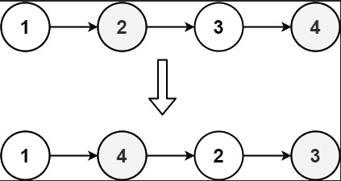
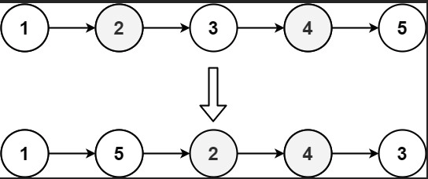

# Reorder List

You are given the head of a singly linked-list. The list can be represented as:

L0 → L1 → … → Ln - 1 → Ln
Reorder the list to be on the following form:

L0 → Ln → L1 → Ln - 1 → L2 → Ln - 2 → …
You may not modify the values in the list's nodes. Only nodes themselves may be changed.



```
Input: head = [1,2,3,4]
Output: [1,4,2,3]
```



```
Input: head = [1,2,3,4,5]
Output: [1,5,2,4,3]
```
