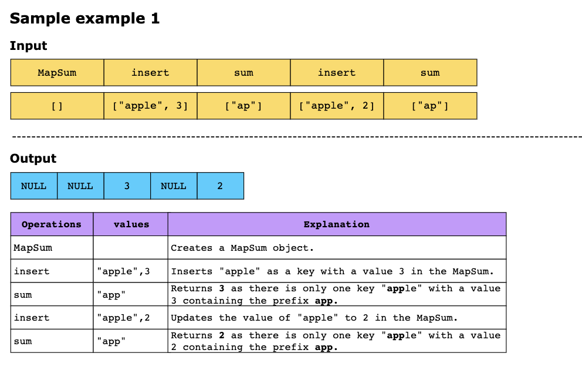
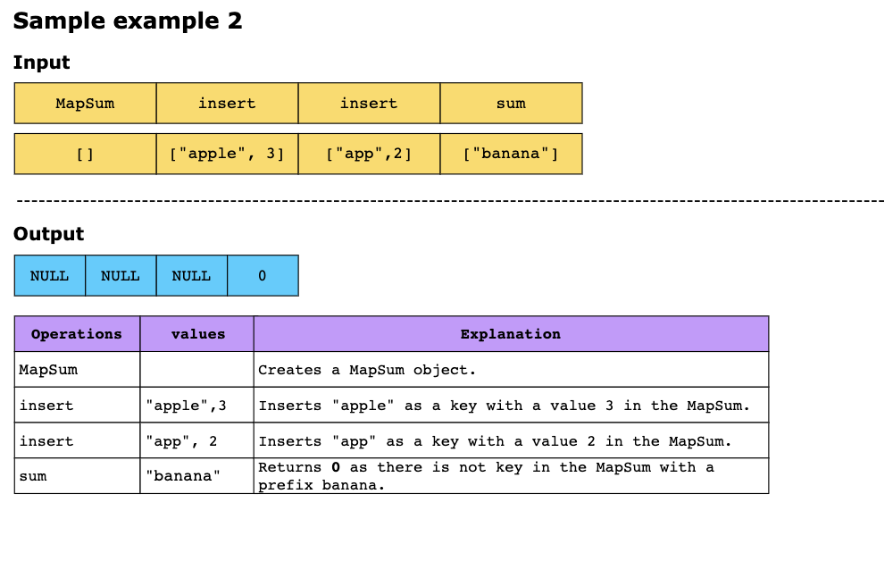
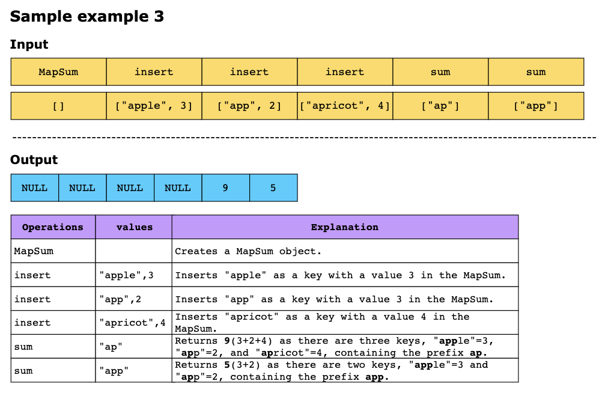

# Map Sum Pairs

Design a data structure that supports the following operations:

1. Insert a key-value pair:
   - Each key is a string, and each value is an integer.
   - If the key already exists, update its value to (overriding the previous value).

2. Return the prefix sum:
   - Given a string, `prefix`, return the total sum of all values associated with keys that start with this prefix.

To accomplish this, implement a class MapSum:

- Constructor: Initializes the object. 
- `void insert (String key, int val)`: Inserts the key-value pair into the data structure. If the key already exists,
  its value is updated to the new one. 
- `int sum (String prefix)`: Returns the total sum of values for all keys that begin with the specified prefix.

## Constraints

- 1 ≤ `key.length`, `prefix.length` ≤ 50
- Both `key` and `prefix` consist of only lowercase English letters.
- 1 ≤ `val` ≤ 1000
- At most 50 calls will be made to insert and sum.

## Examples

## Topics

- Hash Table
- String
- Design
- Trie
