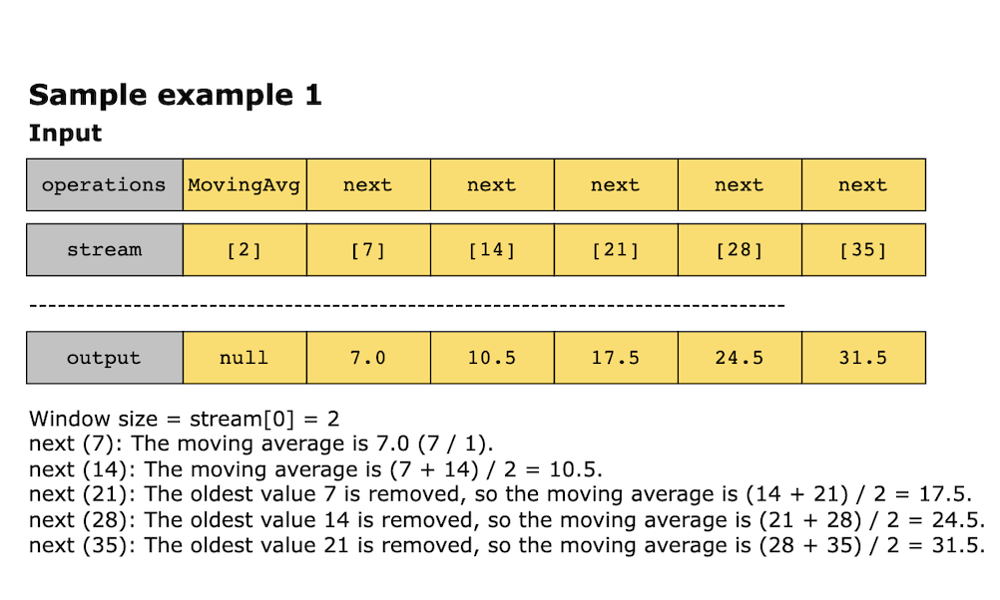

# Moving Average from Data Stream

Given a stream of integers and a window size, calculate the moving average of all integers in the sliding window. 
Implement a class called MovingAverage that has the following methods:

Constructor (int size): This constructor initializes the object with the specified window size.

double next (int val): This method takes an integer value as input and returns the moving average of the last size 
values from the stream.

## Constraints

- 1 <= size <= 100
- -10^3 <= val <= 10^3
- At most 10^2 calls will be made to next

## Examples

## Solution

The algorithm calculates the moving average of the most recent values within a fixed-size window. It employs a queue to
store these values and maintains a running sum for efficient computation. Each time a new value is added to the window,
it is appended to the queue, and the running sum is updated accordingly. If the queue exceeds the specified size (i.e.,
the window is full), the oldest value is removed from the queue, and the sum is adjusted by subtracting this value. The
moving average is then calculated by dividing the running sum by the number of values in the queue. This approach ensures
that the moving average is updated, achieving constant time complexity for each operation.

1. **Constructor**: The constructor initializes the following variables:
   - _size_: This represents the window size, the maximum number of recent values for calculating the moving average. 
   - _queue_: A queue data structure stores the most recent values up to the specified window size. The queue supports 
     efficient operations for adding new values to the end and removing the oldest value from the front, essential for 
     maintaining the sliding window.
   - _window_sum_: This keeps a running sum of the values currently in the window. This allows the moving average to be 
     calculated efficiently without the need to sum all values repeatedly.

2. The **next** method: The next method calculates the moving average by following these steps:
   - Enqueue the new value (val) to queue and add it to window_sum. This effectively extends the current sliding window 
     to include the new value.
   - If the number of elements in queue exceeds size (indicating the window is full), remove the oldest value from queue
     and update window_sum by subtracting this value. This ensures the queue size stays within the specified window size. 
   - Compute the moving average as window_sum / len(queue). Use floating-point division to ensure the result is a float.

### Time Complexity

1. **Constructor**: Initializing the MovingAverage instance with a given size takes O(1) time. This is because the operation
   involves only setting the size, initializing an empty queue, and initializing the sum.
2. **Next method**: 
   - Appending a value: Adding a value to the queue takes O(1) time as operations like append and popleft are optimized 
    for constant time execution in a queue.
   - Removing the oldest value: If the window is full, removing the oldest value also takes O(1) time, as popleft is a 
     constant time operation in a queue.
   - Calculating the moving average: This step involves dividing window_sum by the number of elements in the queue, 
     which is an O(1) operation.

Thus the time complexity of the next method is O(1).

### Space Complexity

The queue holds up to _size_ elements at any given time (i.e., the number of elements in the sliding window). Therefore, 
the space complexity of the queue is O(size), where size is the maximum window size.
