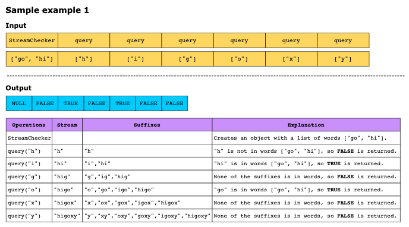
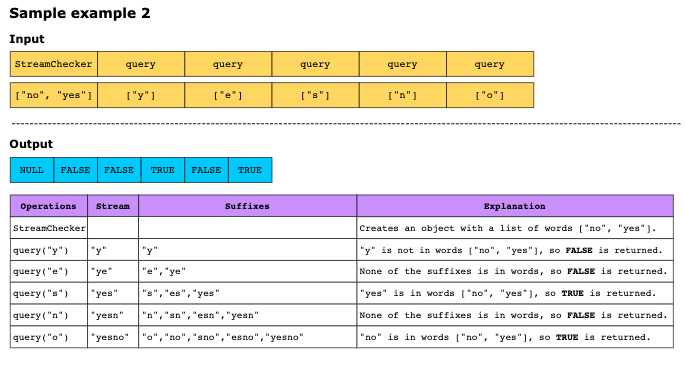
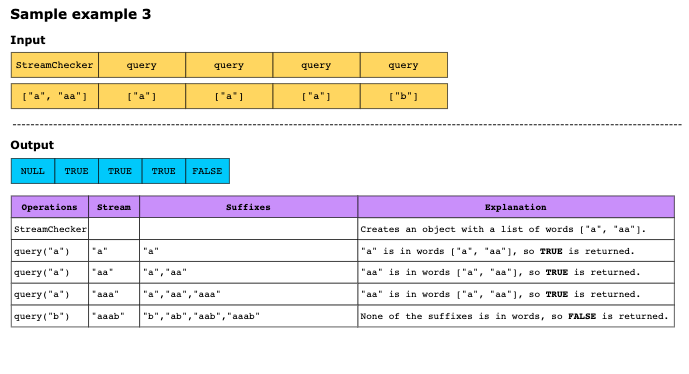

# Stream of Characters

Design a data structure that processes a stream of characters and, after each character is received, determines if a 
suffix of these characters is a string in a given array of strings words.

For example, if words = ["dog"] and the stream adds the characters ‘d’, ‘c’, ‘a’ , and ‘t’ in sequence, the algorithm 
should detect that the suffix "cat" of the stream "dcat" matches the word "cat" from the list.

So, for words, the goal is to detect if any of these words appear as a suffix of the stream built so far. To accomplish
this, implement a class StreamChecker:

- **Constructor**: Initializes the object with the list of target words.
- **boolean query(char letter)**: Appends a character to the stream and returns TRUE if any suffix of the stream matches
  a word in the list words.

Constraints:

- 1 ≤ words.length ≤ 1000
- 1 ≤ words[i].length ≤ 200
- words[i] consists of lowercase English letters.
- letter is a lowercase English letter.
- At most 4 * 10^2 calls will be made to query.

Examples:

