# Binary Search Tree

Contains binary search tree implementation in Python

Write a function to find the 2nd largest element in a binary search tree ↴ A binary search tree is a binary tree in
which, for each node:

The node's value is greater than all values in the left subtree. The node's value is less than all values in the right
subtree. BSTs are useful for quick lookups. If the tree is balanced, we can search for a given value in the tree in O(
\lg{n})O(lgn) time.

Let's start by solving a simplified version of the problem and see if we can adapt our approach from there. How would we
find the largest element in a BST?

A reasonable guess is to say the largest element is simply the "rightmost" element.

So maybe we can start from the root and just step down right child pointers until we can't anymore (until the right
child is None). At that point the current node is the largest in the whole tree.

Is this sufficient? We can prove it is by contradiction:

If the largest element were not the "rightmost," then the largest element would either:

be in some ancestor node's left subtree, or have a right child. But each of these leads to a contradiction:

If the node is in some ancestor node's left subtree it's smaller than that ancestor node, so it's not the largest. If
the node has a right child that child is larger than it, so it's not the largest. So the "rightmost" element must be the
largest.

How would we formalize getting the "rightmost" element in code?

We can use a simple recursive approach. At each step:

If there is a right child, that node and the subtree below it are all greater than the current node. So step down to
this child and recurse. Else there is no right child and we're already at the "rightmost" element, so we return its
value.

``` python
  def find_largest(root_node):
    if root_node.right:
        return find_largest(root_node.right)
    return root_node.value
```

> Okay, so we can find the largest element. How can we adapt this approach to find the second largest element?

Our first thought might be, "it's simply the parent of the largest element!" That seems obviously true when we imagine a
nicely balanced tree like this one:

.        ( 5 )
/     \
(3)     (8)
/ \ /  \
(1)  (4) (7)  (9)
But what if the largest element itself has a left subtree?

.        ( 5 )
/     \
(3)     (8)
/ \ /  \
(1)  (4) (7)  (12)
/
(10)
/  \
(9)  (11)
Here the parent of our largest is 8, but the second largest is 11!

Drat, okay so the second largest isn't necessarily the parent of the largest...back to the drawing board...

Wait. No. The second largest is the parent of the largest if the largest does not have a left subtree. If we can handle
the case where the largest does have a left subtree, we can handle all cases, and we have a solution.

So let's try sticking with this. How do we find the second largest when the largest has a left subtree?

It's the largest item in that left subtree! Woah, we freaking just wrote a function for finding the largest element in a
tree. We could use that here!

``` pythonstub
  def find_largest(root_node):
    if root_node is None:
        raise Exception('Tree must have at least 1 node')
    if root_node.right is not None:
        return find_largest(root_node.right)
    return root_node.value

def find_second_largest(root_node):
    if root_node is None or \
            (root_node.left is None and root_node.right is None):
        raise Exception('Tree must have at least 2 nodes')

    # case: we're currently at largest, and
    # largest has a left subtree
    # 2nd largest is largest in said subtree
    if root_node.left and not root_node.right:
        return find_largest(root_node.left)

    # case: we're at parent of largest,
    # and largest has no left subtree
    # so 2nd largest must be current node
    if root_node.right and \
       not root_node.right.left and \
       not root_node.right.right:
        return root_node.value

    # otherwise: step right
    return find_second_largest(root_node.right)
```

Okay awesome. This'll work. It'll take O(h)O(h) time (where hh is the height of the tree) and O(h)O(h) space.

But that hh space in the call stack ↴
> The call stack is what a program uses to keep track of what function it's currently running and what to do with that function's return value. Whenever you call a function, a new frame gets pushed onto the call stack, which is popped off when the function returns. As functions call other functions, the stack gets taller. In recursive functions, the stack can get as tall as the number of times the function calls itself. This can cause a problem: the stack has a limited amount of space, and if it gets too big you can get a stack overflow error.

is avoidable. How can we get this down to constant space?

Solution We start with a function for getting the largest value. The largest value is simply the "rightmost" one, so we
can get it in one walk down the tree by traversing rightward until we don't have a right child anymore:

def find_largest(root_node):
current = root_node while current:
if not current.right:
return current.value current = current.right

With this in mind, we can also find the second largest in one walk down the tree. At each step, we have a few cases:

If we have a left subtree but not a right subtree, then the current node is the largest overall (the "rightmost") node.
The second largest element must be the largest element in the left subtree. We use our get_largest() function above to
find the largest in that left subtree!
If we have a right child, but that right child node doesn't have any children, then the right child must be the largest
element and our current node must be the second largest element!
Else, we have a right subtree with more than one element, so the largest and second largest are somewhere in that
subtree. So we step right. def find_largest(root_node):
current = root_node while current:
if not current.right:
return current.value current = current.right

def find_second_largest(root_node):
if root_node is None or \
(root_node.left is None and root_node.right is None):
raise Exception('Tree must have at least 2 nodes')

    current = root_node

    while current:
        # case: current is largest and has a left subtree
        # 2nd largest is the largest in that subtree
        if current.left and not current.right:
            return find_largest(current.left)

        # case: current is parent of largest, and
        # largest has no children, so
        # current is 2nd largest
        if current.right and \
           not current.right.left and \
           not current.right.right:
            return current.value

        current = current.right

Complexity We're doing one walk down our BST, which means O(h)O(h) time, where hh is the height of the tree (again,
that's O(\lg{n})O(lgn) if the tree is balanced, O(n)O(n) otherwise). O(1)O(1) space.

What We Learned Here we used a "simplify, solve, and adapt" strategy.

The question asks for a function to find the second largest element in a BST, so we started off by simplifying the
problem: we thought about how to find the first largest element.

Once we had a strategy for that, we adapted that strategy to work for finding the second largest element.

It may seem counter-intuitive to start off by solving the wrong quesiton. But starting off with a simpler version of the
problem is often much faster, because it's easier to wrap our heads around right away.

One more note about this one:

Breaking things down into cases is another strategy that really helped us here.

Notice how simple finding the second largest node got when we divided it into two cases:

The largest node has a left subtree. The largest node does not have a left subtree. Whenever a problem is starting to
feel complicated. Try breaking it down into cases.

It can be really helpful to actually draw out sample inputs for those cases. This'll keep your thinking organized and
also help get your interviewer on the same page as you.

---

# Super Balanced Binary Tree

Write a function to see if a binary tree is "superbalanced" (a new tree property we just made up). A tree is "
superbalanced" if the difference between the depths of any two leaf nodes

> A leaf node is a tree node with no children.
> It's the "end" of a path to the bottom, from the root.

is no greater than one.

[Reference](https://www.interviewcake.com/question/python/balanced-binary-tree)

We do a depth-first walk through our tree, keeping track of the depth as we go. When we find a leaf, we throw its depth
into a list of depths if we haven't seen that depth already.

```
Depth-first traversal is a method for walking through a tree or graph where you go as deep as possible down a path before "fanning out." Your set of visited nodes will shoot out from the starting point along one path, with more single paths progressively shooting off of that one as each path hits a dead end.
Depth-first search or DFS uses depth-first traversal to search for something in a tree or graph.
Depth-first traversal is often compared with breadth-first traversal.

Advantages:
+ Depth-first traversal on a binary tree generally requires less memory than breadth-first.
+ Depth-first traversal can be easily implemented with recursion.

Disadvantages
+ A DFS doesn't necessarily find the shortest path to a node, while breadth-first search does.
```

Each time we hit a leaf with a new depth, there are two ways that our tree might now be unbalanced:

There are more than 2 different leaf depths There are exactly 2 leaf depths and they are more than 1 apart. Why are we
doing a depth-first walk and not a breadth-first ↴ one? You could make a case for either. We chose depth-first because
it reaches leaves faster, which allows us to short-circuit earlier in some cases.

```
Breadth-first traversal is a method for walking through a tree or graph where you "fan out" as much as possible before going deeper. Your set of visited nodes will seem to "ripple outwards" from the starting point.

Breadth-first search or BFS uses breadth-first traversal to search for something in a tree or graph.

Breadth-first traversal is often compared with depth-first traversal.

Advantages:

A BFS will not necessarily find a target as quickly as possible, but it will find the shortest path between the starting point and the target. A depth-first search will not necessarily find the shortest path.
Disadvantages

A BFS on a binary tree generally requires more memory than a DFS.
```

## Complexity

O(n) time and O(n) space.

For time, the worst case is the tree is balanced and we have to iterate over all n nodes to make sure.

For the space cost, we have two data structures to watch: depths and nodes.

depths will never hold more than three elements, so we can write that off as O(1).

Because we’re doing a depth first search, nodes will hold at most d nodes where d is the depth of the tree (the number
of levels in the tree from the root node down to the lowest node). So we could say our space cost is O(d).

But we can also relate d to n. In a balanced tree, dd is O(log2(n)). And the more unbalanced the tree gets, the closer d
gets to n.

In the worst case, the tree is a straight line of right children from the root where every node in that line also has a
left child. The traversal will walk down the line of right children, adding a new left child to nodes at each step. When
the traversal hits the rightmost node, nodes will hold half of the n total nodes in the tree. Half n is O(n), so our
worst case space cost is O(n).

## What we learn

Particular things to note:

One tip: Remember that breadth-first uses a queue ↴ and depth-first uses a stack ↴ (could be the call stack or an actual
stack object). That's not just a clue about implementation, it also helps with figuring out the differences in behavior.
Those differences come from whether we visit nodes in the order we see them (first in, first out) or we visit the
last-seen node first (last in, first out).

---

# Check if Tree is valid Binary Search Tree

Write a function to check that a binary tree is a valid binary search tree

```
A binary search tree is a binary tree in which, for each node:

The node's value is greater than all values in the left subtree.
The node's value is less than all values in the right subtree.
BSTs are useful for quick lookups. If the tree is balanced, we can search for a given value in the tree in O(lgn) time.

```

We do a depth-first walk through the tree, testing each node for validity as we go. A given node is valid if it's
greater than all the ancestral nodes it's in the right sub-tree of and less than all the ancestral nodes it's in the
left-subtree of. Instead of keeping track of each ancestor to check these inequalities, we just check the largest number
it must be greater than (its lower_bound) and the smallest number it must be less than (its upper_bound).

O(n) time and O(n) space.

The time cost is easy: for valid binary search trees, we’ll have to check all n nodes.

Space is a little more complicated. Because we’re doing a depth first search, node_and_bounds_stack will hold at most dd
nodes where d is the depth of the tree (the number of levels in the tree from the root node down to the lowest node). So
we could say our space cost is O(d).

But we can also relate d to n. In a balanced tree, d is log​2​ n. And the more unbalanced the tree gets, the closer d
gets to n.

In the worst case, the tree is a straight line of right children from the root where every node in that line also has a
left child. The traversal will walk down the line of right children, adding a new left child to the stack at each step.
When the traversal hits the rightmost node, the stack will hold half of the n total nodes in the tree. Half n is O(n),
so our worst case space cost is O(n).

Bonus What if the input tree has duplicate values?

---

## Inorder Successor in BST

You are given the root node of a binary search tree and a specific node p. Your task is to return the inorder successor 
of this p node. If there is no inorder successor of the given node, return NULL.

> Note: The inorder successor of p is the node with the smallest value greater than p.data in the binary search tree.

**Constraints**

- The tree contains nodes in the range [1, 500]
- −10^4 ≤ `Node.data` ≤ 10^4 
- All Nodes will have unique values. 
- `p` should exist in the tree.

### Examples

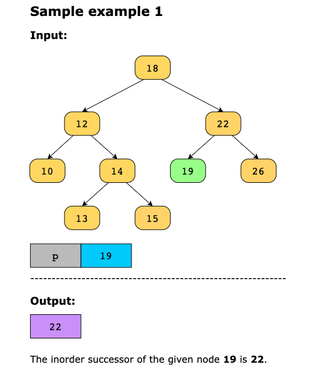

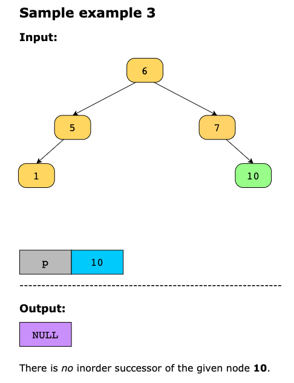

## Solution

To solve this problem, we will use the depth-first search pattern because it allows us to perform an inorder traversal 
of the tree, which is necessary to find the inorder successor of a given node. 
The properties of the BST allow us to make an efficient search by discarding half of the tree at each step. We start 
from the root node and compare the value of the current node with p. It helps us decide whether to move to the left or 
right subtree. If p is greater than or equal to the current node’s value, we move to the right subtree, as the in-order 
successor must be in the right subtree or above the current node. Otherwise, we explore the left subtree to find a 
potentially smaller successor. This way, we efficiently find the inorder successor of the given node. 

Let’s go through the algorithm to see how we will reach the solution:

- Initialize a variable successor to NULL. It stores the potential inorder successor as we traverse the tree. 
- Traverse the tree starting from the root, and for each node, compare the values of p and root:
  - If the value of p is greater than or equal to the value of the root, the inorder successor must be in the right 
    subtree or higher up in the tree. We move to the right subtree by setting root = root.right. 
  - Otherwise, we update the successor to the current node, as this node is a potential in-order successor. Then, move 
    to the left subtree by setting root = root.left.

- After the loop ends, we return the successor. This contains the inoder successor of the given node.

> Note: If there was no in-order successor of the given node, the successor will remain NULL.

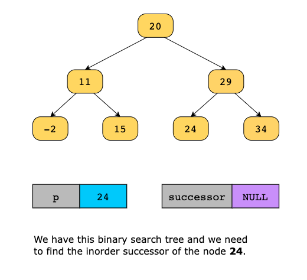
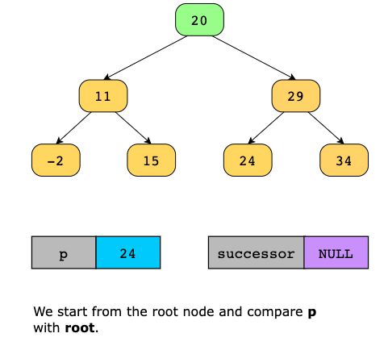
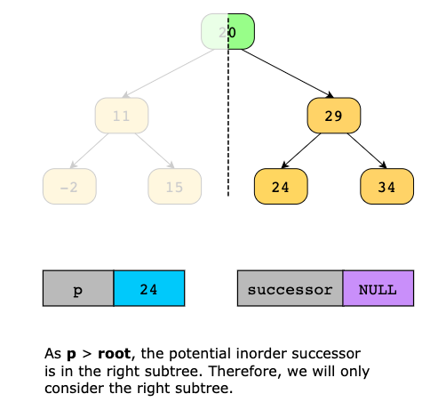
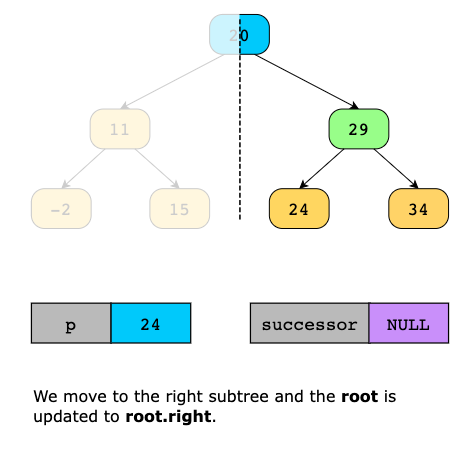
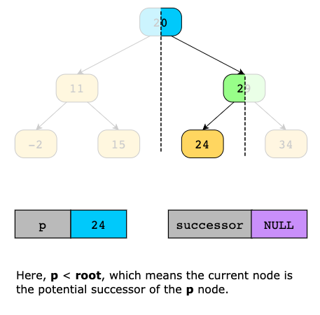
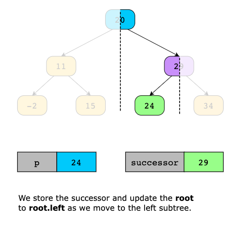


### Time Complexity

The time complexity of this solution is O(n) in the worst-case scenario where the given tree is skewed. However, for a 
balanced binary search tree, it will be O(logn).

### Space Complexity

The space complexity of the solution is O(1) because we don’t use any additional space.

---

## Is Valid Binary Search Tree

Given the root of a binary tree, determine if it is a valid binary search tree (BST).

A tree is a BST if the following conditions are met:

Every node on the left subtree has a value less than the value of the current node.
Every node on the right subtree has a value greater than the value of the current node.
The left and right subtrees must also be valid BSTs.

### Examples

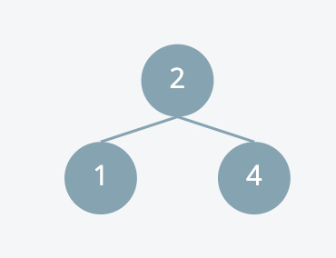

Input: [2,1,4]
Output: True

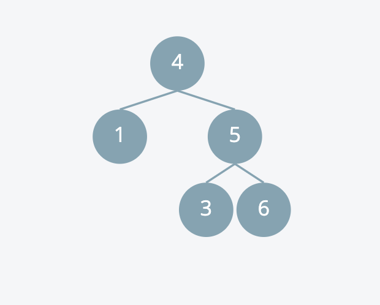

Input: [4,1,5,null,null,3,6]
Output: False. 3 is the the root node's right subtree, but it is less than the root node 4.

### Solution

Let's think about what it means for a binary tree to be a valid binary search tree. For a binary tree to be a valid
binary search tree, the following conditions must be true:

- Every node in the left subtree of the root node must have a value less than the value of the root node.
- Every node in the right subtree of the root node must have a value greater than the value of the root node.

This definition is true for every subtree in the node.

We can use that definition to validate a binary search tree by having parents pass values down to their children. Let's
say we are validating this binary search tree:

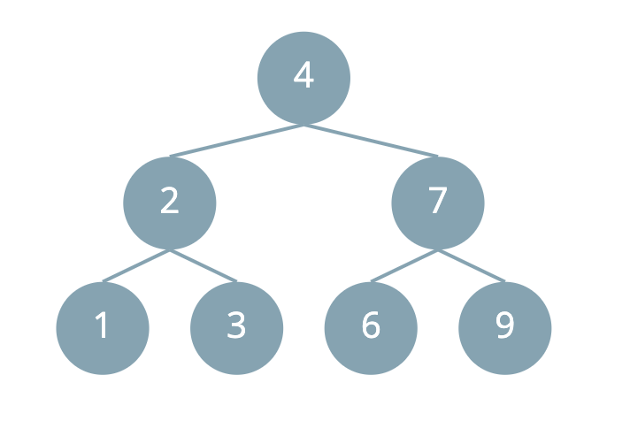

Based on the definition of a valid binary search tree, any value in the left subtree must be less than 4, but there is
no limit to how small the values are.

So we can pass max = 4 and min = -inf to the left child as a range of valid values of the left subtree.

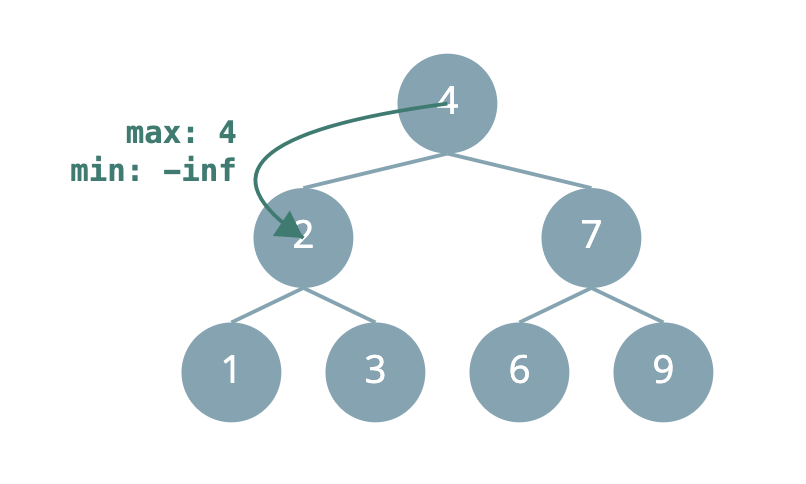

From there, for the subtree rooted at node 2:
The max value of any node in the left subtree 2 is 2, and the min value is still -inf.

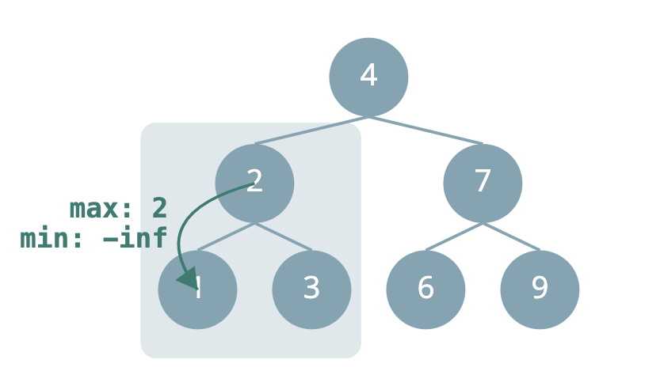

Any value in the right subtree must be greater than the 2, but also less than 4 (the value of the root node). So we can
pass max = 4 and min = 2 to the right child as a range of valid values of the right subtree.

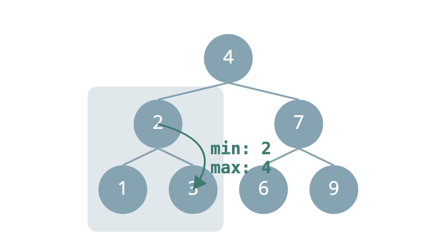

We can visit each node in the tree, and have the parent pass down the range of valid values to their children in this
fashion. If the current node's value falls outside of the valid range, we can return False immediately. If we reach the
empty subtree, this means that we have not yet found an invalid node yet, and we can return True.

#### Return Values

If I'm at a node in the tree, what values do I need from my left and right children to tell if the current subtree is a
valid binary search tree?

The current subtree is a valid binary search tree if:
- The left subtree is a valid binary search tree.
- The right subtree is a valid binary search tree.
- And the value of the current node falls within the valid range.

This tells me that each recursive call should return a boolean value indicating whether the current subtree is a valid
binary search tree.

#### Base Case

An empty tree is a valid binary search tree.

#### Extra Work

The work that we need to do at each node is to check if the current node's value falls within the valid range. If it
doesn't we can return False immediately.

#### Helper Functions

Since we need to pass the minimum and maximum values down to their children, we need to introduce a helper function to
keep track of these values.

This helper function will introduce two parameters, min_ and max_, which represent the range of values that the current
subtree's nodes can take on. The helper function will return a boolean value indicating whether the current subtree is
a valid binary search tree.

When we recurse to our left child, we:
- Pass the current node's value as the new max_ value, since the left child's value must be less than the current node's
  value. min_ remains the same.

When we recurse to our right child, we:
- Pass the current node's value as the new min_ value, since the right child's value must be greater than the current
  node's value. max_ remains the same.

#### Global Variables

The return value of the helper function matches the answer to the problem, so we don't need to use any global variables.

#### Complexity Analysis

##### Time Complexity

O(N) where N is the number of nodes in the binary tree. We visit each node via each recursive call to dfs exactly once.
Each recursive call does a constant amount of work.

##### Space Complexity

O(N) where N is the number of nodes in the binary tree, for the space that it takes to allocate each recursive call
frame on the call stack.
