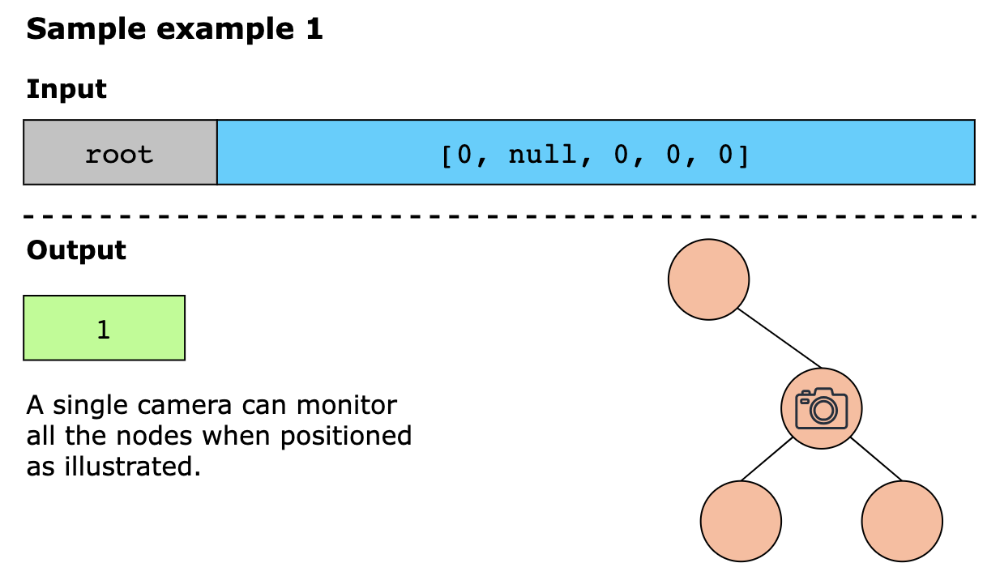
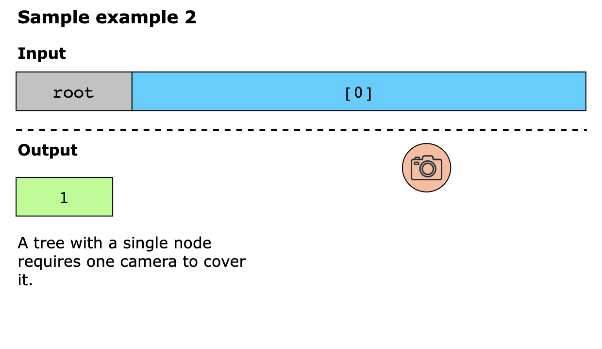
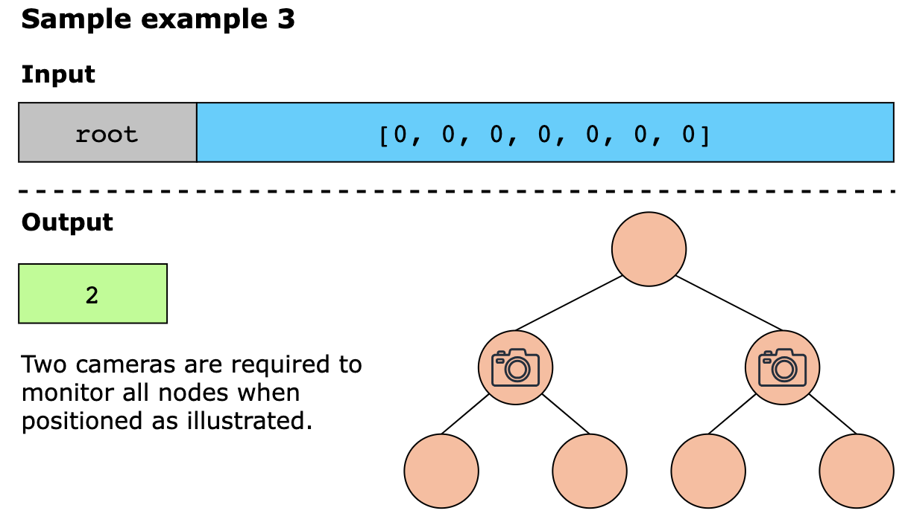

# Binary Tree

Contains Binary tree implementation in Python

---

## Leaf-Similar Trees

Consider all the leaves of a binary tree, from left to right order, the values of those leaves form a leaf value
sequence.

For example, in the given tree [3,5,1,6,2,9,8,null,null,7,4], the leaf value sequence is (6, 7, 4, 9, 8).

Two binary trees are considered leaf-similar if their leaf value sequence is the same.

Return true if and only if the two given trees with head nodes root1 and root2 are leaf-similar.

```plain
Example:

Input: root1 = [3,5,1,6,2,9,8,null,null,7,4], root2 = [3,5,1,6,7,4,2,null,null,null,null,null,null,9,8]
Output: true
```

```plain
Example:

Input: root1 = [1,2,3], root2 = [1,3,2]
Output: false
```

### Approach 1: Depth First Search

#### Intuition and Algorithm

Let's find the leaf value sequence for both given trees. Afterwards, we can compare them to see if they are equal or
not.

To find the leaf value sequence of a tree, we use a depth first search. Our dfs function writes the node's value if it
is a leaf, and then recursively explores each child. This is guaranteed to visit each leaf in left-to-right order, as
left-children are fully explored before right-children.

#### Complexity Analysis

1. `Time Complexity: O(T1+T2)` where T1, T2, are the lengths of the given trees.
2. `Space Complexity: O(T1+T2)`, the space used in storing the leaf values.

### Related Topics

- Tree
- Depth-First Search
- Binary Tree

---

## Path Sum

Given the root of a binary tree and an integer targetSum, return the number of paths where the sum of the values along
the path equals targetSum.

The path does not need to start or end at the root or a leaf, but it must go downwards (i.e., traveling only from parent
nodes to child nodes).

```plain
Example 1
Input: root = [10,5,-3,3,2,null,11,3,-2,null,1], targetSum = 8
Output: 3

Example 2:
Input: root = [5,4,8,11,null,13,4,7,2,null,null,5,1], targetSum = 22
Output: 3
```

### Related Topics

- Tree
- Depth First Search
- Binary Tree

---

## Longest ZigZag Path in a Binary Tree

You are given the root of a binary tree.

A ZigZag path for a binary tree is defined as follow:

Choose any node in the binary tree and a direction (right or left).
If the current direction is right, move to the right child of the current node; otherwise, move to the left child.
Change the direction from right to left or from left to right.
Repeat the second and third steps until you can't move in the tree.
Zigzag length is defined as the number of nodes visited - 1. (A single node has a length of 0).

Return the longest ZigZag path contained in that tree.

```plain
Input: root = [1,null,1,1,1,null,null,1,1,null,1,null,null,null,1]
Output: 3
Explanation: Longest ZigZag path in blue nodes (right -> left -> right).

Input: root = [1,1,1,null,1,null,null,1,1,null,1]
Output: 4
Explanation: Longest ZigZag path in blue nodes (left -> right -> left -> right).

Input: root = [1]
Output: 0
```

### Solution

#### Approach: Depth First Search

##### Intuition

We can see that there are only two options available from each parent node. We either go to its left or right child (if
they exist).

Let us observe some situations in which we move from a parent node to its children.

Consider a parent node p, which itself is a left child. If p has a left child, l, we cannot combine the edges going into
p and l, because they have the same direction and do not form a zigzag path. We can only begin a new zigzag path of
length 1 by including the edge between p and l.

If p has a right child, r, we can include the edges going into p and r together because their directions are opposite
and form a zigzag path. If we know the length of the zigzag path until node p, including r increases the length of the
path by 1.

Now assume, that node p itself is a right child. If it has a left child l, we can combine the edges going into p and l.
The length of the zigzag path until l is equal to the length of the zigzag path until p plus 1. If p has a right child,
r, we must start over with only the edge between p and r forming a zigzag path of length 1.

This provides us with a solution to the problem. All we have to do now is keep track of which way we should go to
continue forming a zigzag path. Depending on the current direction, we either include the edge of the child in the
zigzag path that includes the edge going into the parent node, or we start a new zigzag path with the edge going into
the child if the current direction does not match the direction of the child node.

We can use a graph traversal algorithm like depth-first search (DFS) to traverse in the tree. In DFS, we use a recursive
function to explore nodes as far as possible along each branch. Upon reaching the end of a branch, we backtrack to the
previous node and continue exploring the next branches.

To store the longest zigzag path found thus far, we define an answer variable pathLength = 0. We implement a dfs method
that accepts a TreeNode node, a boolean goLeft to indicate whether we should go left for the continuation of the zigzag
path, and steps which stores the length of the zigzag path so far.

It's worth noting that we can substitute any other indication for goLeft. We can use whether the parent node is a left
or right child, or we can choose whether to continue the zigzag path to the right (similar to left).

In the dfs method, we first determine whether node is null or not. If node is null, we exit the method. If it is a valid
node, we update our answer variable pathLength = max(pathLength, steps).

If goLeft is true, the zigzag path will continue to the left. We can't go left in the next step to continue this zigzag
path because we're already going left in this step. As a result, we call dfs(node.left, false, steps + 1). We passed
steps + 1 because we kept going in a zigzag pattern.

It should be noted that if the left does not exit, this call will be returned while we check if node is null at the
beginning. After the null node check, we update pathLength, so it should only update pathLength for valid nodes.

We use dfs(node.right, true, 1) for the right child. Because we must visit the left child the next time, we passed true
for goLeft. We pass 1 forsteps to begin a new zigzag path including only the parent to the right child edge as it cannot
be merged with ongoing path.

If goLeft is set to false, the zigzag path will continue to the right. We use dfs(node.left, false, 1) for the left
child because we need to start a new zigzag path from the parent to the left child edge and we can't take left again in
the next step. For the right child, we call dfs(node.right, true, steps + 1) because we keep continuing in the zigzag
pattern.

##### Algorithm

1. Create an integer variable pathLength to store the length of the longest zigzag path found discovered so far.
   Initialize it with 0.
2. Begin the DFS traveral. We implement the dfs method which takes three parameters: a TreeNode node from which the
   current traversal begins, a boolean goLeft to indicate whether we should go left now to continue the ongoing zigzag
   path, and an integer steps to store the length of the current zigzag path. We call dfs(root, false, 0) and dfs(root,
   true, 0) because we can take any direction from the root node and pass 0 for steps as there is no zigzag path formed
   yet:
    - If node == null, return.
    - If goLeft is true, we can continue on the zigzag path by going left. To move to the left child, we use dfs(
      node.left,
      false, steps + 1), marking goLeft as false for the next move and increasing steps by 1. We also traverse to the
      right child using dfs(node.right, true, 1) to begin a new zigzag path that only includes the edge leading to the
      right child as it cannot be merged with the ongoing path. We pass true for the next move as we moved in the right
      direction in this step.
    - Otherwise, if goLeft is false, we move to the left child by calling dfs(node.left, false, 1) and move to the right
      child by calling dfs(node.right, true, steps + 1).
3. Return pathLength.

##### Complexity Analysis

###### Time complexity: O(n)

Using the dfs function, we recursively visit both the childrens of every node once. As a result, it takes O(n)
time because there are n nodes in total. We iterate over each edge once to visit all the all nodes, which again takes
O(n) operations as there are n−1 edges in the tree.

###### Space complexity: O(n)

The recursion stack used by dfs can have no more than n elements in the worst-case scenario where each node is added
to it. It would take up O(n) space in that case.

### Related Topics

- Dynamic Programming
- Tree
- Depth First Search
- Binary Tree

--- 

## Right View of Binary Tree

Given a binary tree A of integers. Return an array of integers representing the right view of the Binary tree.

Right view of a Binary Tree: is a set of nodes visible when the tree is visited from Right side.

Return an integer array denoting the right view of the binary tree A.

> Given the root of a binary tree, imagine yourself standing on the right side of it, return the values of the nodes you
> can see ordered from top to bottom.

```plain
Example Input
Input 1:

        1
      /   \
     2    3
    / \  / \
   4   5 6  7
  /
 8 
 
Output 1:

[1, 3, 7, 8]

Input 2:

    1
   /  \
  2    3
   \
    4
     \
      5
Output 2:
[1, 3, 4, 5]
```

### Solution

#### Approach: Breadth-First Search

A level order traversal, selecting the far right node in each level makes a lot of sense. We can perform a level order
traversal using a queue and performing a breadth-first search.

A level order traversal can be started by placing the root into the queue. Then for each iteration, we can loop over the
length of the queue,n. By looping over n it means we only ever loop over the current level, meaning we can add nodes to
the queue, and will never reach them as
our for loop will stop, maintaining a perfect level order traversal.

We can place the nodes from left to right, or right to left. If we place nodes right first, then left. Then on each
iteration, our rightmost node will be first in the queue. If we place them left to right, then on each iteration the
rightmost node will be last in our queue.

Time Complexity: O(n) we have to process each node once. If we only tried to process the right node, and skip nodes when
the rightmost node exists, we would be skipping nodes in the left subtree in the cases where the right subtree is
shorter in height than the left subtree.

Space Complexity (O(n). In the worst case, that is a full binary tree, the last level of our traversal will fill our
queue with n/2 nodes, leading us to a O(n) space complexity.

### Related Topics

- Binary Tree
- Tree
- Dynamic Programming
- Depth First Search
- Breadth-first Search

---

## Maximum Level sum of a Binary Tree

Given the root of a binary tree, the level of its root is 1, the level of its children is 2, and so on.

Return the smallest level x such that the sum of all the values of nodes at level x is maximal.

```plain
Example 1:
Input: root = [1,7,0,7,-8,null,null]
Output: 2
Explanation: 
Level 1 sum = 1.
Level 2 sum = 7 + 0 = 7.
Level 3 sum = 7 + -8 = -1.
So we return the level with the maximum sum which is level 2.

Example 2:

Input: root = [989,null,10250,98693,-89388,null,null,null,-32127]
Output: 2
```

### Solution

#### Approach 1: Breadth First Search

The task is to compute the sum of all node values at each level to get the highest level with the maximum sum.

We can simply use a standard breadth-first search traversal because we need to analyze nodes by level.

BFS is an algorithm for traversing or searching a graph. It traverses in a level-wise manner, i.e., all the nodes at the
present level (say l) are explored before moving on to the nodes at the next level (l + 1). BFS is implemented with a
queue.

We initialize a queue of integers and an integer level = 0 to track the current level. In the queue, we push the root
node.

We perform a level-wise traversal, incrementing level by 1 each time when we move to a new level. At each iteration, we
remove all nodes at level, compute the sum of all node values at this level, and insert all their neighbouring nodes at
level + 1.

Because we are popping all of the nodes at level and inserting all of the nodes at level + 1, the size of the queue will
represent the number of nodes at the next level at the end of this iteration.

So we have two loops: the outer loop runs until the queue is empty, and the inner loop runs the number of times equal to
the size of the queue to just cover the nodes at the current level. We will pop all the nodes at level, compute the sum
of all the values, and insert all the nodes at level + 1 into the queue.

To get the answer, we compare the sum of all node values at the current level to the maximum sum of values we've already
seen. If the current sum of node values is greater than what we've seen before, we update our answer to level, and the
current sum becomes our largest sum of values seen thus far. Since we are traversing the higher levels first, by only
updating the answer when the level sum is greater than what we've seen before, we handle the tiebreakers automatically.

#### Complexity Analysis

##### Time Complexity O(n)

- Each queue operation in the BFS algorithm takes O(1) time, and a single node can only be pushed once, leading to
  O(n) operations for nnn nodes.
- The computation of sum of all the values of nodes at a level also takes O(n) time as each node's value is used
  once.

##### Space Complexity O(n)

- As the BFS queue stores the nodes in level-wise manner, the maximum number of nodes in the BFS queue would equal to
  the most number of nodes at any level. So, the best case would be O(1) where all the levels have just one node.
- The worst case would be a complete binary tree. In a complete binary tree, the last or second last level would have
  the most nodes (the last level can have multiple null nodes). Because we are iterating by level, the BFS queue will be
  most crowded when all of the nodes from the last level (or second last level) are in the queue. Assume we have a
  complete binary tree with height hhh and a fully filled last level having 2^h nodes. All the nodes at each level add
  up to 1+2+4+8+...+2^h=n. This implies that 2^{h + 1} - 1 = n and thus 2^h=(n+1)/2
  Because the last level h has 2^h nodes, the BFS queue will have (n+1)/2=O(n) elements in the worst-case scenario.

---

## Visible Tree Node | Number of Visible Nodes

In a binary tree, we define a node "visible" when no node on the root-to-itself path (inclusive) has a strictly greater
value. The root is always "visible" since there are no other nodes between the root and itself. Given a binary tree,
count the number of "visible" nodes.

```plain
    5 <- visible
   /  \
  4    6 <- visible
 /  \
3    8 <- visible

Visible nodes are 5, 6 & 8
```

> Output: 3.
> For example: Node 4 is not visible since 5>4, similarly Node 3 is not visible since both 5>3 and 4>3. Node 8 is
> visible since all 5<=8, 4<=8, and 8<=8.

---

## Minimum Camera Cover

You are given the root of a binary tree. Cameras can be installed on any node, and each camera can monitor itself, its 
parent, and its immediate children.

Your task is to determine the minimum number of cameras required to monitor every node in the tree.

Constraints:

- The number of nodes in the tree is in the range [1, 1000].
- Node.data == 0




