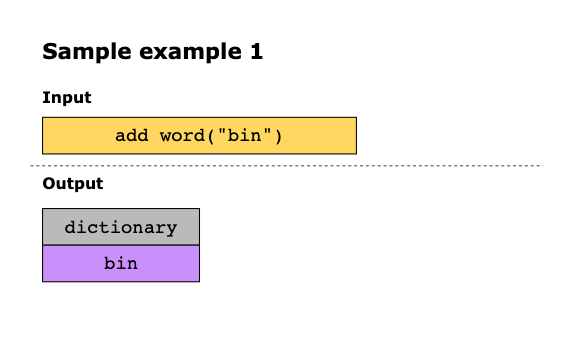
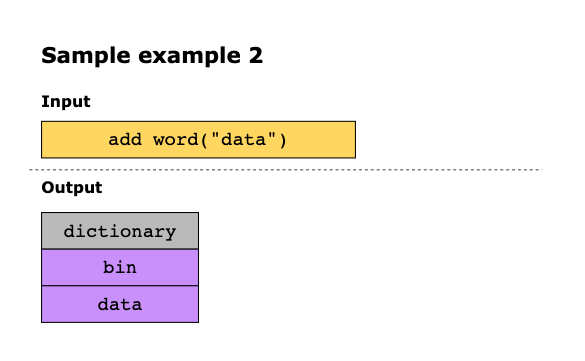
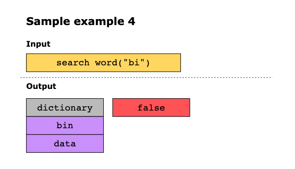
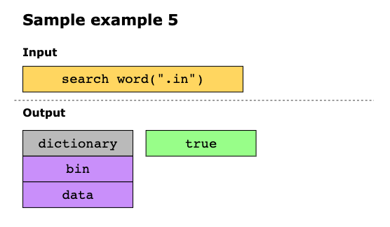
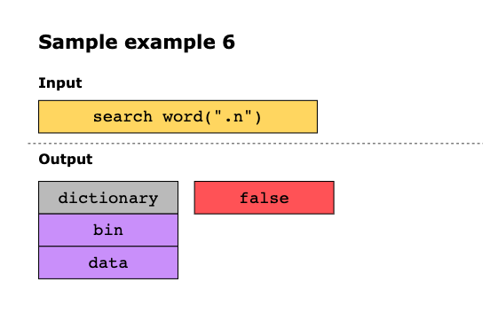
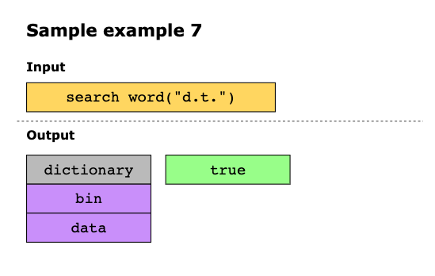
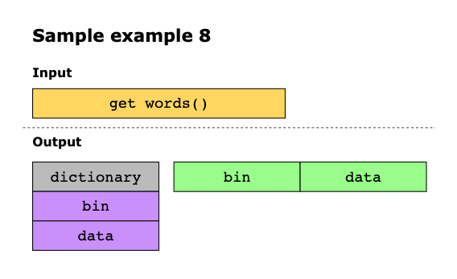

#  Design Add and Search Words Data Structure

Design a data structure called WordDictionary that supports the following functionalities:

- Constructor: This function will initialize the object.
- Add Word(word): This function will store the provided word in the data structure.
- Search Word(word): This function will return TRUE if any string in the WordDictionary object matches the query word.
  Otherwise, it will return FALSE. If the query word contains dots, `.`, each dot is free to match any letter of the
  alphabet. 
  For example, the dot in the string “.ad” can have 26 possible search results like “aad”, “bad”, “cad”, and so on.

- Get Words(): This function will return all the words in the WordDictionary class.

## Constraints

- 1 ≤ word.length ≤ 25
- Words passed to Add Word() consist of lowercase English letters. 
- Words passed to Search Word() consist of . or lowercase English letters. 
- There will be, at most, three dots in a word passed to Search Word(). 
- At most, 10^2 calls will be made to Add Word() , Get Words() and Search Word().

## Examples

