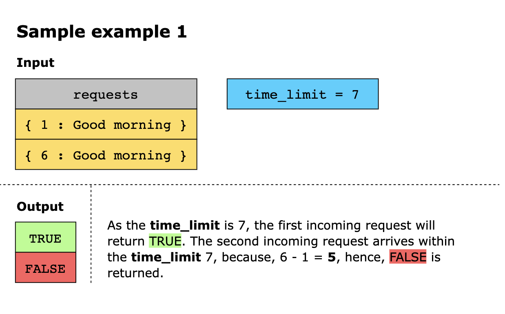
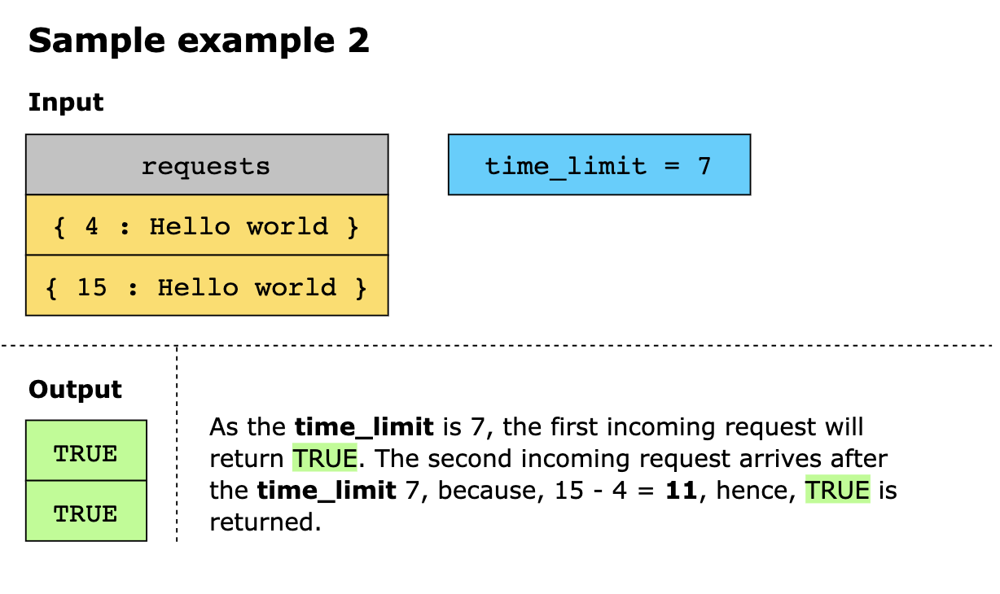
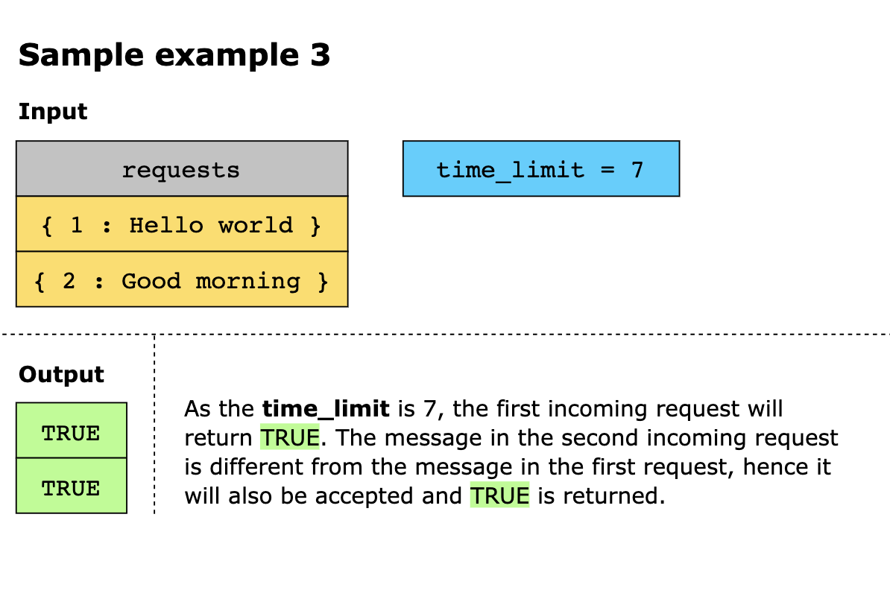
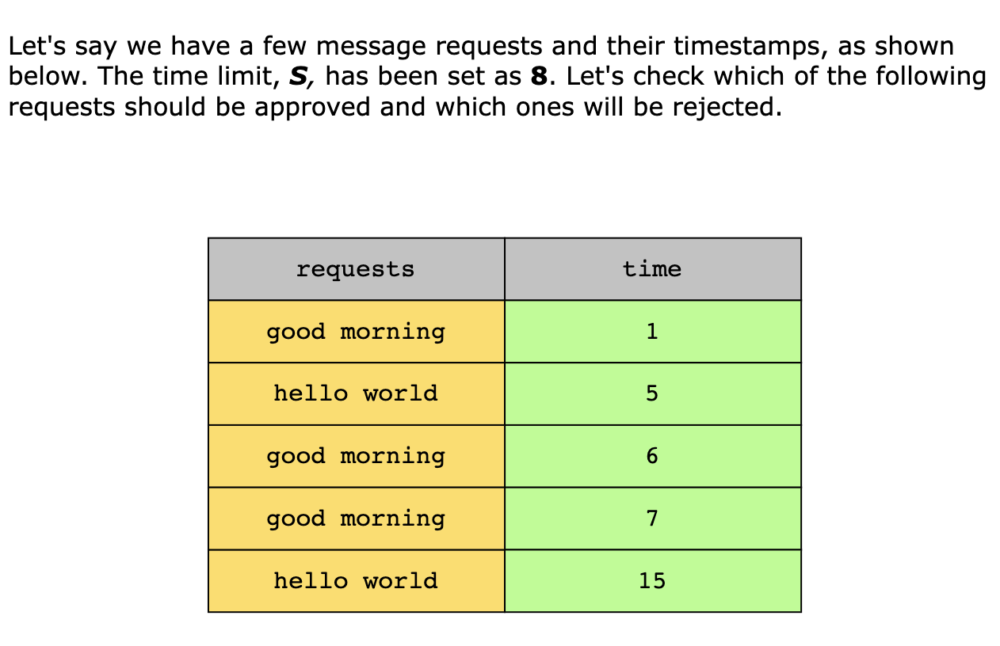
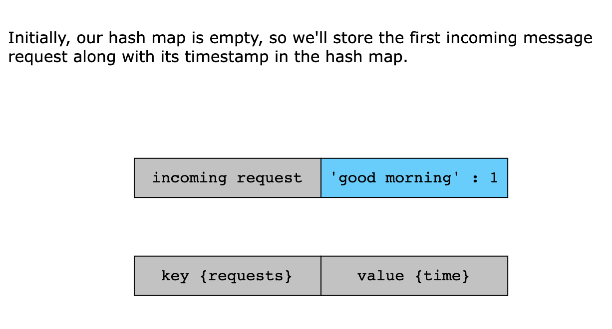
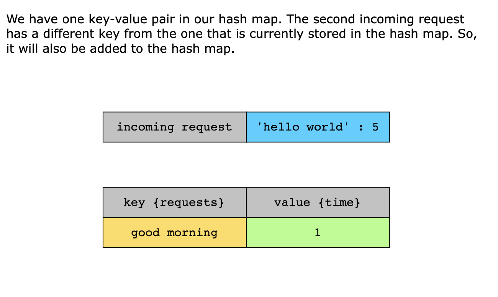
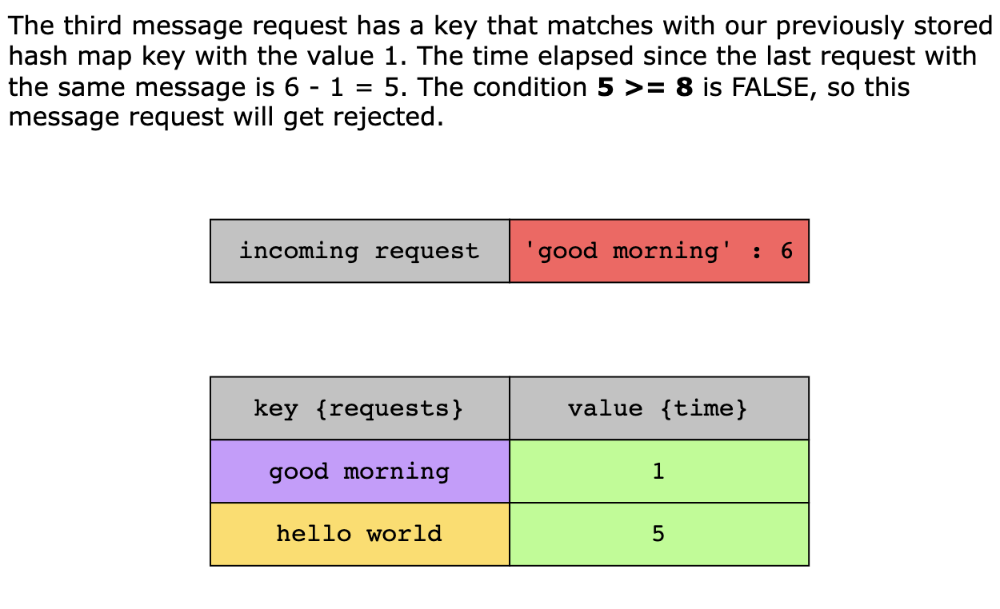
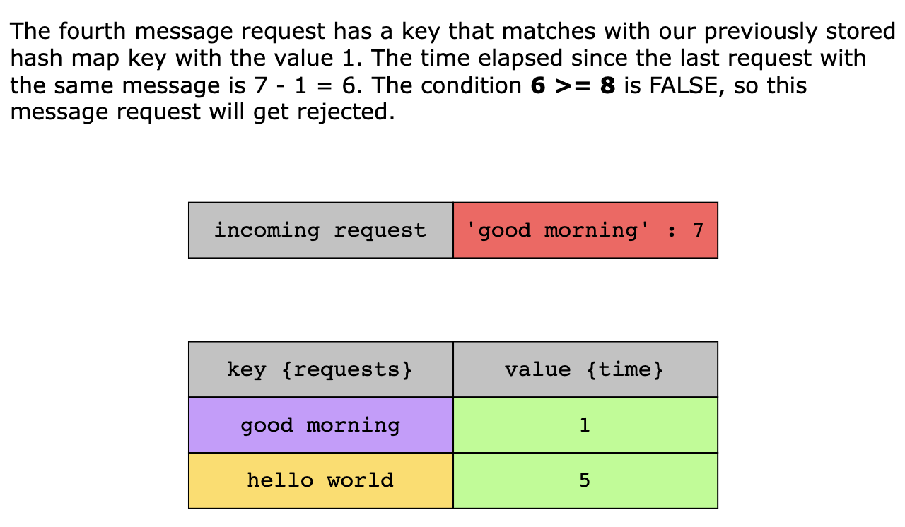

# Logger Rate Limiter

For the given stream of message requests and their timestamps as input, you must implement a logger rate limiter system 
that decides whether the current message request is displayed. The decision depends on whether the same message has 
already been displayed in the last S seconds. If yes, then the decision is FALSE, as this message is considered a 
duplicate. Otherwise, the decision is TRUE.

> Note: Several message requests, though received at different timestamps, may carry identical messages.

## Constraints

- 1 <= `request.length` <= 10^2
- 0 <= `timestamp` <= 10^3
- Timestamps are in ascending order.
- Messages can be written in lowercase or uppercase English alphabets.

## Examples

## Solution

We need to know if a message already exists and keep track of its time limit. When thinking about such problems where 
two associated values need to be checked, we can use a hash map.

We can use all incoming messages as keys and their respective time limits as values. This will help us eliminate 
duplicates and respect the time limit of S seconds as well.

Here is how we’ll implement our algorithm using hash maps:

1. Initialize a hash map. 
2. When a request arrives, check if it’s a new request (the message is not among the keys stored in the hash map) or a 
   repeated request (an entry for this message already exists in the hash map). If it’s a new request, accept it and add 
   it to the hash map. 
3. If it’s a repeated request, compare the difference between the timestamp of the incoming request and the timestamp of 
   the previous request with the same message. If this difference is greater than the time limit, S, accept it and 
   update the timestamp for that specific message in the hash map. Otherwise, reject it.

### Solution Summary

Let’s summarize our optimized algorithm:

1. After initializing a hash map, whenever a request arrives, we check whether it’s a new request or a repeated request
   after the assigned time limit

2. If the request meets either of the conditions mentioned in the above step, we accept and update the entry associated
   with that specific request in the hash map. Otherwise, reject the request and return the final decision.

### Time Complexity

The decision function checks whether a message has already been encountered, and if so, how long ago it was encountered.
Thanks to the use of hash maps, both operations are completed in constant time—therefore, the time complexity of the
decision function is O(1).

### Space Complexity

The space complexity of the algorithm is O(n), where n is the number of incoming requests that we store.

