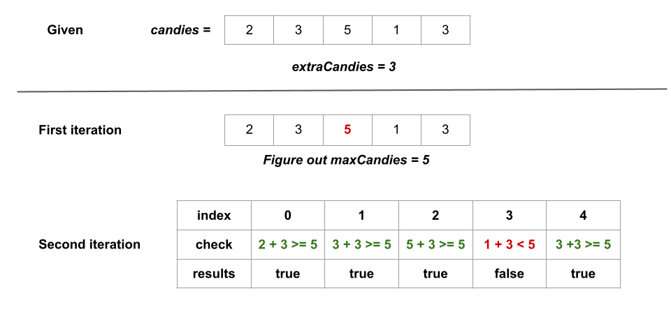

# Kids With the Greatest Number of Candies

There are n kids with candies. You are given an integer array candies, where each candies[i] represents the number of
candies the ith kid has, and an integer extraCandies, denoting the number of extra candies that you have.

Return a boolean array result of length n, where result[i] is true if, after giving the ith kid all the extraCandies,
they will have the greatest number of candies among all the kids, or false otherwise.

Note that multiple kids can have the greatest number of candies.

```plain
Example 1:

Input: candies = [2,3,5,1,3], extraCandies = 3
Output: [true,true,true,false,true] 
Explanation: If you give all extraCandies to:
- Kid 1, they will have 2 + 3 = 5 candies, which is the greatest among the kids.
- Kid 2, they will have 3 + 3 = 6 candies, which is the greatest among the kids.
- Kid 3, they will have 5 + 3 = 8 candies, which is the greatest among the kids.
- Kid 4, they will have 1 + 3 = 4 candies, which is not the greatest among the kids.
- Kid 5, they will have 3 + 3 = 6 candies, which is the greatest among the kids.

Example 2:

Input: candies = [4,2,1,1,2], extraCandies = 1
Output: [true,false,false,false,false] 
Explanation: There is only 1 extra candy.
Kid 1 will always have the greatest number of candies, even if a different kid is given the extra candy.

Example 3:

Input: candies = [12,1,12], extraCandies = 10
Output: [true,false,true]
```

---

## Solution

### Approach: Ad Hoc

#### Intuition

We precompute the greatest number of candies that any kid(s) has, let's call it `maxCandies`.

Following the precomputation, we iterate over candies, checking whether the total candies that the current kid has
exceeds maxCandies after giving extraCandies to the kid. For every kid, we perform candies[i] + extraCandies >=
maxCandies and push it into a boolean list called result.

In the end, we return result.

Here's a visual representation of how the approach works in the first example given in the problem description:



#### Complexity Analysis

Here, n is the number of kids.

##### Time complexity: `O(n)`

- We iterate over the candies array to find out `maxCandies` which takes `O(n)` time.
- We iterate over the candies array once more. We check for each kid whether they will have the most candies among all
  the children after receiving `extraCandies` and push the result in result which takes `O(1)` time. It requires `O(n)`
  time for `n` kids.

##### Space complexity: `O(1)`

- Without counting the space of input and output, we are not using any space except for some integers like maxCandies
  and candy.

---

## Related Topics

- Array
