# Lucky Numbers in a Matrix

Given an m × n matrix of distinct numbers, return the lucky number in the matrix.

> A lucky number is an element of the matrix such that it is the smallest element in its row and largest in its column.

Constraints

- m = `matrix.length`
- n = `matrix[i].length`
- 1 <= m, n <= 50
- 1 <= `matrix[i][j]` <= 10^5
- All elements in the matrix are distinct.

## Examples

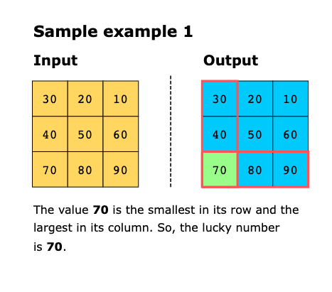
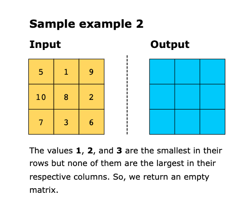
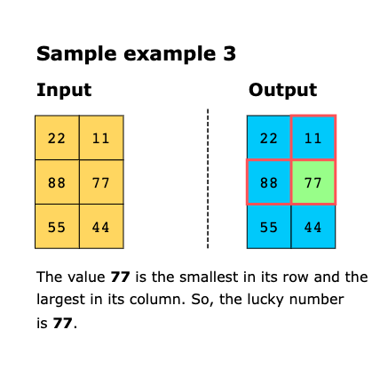

## Solution: Greedy

The core idea behind the solution is to recognize that there can be, at most, one lucky number in the matrix. This is 
proven by contradiction, as having two such numbers would violate the unique conditions for being a lucky number.

> **Proof by contradiction:**
> 
> Suppose we have an integer x located at row r1 and column c1 in a matrix. The integer x is the smallest value in its 
> row and the largest value in its column, making it a lucky number. 
> Now, assume another integer y exists in row r2 and column c2. For the sake of argument, let’s assume y is also a 
> lucky number, meaning it is the smallest value in its row and the largest in its column. 
> We assess these assumptions using the following steps:
> 
> 1. As `y` is a lucky number, the smallest value is in row r2 and the largest value is in column c2. Let’s denote the 
> integer at position (r2,c2) as `a`
>    - Then, `y` < `a` because `y` is the minimum in its row
>    - Then, `x` > `a` because `x` is the maximum in it column.
> 
>   Therefore `y` < `x`
> 
> 2. Next, let's consider the integer at position (r1, c2), which we'll call `b`
>    - Then, `y` > `b` because `y` is the maximum in its column
>    - Then, `x` < `b` because `x` is the minimum in its row
> 
>   Therefore `y` > `x`
> 
> This leads to a contradiction, as we deduced `y<x` and `y>x`. This inconsistency implies that our initial assumption—
> that y is a lucky number—is incorrect. Therefore, only x can be the lucky number in this configuration.
> 
> Visually, this looks like this:
> 
> 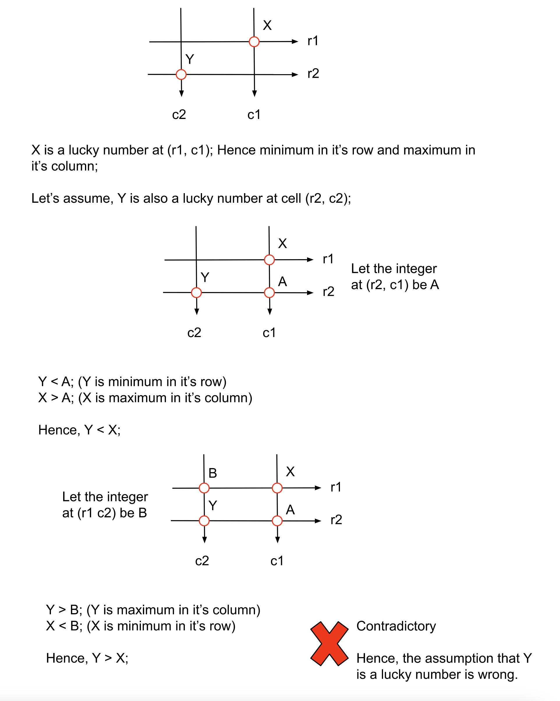

This problem can be solved using a greedy algorithm that analyzes the matrix row by row and column by column.

We start by iterating over the rows to find the minimum values. Out of those minimum values, we choose the largest 
minimum value and store it in r_largest_min. Similarly, we calculate the maximum values in columns and after finding 
all the largest values, we choose the smallest of them and store them in c_smallest_max. Once we have found the values 
in both rows and columns, we match them to see if they are the same. If they are, we return either of the values; 
r_largest_min or c_smallest_max. Otherwise if now matching value is found, we return an empty matrix.

Following are the detailed steps of the algorithm that we have just discussed:

1. We define two variables, r_largest_min and c_smallest_max:

   - r_largest_min is set to negative infinity (float('-inf')) to ensure any row’s minimum value can be updated.
   - c_smallest_max is set to positive infinity (float('inf')) to ensure any column’s maximum value can be updated.

2. For each row in the matrix:

   - We calculate the minimum value of the row (r_min).
   - Then, we update r_largest_min to the maximum of r_largest_min and r_min.
   - The steps above ensure we consider only minimum values in their rows, narrowing the candidate set for a lucky number.

3. For each column in the matrix:

   - We calculate the maximum value of the column (c_max) by iterating over all rows.
   - Next, we update c_max_min to the minimum of c_smallest_max and c_max.
   - The above steps ensure we consider only maximum values in their columns, further narrowing the candidate set for a 
     lucky number.

4. Finally, we compare whether r_largest_min equals c_smallest_max. If TRUE, we return the value stored in [r_largest_min]. 
   Otherwise, we return an empty array []. The comparison ensures that the identified value satisfies both conditions of
   being the minimum in its row and the maximum in its column, making it a valid lucky number.

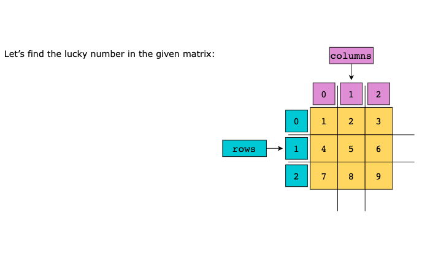
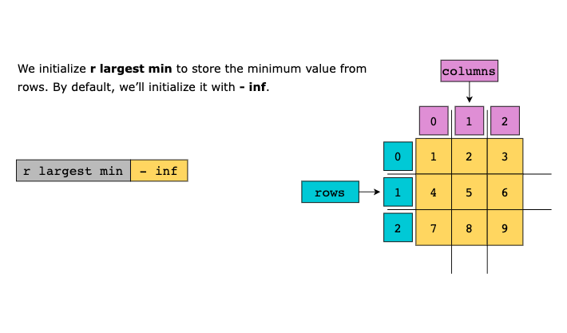
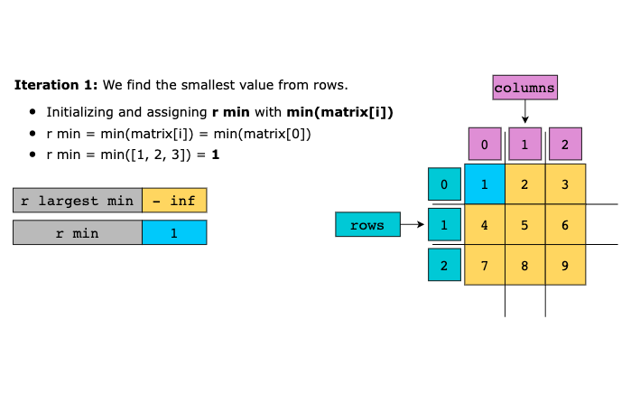
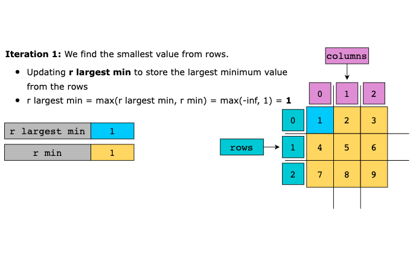
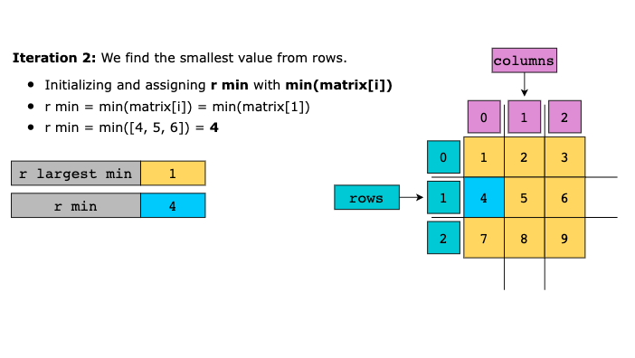
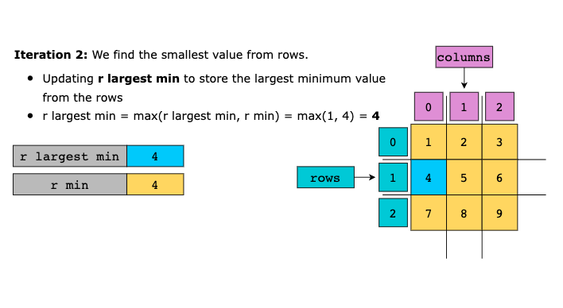
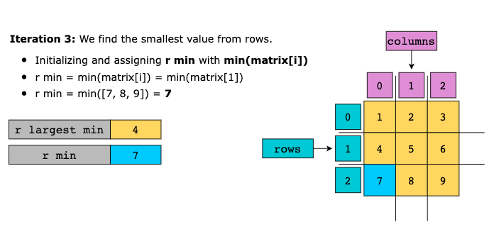
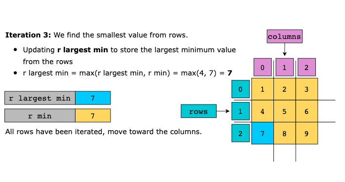
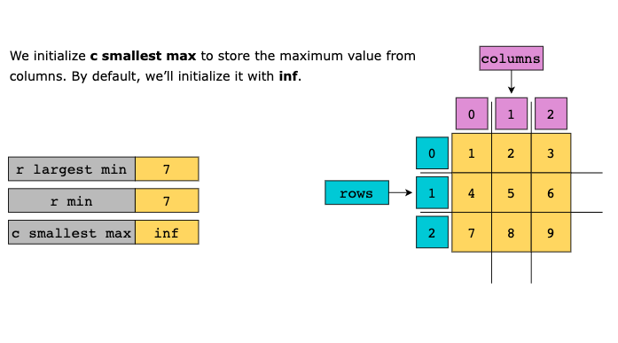
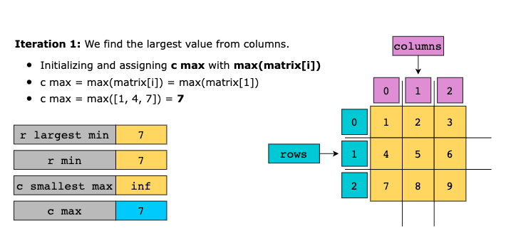
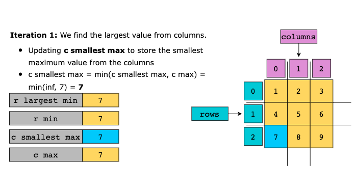
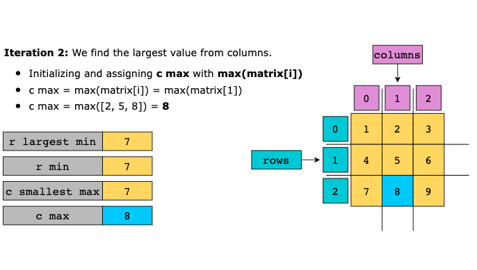
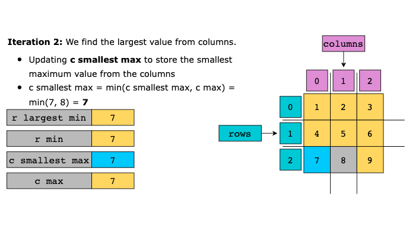
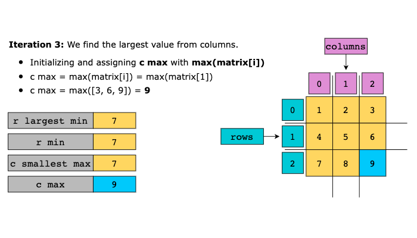
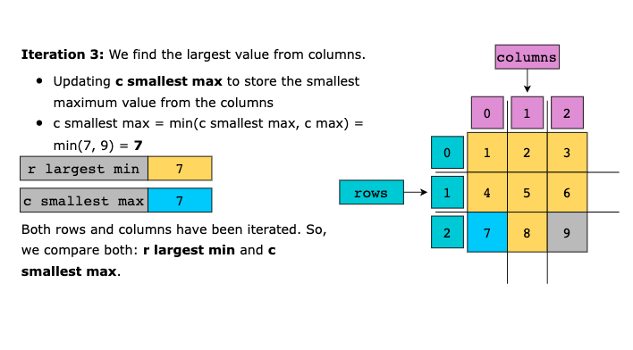
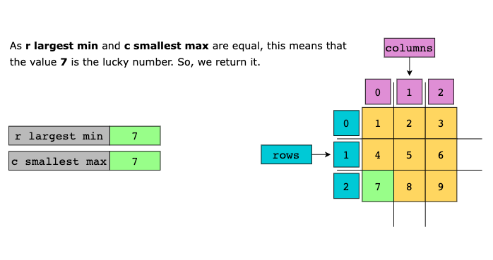

### Time Complexity

The time complexity of the solution is O(m×n), where m is the number of columns in the matrix and n is the number of 
rows in the matrix.

### Space Complexity

The solution’s space complexity is O(1) as no extra space is required apart from the few variables.

## Solution: Simulation

We are given a matrix of size MXN with distinct integers. We need to return the list of lucky numbers in the matrix. 
An integer in the matrix is lucky if it is the maximum integer in its column and it is the minimum value in its row.

In this approach, we will simulate the process by iterating over each integer in the matrix, checking if it is the 
maximum in its row and the minimum in its column. If it meets both criteria, we will add it to the list of lucky numbers, 
luckyNumbers.

The naive approach to check the criteria for each integer involves iterating over each integer in the current row and 
column to verify the minimum and maximum criteria, requiring M+N operations per integer. A more efficient method is to 
precompute the minimum of each row and the maximum of each column before processing the matrix. This allows us to check 
the criteria for each integer in constant time. We iterate over each row to store the minimum in rowMin and each column 
to store the maximum in colMax.

### Algorithm

1. Iterate over each row and store the minimum of the ith row at the ith position in the list rowMin.
2. Iterate over each column and store the maximum of the ith column at the ith position in the list colMax.
3. Iterate over each integer in the matrix and for each integer at (i, j), check if the integer is equal to rowMin[i] 
   and colMax[j]. If yes, add it to the list luckyNumbers.
4. Return luckyNumbers.

### Complexity Analysis

Here, N is the number of rows in the matrix and M is the number of columns in the matrix.

#### Time complexity: O(N*M).

To store the maximum of each row, we require N*M operations and the same for strong the maximum of each column. In the 
end, to find the lucky numbers we again iterate over each integer. Hence, the total time complexity is equal to O(N*M).

#### Space complexity: O(N+M).

We require two lists, rowMin and colMax of size N and M respectively. Hence the total space complexity is equal to O(N+M).
