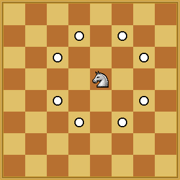

# Knight On Chess Board

Given any source point, (C, D) and destination point, (E, F) on a chess board, we need to find whether Knight can move
to the destination or not.

The above figure details the movements for a knight ( 8 possibilities ).

If yes, then what would be the minimum number of steps for the knight to move to the said point.

If knight can not move from the source point to the destination point, then return -1.

Note: A knight cannot go out of the board.

Input Format:

The first argument of input contains an integer A.
The second argument of input contains an integer B.
=> The chessboard is of size A x B.
The third argument of input contains an integer C.
The fourth argument of input contains an integer D.
=> The Knight is initially at position (C, D).
The fifth argument of input contains an integer E.
The sixth argument of input contains an integer F.
=> The Knight wants to reach position (E, F).
Output Format:

If it is possible to reach the destination point, return the minimum number of moves.
Else return -1.
Constraints:

1 <= A, B <= 500
Example

Input 1:
A = 8
B = 8
C = 1
D = 1
E = 8
F = 8

Output 1:
6

Explanation 1:
The size of the chessboard is 8x8, the knight is initially at (1, 1) and the knight wants to reach position (8, 8).
The minimum number of moves required for this is 6.
