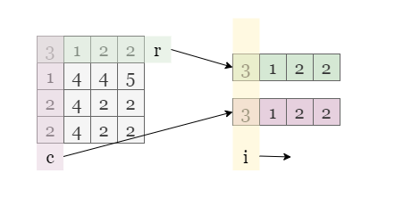
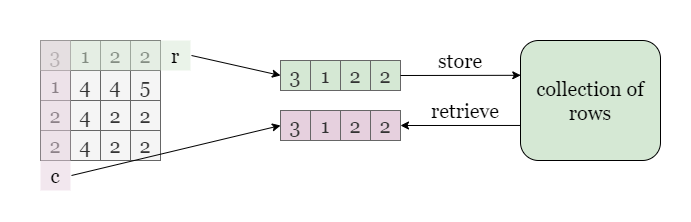
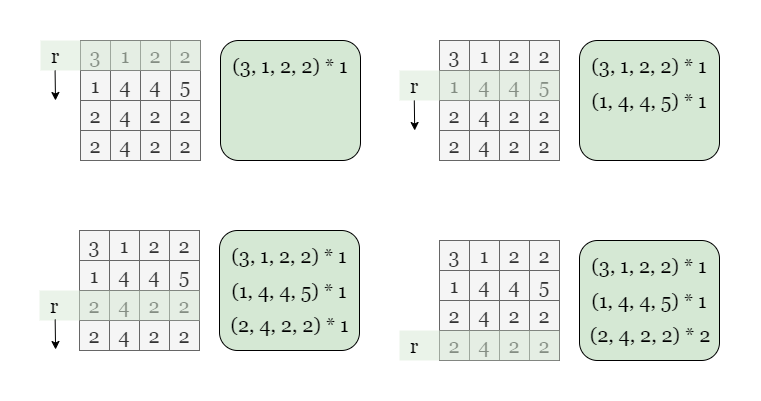
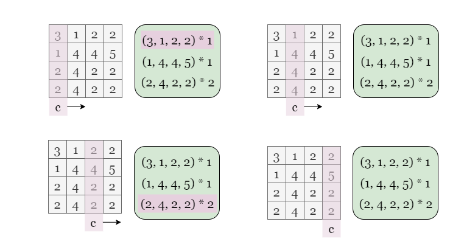
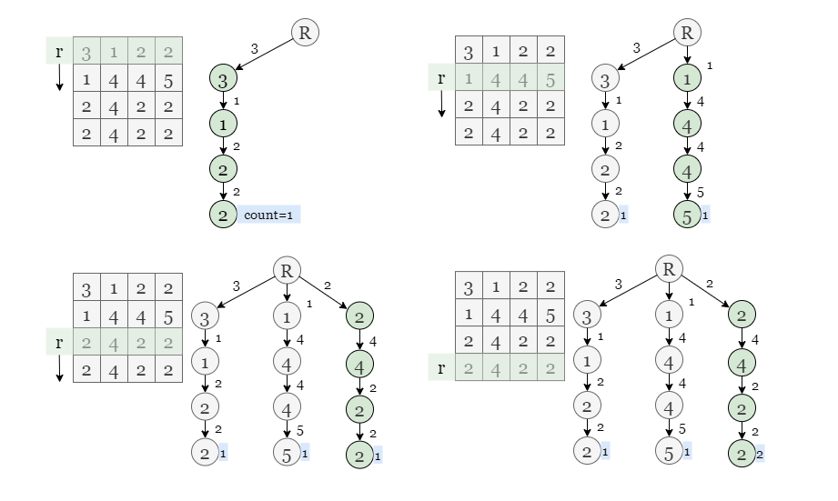
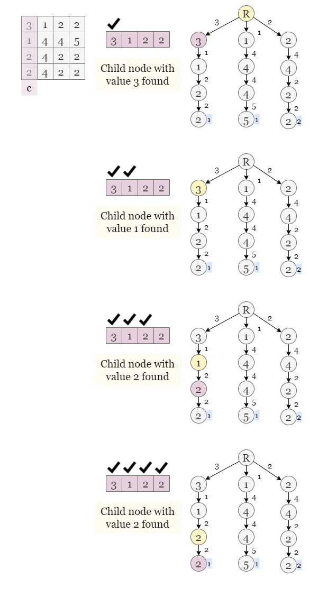
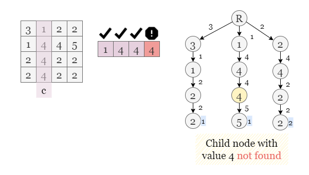

# Equal Row and Column Pairs

Given a 0-indexed n x n integer matrix grid, return the number of pairs (ri, cj) such that row ri and column cj are
equal.

A row and column pair is considered equal if they contain the same elements in the same order (i.e., an equal array).

Example 1


```plain
Input: grid = [[3,2,1],[1,7,6],[2,7,7]]
Output: 1
Explanation: There is 1 equal row and column pair:
- (Row 2, Column 1): [2,7,7]
```

Example 2


```plain
Input: grid = [[3,1,2,2],[1,4,4,5],[2,4,2,2],[2,4,2,2]]
Output: 3
Explanation: There are 3 equal row and column pairs:
- (Row 0, Column 0): [3,1,2,2]
- (Row 2, Column 2): [2,4,2,2]
- (Row 3, Column 2): [2,4,2,2]
```

---

## Solution

### Approach 1: Brute Force

#### Intuition

Let's start with the most intuitive approach, which is brute force. Since we need to find the number of matching rows
and columns, we traverse through every possible combination of rows and columns (row R, col C) and check if all elements
at the same position in R and C are equal to each other.



#### Algorithm

1. Initialize count to 0.
2. Iterate over each row R in grid.
3. For each row, iterate over each column C in grid.
4. Check if row R equals column C by comparing each element at the same index i in both R and C. If row R equals column
   C, increment count by 1.
5. Return count after iterating over all row-column pairs.

#### Complexity Analysis

Let `nxn` be the size of `grid`

- Time Complexity: `O(n^3)`
    - There are a total of `O(n^2)` pairs when iterating over each row R and column C. Traversing each element in R and
      C takes `O(n)` time
- Space Complexity: `O(1)`
    - We use constant amount of extra space to store the answer `count`

### Approach 2: Hash Map

#### Intuition

The brute force approach involves comparing each row R with each column C, resulting in a time complexity of `O(n^3)`.
However, we can optimize this approach by using a hash map data structure to reduce the time complexity.

In this approach, we can consider each row as the key and store it in a hash map. The corresponding value for each key
would be the frequency of that row in the grid. Then, we can traverse through each column of the grid and increment the
answer by the frequency of the equivalent row in the hash map.



Taking the example shown in the picture, we traverse each row of the grid and use it as a key and record its frequency
in a hash map.

> Note that arrays cannot typically be used as keys, so we need to convert them into equivalent hashable objects, such
> as tuples in Python. The converted object still maintains a one-to-one correspondence with the original
> object, allowing us to record the frequency of the original array by hash map.



Next, we traverse through each column of the grid, convert the array of each column into a hashable object of the same
type as the previous keys, and then retrieve its number of occurrences in the hash map. This provides us with the number
of rows in the grid that are equal to this column.



We found that [3,1,2,2] appears once and [2,4,2,2] appears twice. Therefore, the final answer is 3.

#### Algorithm

1. Create an empty hash map row_counter and set count to 0.
2. For each row `row` in the grid, convert it into an equivalent hashable object and use it as a key to the row_counter.
   Increment the value of the corresponding key by 1.
3. For each column in the grid, convert it into the same type of hashable object and check if it appears in the
   row_counter. If it does, increment count by the frequency.
4. Return the answer `count`.

#### Complexity Analysis

Let `n×n `be the size of grid.

- Time complexity:`O(n^2)`
    - We iterate over each row and column only once, converting one array of length n into a hashable object
      takes `O(n)`
      time.
    - Operations like adding or checking on hash map take `O(1)` time.

- Space complexity: `O(n^2)`
    - We store each row of the grid in the hash map, in the worst-case scenario, row_counter might contains n distinct
      rows of length n.

### Approach 3: Trie

#### Intuition

Trie, also known as prefix tree, is a tree-like data structure which is often used to store strings (In this problem, we
store arrays of integers instead of strings). The key advantage of trie is its efficient search time, which can be
achieved in O(n) time where nnn is the length of the array. Trie works by storing each element of the array in a
separate node, and each node has an array of children representing the possible characters that can follow the current
element.

Depending on the requirements, we can modify the original trie by adding more elements. In this problem, we need to
determine the frequency of each row, so we add a variable called count into the trie node. To construct the trie, we
traverse each row of the grid and insert the row into the trie by traversing down the trie based on each element in the
row. At the end of the row, we increment count associated with the last node in the trie to indicate that we have
recorded the occurrence of this row.



To count the number of pairs of equal row and column, we traverse through each column col_array of the grid and search
for it in the trie by traversing down the trie based on each element in col_array. If we reach the end of the array and
encounter a node, we know that there are rows in grid equal to this column, and we can increment the answer by the value
of count of this node.



In the above image, we see that the value of count of the last node is 1, indicating that there is one row in the grid
that matches the column col_array we are searching for.

If we can't find a node associated with current value in col_array, it means that there is no such array stored in the
trie that is equal to col_array, so we stop the search.



#### Algorithm

1. Initialize a empty trie my_trie and set count as 0.
2. Insert each row of grid into my_trie.
3. Search for each column col_array in the trie.
4. If the col_array is found in the trie, add the frequency count to the count.
5. Return the answer count.

#### Complexity Analysis

Let `n×n` be the size of grid.

- Time complexity: `O(n^2)`
    - The length of input rows is fixed to `n`, the time complexity of building a trie for `n` rows is `O(n^2)`since we
      need to traverse each element in the array to insert it into the trie.
    - The time complexity of search an array of length `n` is `O(n)` as we need to iterate over the entire array
      in the worst-case scenario.

- Space complexity: `O(n^2)`
    - In a trie, each node represents a number. Therefore, for `n` rows of length `n`, the trie has `n^2` nodes in the
      worst-case scenario.

---

## Related Topics

- Array
- Hash Table
- Matrix
- Simulation
