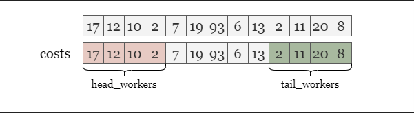
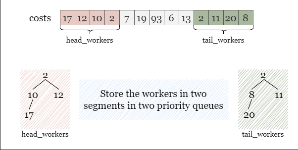
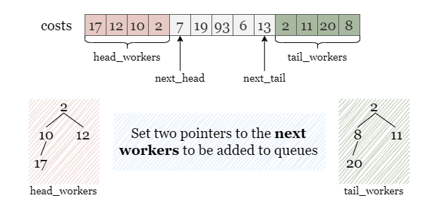
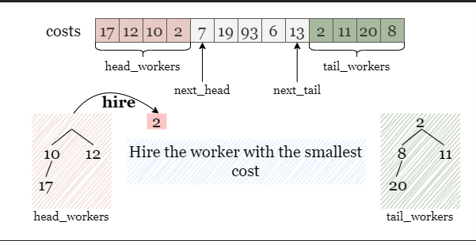
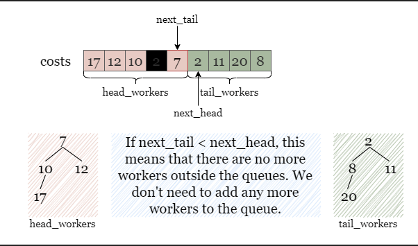

# Total Cost to Hire K Workers

You are given a 0-indexed integer array costs where costs[i] is the cost of hiring the ith worker.

You are also given two integers k and candidates. We want to hire exactly k workers according to the following rules:

You will run k sessions and hire exactly one worker in each session.
In each hiring session, choose the worker with the lowest cost from either the first candidates workers or the last
candidates workers. Break the tie by the smallest index.
For example, if costs = [3,2,7,7,1,2] and candidates = 2, then in the first hiring session, we will choose the 4th
worker because they have the lowest cost [3,2,7,7,1,2].
In the second hiring session, we will choose 1st worker because they have the same lowest cost as 4th worker but they
have the smallest index [3,2,7,7,2]. Please note that the indexing may be changed in the process.
If there are fewer than candidates workers remaining, choose the worker with the lowest cost among them. Break the tie
by the smallest index.
A worker can only be chosen once.
Return the total cost to hire exactly k workers.

Example 1:

```plain
Input: costs = [17,12,10,2,7,2,11,20,8], k = 3, candidates = 4
Output: 11
Explanation: We hire 3 workers in total. The total cost is initially 0.
- In the first hiring round we choose the worker from [17,12,10,2,7,2,11,20,8]. The lowest cost is 2, and we break the tie by the smallest index, which is 3. The total cost = 0 + 2 = 2.
- In the second hiring round we choose the worker from [17,12,10,7,2,11,20,8]. The lowest cost is 2 (index 4). The total cost = 2 + 2 = 4.
- In the third hiring round we choose the worker from [17,12,10,7,11,20,8]. The lowest cost is 7 (index 3). The total cost = 4 + 7 = 11. Notice that the worker with index 3 was common in the first and last four workers.
The total hiring cost is 11.
```

Example 2:

```plain
Input: costs = [1,2,4,1], k = 3, candidates = 3
Output: 4
Explanation: We hire 3 workers in total. The total cost is initially 0.
- In the first hiring round we choose the worker from [1,2,4,1]. The lowest cost is 1, and we break the tie by the smallest index, which is 0. The total cost = 0 + 1 = 1. Notice that workers with index 1 and 2 are common in the first and last 3 workers.
- In the second hiring round we choose the worker from [2,4,1]. The lowest cost is 1 (index 2). The total cost = 1 + 1 = 2.
- In the third hiring round there are less than three candidates. We choose the worker from the remaining workers [2,4]. The lowest cost is 2 (index 0). The total cost = 2 + 2 = 4.
The total hiring cost is 4.
```

## Solutions

### Approach 1: 2 Priority Queue

In each of the k hiring rounds, we must hire a worker with the lowest cost (with the smallest index being a tiebreaker)
based on the provided rules.

We have the option to select the worker with the lowest cost from either the first m candidates or the last m candidates
from costs. Once we choose a worker from either of these sections, we remove the chosen worker from the array, which
makes space for another worker to be in either the first or last m candidates. We continue to select the worker with the
lowest cost, each time making space for another worker from costs to be into consideration. Because we need to
repeatedly find the minimum cost, using a priority queue is the most appropriate approach to simulate this process.

During each hiring session, our goal is to select the worker with the lowest cost. As mentioned above, after selecting a
worker, a spot will open up for another worker to be among the first or last m candidates. As such, we need to
distinguish between the first m candidates and the last m candidates. That way, when we choose a worker, we know if a
spot was opened in the first m candidates or the last m candidates.



To store the workers in two sections separately, we can use two priority queues, head_workers and tail_workers, where
the worker with the lowest cost has the highest priority.



Throughout the process, after we hire a worker from a section, we need to add an additional candidate to this section.
Therefore, we need two pointers, next_head and next_tail, that denotes the next worker to be added to the respective
queues.



Just like in this situation shown in the picture, if two workers with the same cost appear at the top of both queues, we
will hire the one from head_workers, since this worker has a smaller index compared with the other one from
tail_workers. Afterwards, we need to refill head_workers with the worker at next_head to ensure that it still contains
the first m unselected candidates.



However, if we encounter the condition next_tail < next_head, it indicates that all the workers have been selected as
candidates and there are no more workers outside the two queues. To avoid double counting, we should not add a worker to
both queues or update either pointer. Therefore, we can simply move on without making any updates to the queues or
pointers.



#### Algorithm

1. Initialize two priority queues head_workers and tail_workers that store the first m workers and the last m workers,
   where the worker with the lowest cost has the highest priority.
2. Set up two pointers next_head = m, next_tail = n - m - 1 indicating the next worker to be added to two queues.
3. Compare the top workers in both queues, and hire the one with the lowest cost, if both workers have the same cost,
   hire
   the worker from head_workers. Add the cost of this worker to the total cost.
4. If next_head <= next_tail, we need to fill the queue with one worker:
    - If the hired worker is from head_workers, we add the worker costs[next_head] to it and increment next_head by 1.
    - If the hired worker is from tail_workers, we add the worker costs[tail_head] to it and decrement tail_head by 1.

   Otherwise, skip this step.

5. Repeat steps 3 and 4 k times.
6. Return the total cost of all the hired workers.

#### Complexity Analysis

Let `m` be the given integer `candidates`.

- **Time complexity**: `O((k+m)⋅log(m))`

    - We need to initialize two priority queues of size `m`, which takes O(m⋅log(m)) time.
    - During the hiring rounds, we keep removing the top element from priority queues and adding new elements for up
      to `k` times. Operations on a priority queue take amortized O(log(m)) time. Thus this process takes O(k⋅log(m))
      time.
    - Note: `heapq.heapify()` creates the priority queue in linear time. Therefore, the time complexity is O(m+k⋅log(
      m)).

- **Space complexity**: `O(m)`
    - We need to store the first `m` and the last `m` workers in two priority queues.

### Approach 2: 1 Priority Queue

## Related Topics

- Array
- Two Pointers
- Heap(Priority Queue)
- Simulation
