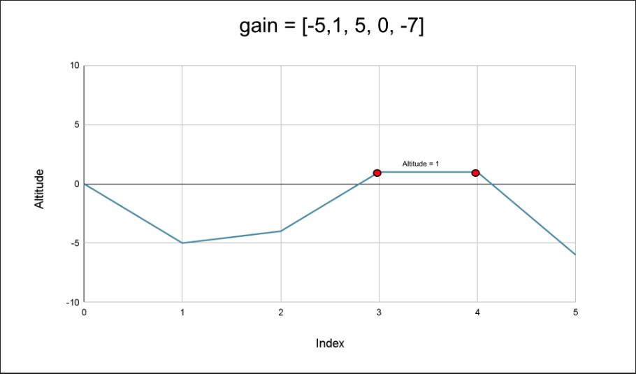

# Find the Highest Altitude

There is a biker going on a road trip. The road trip consists of n + 1 points at different altitudes. The biker starts
his trip on point 0 with altitude equal 0.

You are given an integer array gain of length n where gain[i] is the net gain in altitude between points i​​​​​​ and i +
1 for all (0 <= i < n). Return the highest altitude of a point.

``` plain
Example 1:

Input: gain = [-5,1,5,0,-7]
Output: 1
Explanation: The altitudes are [0,-5,-4,1,1,-6]. The highest is 1.
Example 2:

Input: gain = [-4,-3,-2,-1,4,3,2]
Output: 0
Explanation: The altitudes are [0,-4,-7,-9,-10,-6,-3,-1]. The highest is 0.
```

## Solution

### Approach: Prefix Sum

#### Intuition

We start from the altitude 0 and we have a list of N integers, where each integer represents the gain in altitude at
each step (it could be negative as well, which implies a fall in altitude) a biker takes. We need to return the highest
altitude of the biker in the complete journey, including the starting point at 0.

This can be solved by taking the maximum altitudes at each step in the journey. The altitude at a step can be determined
as the altitude at the previous step plus the gain at the current step. Hence, we will start from 0 and keep adding the
gain in altitude to it at each step, and after each addition, we will update the maximum altitude we have seen so far.



If we observe closely, the altitude at a point is the sum of gains on the left of it, which is nothing but the prefix
sum at this index. Therefore, we can find the prefix sum and return the maximum as the highest reached altitude.

#### Algorithm

- Initialize the variable currentAltitude to 0; this is the current altitude of the biker.
- Initialize the variable highestPoint to currentAltitude, as the highest altitude we have seen is 0.
- Iterate over the gain in altitude in the list gain and add the current gain altitudeGain to the variable
  currentAltitude.
- Update the variable highestPoint as necessary.
- Return highestPoint.

#### Complexity Analysis

Here, N is the number of integers in the list gain.

##### Time complexity: O(N)

We iterate over every integer in the list gain only once, and hence the total time complexity is equal to O(N)O(N)O(N).

##### Space complexity: O(1).

We only need two variables, currentAltitude and highestPoint; hence the space complexity is constant.

## Related Topics

- Array
- Prefix Sum
