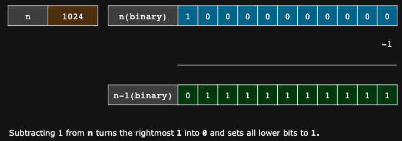
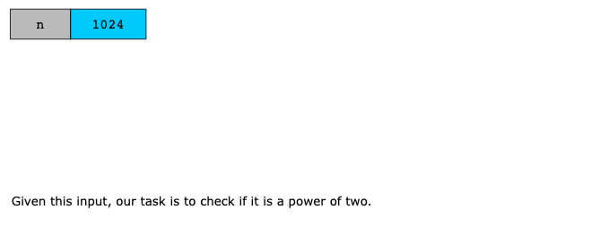
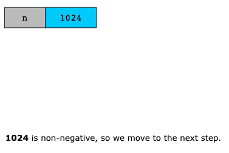
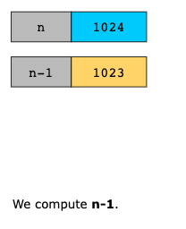
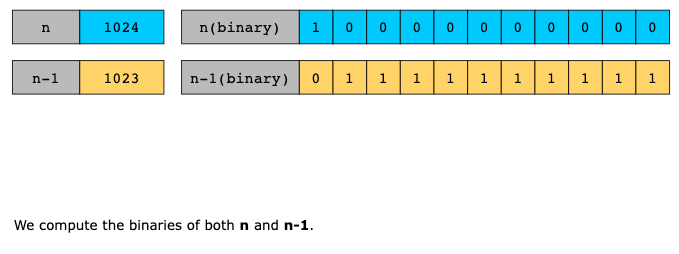
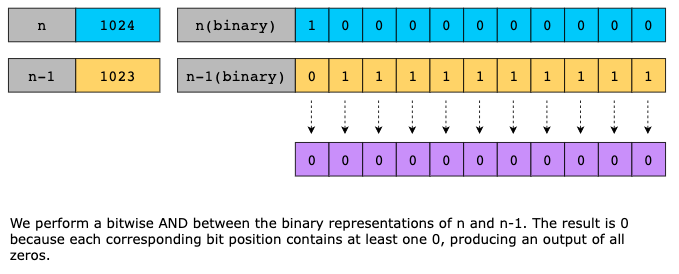
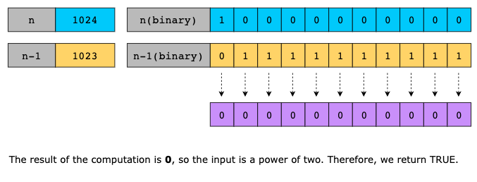

# Power of Two

Given an integer n, return true if it is a power of two. Otherwise, return false.

An integer n is a power of two, if there exists an integer x such that n == 2x.

## Examples

Example 1:
```text
Input: n = 1
Output: true
Explanation: 2^0 = 1
```

Example 2:
```text
Input: n = 16
Output: true
Explanation: 2^4 = 16
```

Example 3:

```text
Input: n = 3
Output: false
```

## Constraints

- -2^31 <= n <= 2^31 - 1
 

> Follow up: Could you solve it without loops/recursion?

## Solution

The main idea of this solution is to use bit manipulation to check whether a number contains only one set bit in its
binary representation. Powers of two are always positive and have exactly one bit set to 1, while all other bits are 0.
First, verify that the number is greater than zero, as negative numbers and zero cannot be powers of two. Then, use the
property that for any power of two, subtracting 1 from n turns the rightmost 1-bit into 0 and flips all bits to the right
of it to 1. Performing a bitwise AND between n and n - 1 gives zero only for powers of two, confirming that the number
contains exactly one set bit.



Using the intuition above, we implement the algorithm as follows:

- If n is less than or equal to zero, return FALSE.
- Compute n - 1 to flip all bits after the rightmost 1-bit in the binary representation of n.
- Perform a bitwise AND between n and n - 1.
- Return TRUE if the result of the above computation is 0; FALSE otherwise.

Let’s look at the following illustration to get a better understanding of the solution:








### Time Complexity

The algorithm’s time complexity is O(1) because it performs only a fixed number of arithmetic and bitwise operations,
regardless of the value of n.

### Space Complexity

The algorithm’s space complexity is constant, O(1).
