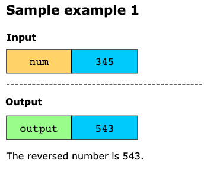
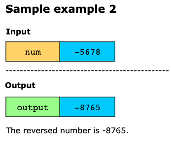
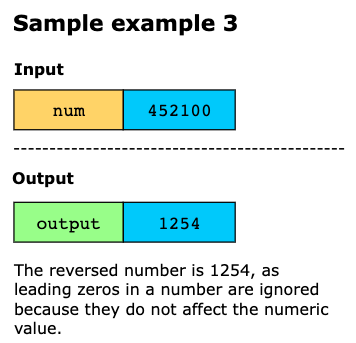
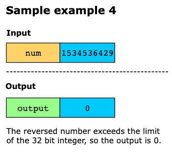

# Reverse Integer

Given a 32-bit signed integer num, reverse its digits and return the result. If the reversed number exceeds the 32-bit
signed integer range [−2^31 ,2^31−1], return 0.

Assume the environment does not support storing 64-bit integers (signed or unsigned).

## Constratints

- `−2^31` <= `num` <= `2^31−1`

## Examples

## Topics

- Math

