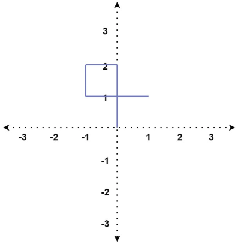
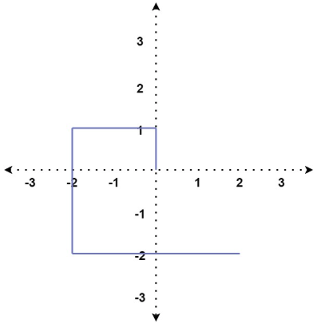
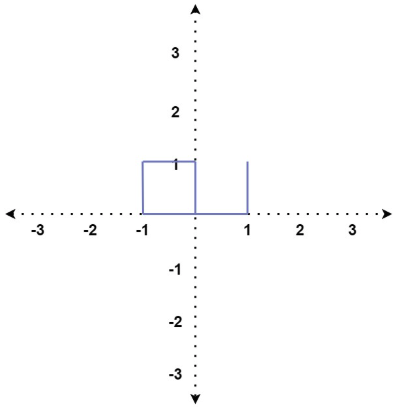
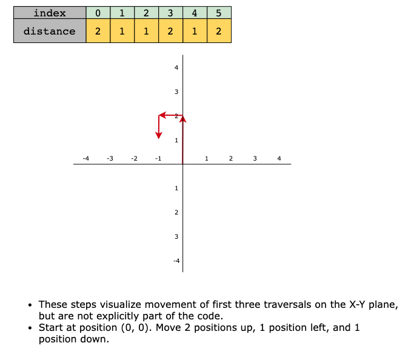
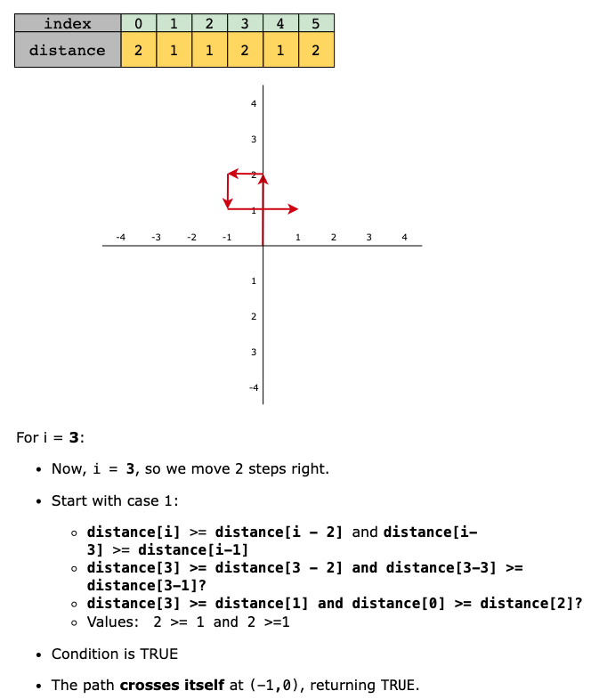
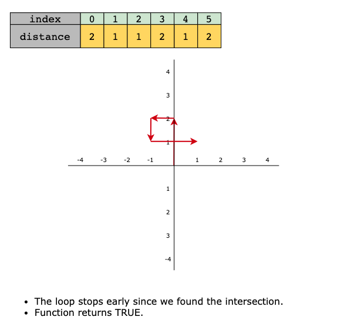

# Self Crossing
You are given an array of integers, distance, where each element represents the length of a move you will make on an
X-Y plane. You start at the origin, which is point (0,0), and move according to the array. Specifically, you move
distance[0] meters north, distance[1] meters west, distance[2] meters south, distance[3] meters east, and continue this
pattern in a counterclockwise direction. Each step follows the sequence—north, west, south, east—repeating as long as
there are remaining distances in the array.

Your task is to determine whether this path crosses itself at any point. This means checking whether you revisit any
previously visited position (including the origin or any other point) at any step. Return TRUE if the path intersects
itself, and FALSE otherwise.

## Constraints

- 1 ≤ `distance.length` ≤ 10^5
- 1 ≤ `distance[i]` ≤ 10^5

## Examples

> Input: distance = [2,1,1,2]
> Output: true
> Explanation: The path crosses itself at the point (0, 1).

> Input: distance = [1,2,3,4]
> Output: false 
> Explanation: The path does not cross itself at any point.

> Input: distance = [1,1,1,2,1]
> Output: true
> Explanation: The path crosses itself at the point (0, 0).

## Topics

- Array
- Math
- Geometry

## Solution

The essence of this solution lies in recognizing the geometric patterns formed when a path moves sequentially in a
structured, counterclockwise manner—north, west, south, and east. This problem follows the math and geometry coding
pattern, where mathematical conditions detect self-crossings based on movement distances alone rather than explicitly
tracking coordinates.

Instead of maintaining a coordinate system, we analyze movement distances and use mathematical comparisons to determine
if the path intersects itself. The key insight is that self crossing occurs when a new line overlaps or intersects a
previous one. By iterating through the distance list, we identify specific conditions used to dynamically handle any
path length effectively. This approach ensures scalability and optimal efficiency.

Specifically, there are three primary cases where self crossing might initially occur, each described below.

> Note: While these cases describe initial intersections involving the 4th, 5th, and 6th lines explicitly, the
> conditions themselves are dynamically applied at every subsequent step for longer paths:

- **Fourth line crosses the first**: This scenario occurs when the current step (distance[i]) crosses over the line from two
  steps before (distance[i - 2]), and the previous step (distance[i -1]) is less than or equal to the distance of three
  steps back (distance[i - 3]).

  > distance[i] ≥ distance[i−2] and distance[i−1] ≤ distance[i−3]

- Fifth line meets first (Overlap): This occurs when the fifth line aligns exactly with, overlaps, or just touches the
  point at which the first line began (0,0). Even touching the origin at the end of the fifth line segment counts as
  self crossing. The condition checks if the previous step distance[i - 1] equals the step three steps back
  distance[i - 3] and whether the sum of the current step distance[i] and the step four steps back distance[i - 4] is
  greater than or equal to the step two steps back distance[i - 2].

  > distance[i−1] == distance[i−3] and distance[i] + distance[i−4] ≥ distance[i−2]

- **Sixth line crosses first (spiral crossing)**: This is a more complex scenario where the sixth line crosses back over the
  first, forming a spiral pattern. Several conditions must simultaneously be met:
  - The fourth step is greater than or equal to the second step:
  
    > distance[i−2] ≥ distance[i−4]
  
  - The fifth step is less than or equal to the third step:
  
    > distance[i−1] ≤ distance[i−3]
  
  - The sum of the first and fifth steps is greater than or equal to the third step:
  
    > distance[i−1] + distance[i−5] ≥ distance[i−3]
     
  - The sum of the current (sixth) step and the fourth step is greater than or equal to the second step:
  
    > distance[i] + distance[i−4] ≥ distance[i−2]
  
This combination ensures the path spirals inward enough to intersect the initial segment.

Now, let’s look at the solution steps below:

1. **Base condition**: If the input list has fewer than four elements, return FALSE because crossing itself with three or
   fewer moves is impossible.
2. **Iterate through the list**: Start iterating from index 3 to check for possible crossings.
3. **Check for crossing cases**:
   - **The fourth line crosses the first (Case 1)**: The fourth step overlaps with the first if the current step is
     greater than or equal to two steps back (distance[i] >= distance[i - 2]), and the previous step is less than or
     equal to three steps back (distance[i - 1] <= distance[i - 3])
   - **The fifth line meets first (Overlap—Case 2)**: The fifth step aligns with the first if the previous step equals
     the step three steps back (distance[i - 1] == distance[i - 3]), and the sum of the current step and the step four
     steps back is greater than or equal to the step two steps back (distance[i] >= distance[i - 2] - distance[i - 4]).
   - **The sixth line crosses first (Spiral crossing—Case 3)**: This happens if:
     - The fourth step is greater than or equal to the second step (distance[i - 2] >= distance[i - 4]).
     - The fifth step is less than or equal to the third step (distance[i - 1] <= distance[i - 3]).
     - The sum of the current step and the fourth step is greater than or equal to the second step (distance[i] + distance[i - 4] >= distance[i - 2]).
     - The sum of the fifth step and the first step is greater than or equal to the third step (distance[i - 1] + distance[i - 5] >= distance[i - 3]).
4. If any of the above conditions are met, return TRUE. If the loop completes without detecting a crossing, return FALSE.

Let’s look at the following illustration to get a better understanding of the solution:

### Time Complexity

The time complexity of the code is `O(n)` because it iterates through the distance array once, where n is the length of
the distance array.

### Space Complexity

The space complexity of the code is O(1) because it stores the variables in a fixed amount of space and does not use
additional data structures that scale with the input size.
