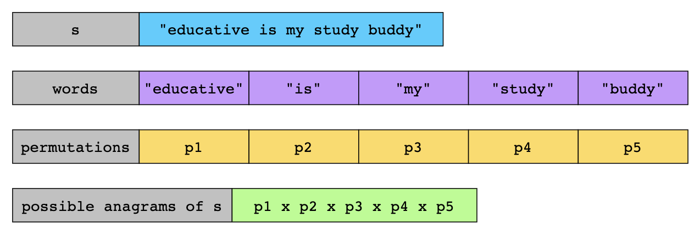
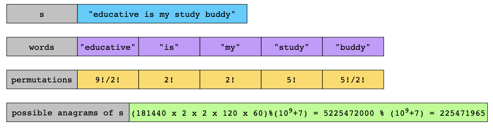

# Count Anagrams

You are given a string s containing one or more words. Every consecutive pair of words is separated by a single space ' '.

A string t is an anagram of string s if the `ith` word of t is a permutation of the `ith` word of s.

For example, "acb dfe" is an anagram of "abc def", but "def cab" and "adc bef" are not.
Return the number of distinct anagrams of s. Since the answer may be very large, return it modulo 10^9 + 7.

## Examples

Example 1:

```text
Input: s = "too hot"
Output: 18
Explanation: Some of the anagrams of the given string are "too hot", "oot hot", "oto toh", "too toh", and "too oht".
```

Example 2:

```text
Input: s = "aa"
Output: 1
Explanation: There is only one anagram possible for the given string.
```

## Constraints

- 1 <= s.length <= 105
- s consists of lowercase English letters and spaces ' '.
- There is single space between consecutive words.

## Topics

- Hash Table
- Math
- String
- Combinatorics
- Counting

## Hints

- For each word, can you count the number of permutations possible if all characters are distinct?
- How to reduce overcounting when letters are repeated? 
- The product of the counts of distinct permutations of all words will give the final answer.

## Solution

An anagram of the entire string means that each word can be rearranged independently, but the order of the words stays
the same. This implies that we can find a string’s total number of distinct anagrams by calculating how many valid
permutations exist for each word. The number of permutations for each word depends on its length and the frequency of its
letters. By multiplying all words’ permutations, we get the total number of distinct anagrams for the whole string.



Let’s explore a few optimizations we can apply to avoid these issues.

- **Precompute factorials**: Calculating factorials repeatedly for each word is very slow. Precompute factorials up to the
  maximum length (1000) to make these calculations faster. This is because it allows us to quickly access the precomputed
  values later.
- **Take modular inverses**: As mentioned in the problem statement, we need to use 10^9 +7 modulo when computing factorial
  values. This prevents integer overflow and keeps the numbers manageable as factorials grow extremely fast. It is easier
  to use modulo when computing permutations of words with no duplicate characters, but it becomes challenging when we have
  words with duplicate characters. This is because a division is involved `(n! / (c1! * c2!*...))` Normal division isn’t
  allowed in modular arithmetic, so we use the modular inverse instead. This will allow us to perform division by
  converting it into multiplication. Therefore, when precomputing factorials, we also precompute their modular inverses,
  i.e. c1!^-1, c2!^-1, c3!^-1 using Fermat’s theorem.

> **Fermat’s Little theorem** states that if p is a prime number and a is an integer not divisible by p, then we we get
> the modular inverse of a as follows:
> a^-1 ≡ a^(p-2) mod p
> In our case, MOD = 10^9 +7 (a prime number), and we need modular inverses of c1!, c2!, c3! and so on, so the modular
> inverse of cx! is computed as:
> cx^-1 ≡ cx^(MOD-2) mod MOD

In the example illustration above, the final answer becomes a more manageable number after applying the modulo operation.



Let’s look at the algorithm steps of this solution:

- **Set up the constants and variables**:
  - We define a large prime number, MOD = 10**9 + 7, to keep calculations manageable.
  - We define a variable, MAX_LEN = 1000, representing the maximum possible word length. The length of any word will not
    exceed 1000.
  - We create two lists, factorials and invFactorials, to store precomputed values that make calculations faster later.
  - We create a variable, result, to store the final result.
- **Precompute factorials and inverse factorials**: This step is done once at the start to speed things up later. A
  function preCompute() is used to:
  - Compute the factorials for all numbers up to MAX_LEN using the preCompute function.
  - Compute the modular inverse of these factorials (used for division in modular arithmetic). First, the modular inverse
    of factorials[MAX_LEN] is computed. Then, we calculate the inverse factorial for all numbers down to 1 using this.
  - Store them in lists, factorials and invFactorials, so we don’t have to recompute them every time.
- **Count permutations for each word**: The function countPermutations(word) calculates how many unique ways we can rearrange
  a word. It uses the precomputed factorials and inverse factorials for fast calculations.
  - First, it counts how many times each letter appears in the word, letter_count.
  - Then, it calculates the number of ways to arrange the letters, total_permutations.
  - If a letter repeats, it adjusts the count to avoid counting the same arrangement multiple times.
- **Count anagram groups in a sentence**: The function countAnagrams(s) works as follows:
  - It splits the sentence into words, words.
  - It finds the unique arrangements for each word using countPermutations(word).
  - It multiplies and stores all the results together in result to get the total number of anagram groups.
  - After processing all words, return the total number of valid anagrams of the entire string result.

### Time Complexity

Let’s break down and analyze the time complexity of this solution:

- **Precomputation step**: This step takes O(n) time, where n = MAX_LEN (the maximum possible word length in the input string
  s). Let’s see how:
  - **Factorials calculation**: Computing factorials for all numbers up to MAX_LEN takes O(n) time.
  - **Inverse factorials calculation**: Calculating inverse factorials in a backward loop also takes O(n).
- **Processing each word:** This step takes O(m) time, where m is the length of the word. Let’s see how:
  - Counting characters for each word takes O(m) time.
  - **Calculating permutations for each word**: We loop over character counts (at most 26 for lowercase English letters),
    which takes O(1).
  - **Modular multiplications**: This takes O(1) per operation.
- Iterating through all words: Let L represent the total length of the input string. As we split the input into words and
  process each word, this takes O(L).

If we sum these up, the overall time complexity simplifies to:

`O(n) + O(m) + O(L) = O(n+L)`

### Space Complexity

Let’s break down and analyze the space complexity of this solution:

- **Factorials array**: It stores factorials from 0 to MAX_LEN, so the space required is O(n).
- **Inverse factorials array**: It stores modular inverses of factorials from 0 to MAX_LEN, so the space required is O(n)

As no additional significant space is used during the calculations, the total space complexity becomes:

`O(n) + O(n) = O(n)`
