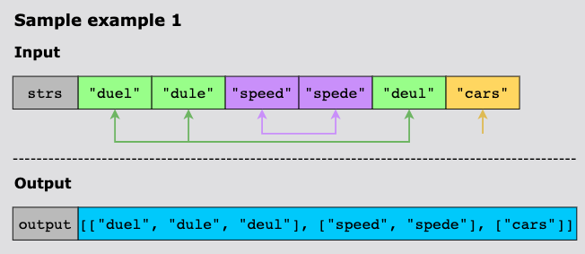
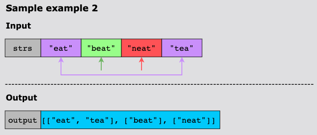

# Group Anagrams

Given a list of words or phrases, group the words that are anagrams of each other. An anagram is a word or phrase formed
from another word by rearranging its letters.

Constraints:

Let `strs` be the list of strings given as input to find the anagrams.

- 1 <= `strs.length` <=10^3
- 0 <= `strs[i].length` <= 100
- `strs[i]` consists of lowercase English letters

> Note the order in which the output is displayed doesn't matter

## Examples

