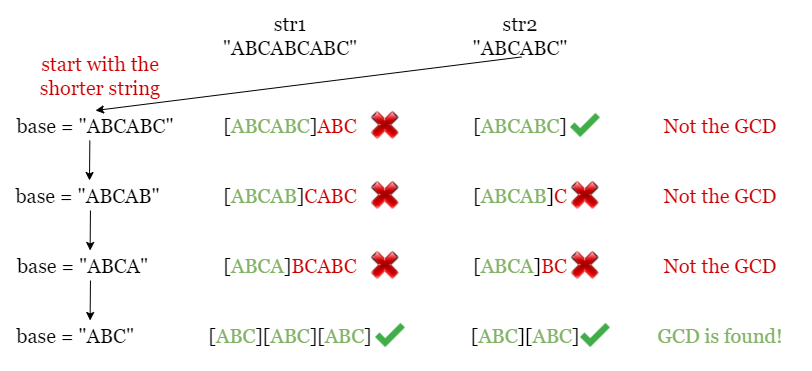
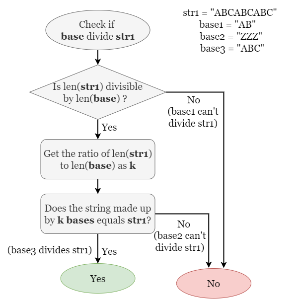

# Greatest Common Divisor of Strings

For two strings s and t, we say "t divides s" if and only if s = t + ... + t (i.e., t is concatenated with itself one or
more times).

Given two strings str1 and str2, return the largest string x such that x divides both str1 and str2.

```plain 

Example 1:

Input: str1 = "ABCABC", str2 = "ABC"
Output: "ABC"
Example 2:

Input: str1 = "ABABAB", str2 = "ABAB"
Output: "AB"
Example 3:

Input: str1 = "LEET", str2 = "CODE"
Output: ""
```

## Solution

### Approach 1: Brute Force

#### Intuition

We start by introducing a brute force method that checks every possible string until we find the GCD string. Before we
do that, let's clarify a few things:

> What are the possible candidate strings?

Here we make use of prefix strings. If a string base is the GCD string, it must be a prefix of both str1 and str2. So
instead of trying every combination of characters, we instead just take each prefix string of str1 (or str2) and check
if it is the GCD string.

> What is the order we should check in?

As the problem indicates that we should look for the greatest common divisor string (longest length), we should start
with the longest possible prefix string, which is the shorter string between str1 and str2 (any longer string is
guaranteed not to be a divisible string since it will be longer than at least one string). If the current base is not
valid, we can check the next shorter prefix by removing the last character from base.



> How to verify if base is the GCD string?

If base is the GCD string, then both str1 and str2 are made up of multiples of base, so we just need to check if str1
and str2 can be made up of multiple base concatenations. We first check if the length of str is divisible by the length
of base. If so, we multiply base by the number of times the lengths divide and check if the made-up string equals str.



#### Algorithm

1. Find the shorter string among str1 and str2, without loss of generality, let it be str1.
2. Start with base = str1, and check if both str1 and str2 are made of multiples of base.
    - If so, return base.
    - Otherwise, we shall try a shorter string by removing the last character from base.
3. If we have checked all prefix strings without finding the GCD string, return "".

#### Complexity Analysis

Let m,n be the lengths of the two input strings str1 and str2.

- Time complexity: `O(min(m,n)⋅(m+n))`:

  We checked every prefix string base of the shorter string among str1 and str2, and verify if both strings are made by
  multiples of base. There are up to min⁡(m,n)\min(m, n)min(m,n) prefix strings to verify and each check involves
  iterating over the two input strings to check if the current base is the GCD string, which costs O(m+n)O(m + n)O(m+n).
  Therefore, the overall time complexity is O(min⁡(m,n)⋅(m+n))O(\min(m, n) \cdot (m + n))O(min(m,n)⋅(m+n)).


- Space complexity: `O(min(m,n))`.

  We need to keep a copy of base in each iteration, which takes O(min⁡(m,n))O(\min(m, n))O(min(m,n)) space.

---

## Related Topics

- String
- Math
