# Integer to English Words

Given a nonnegative integer, num, convert it to its English word representation.

## Constraints

- 0 ≤ `num` ≤ 2^31−1

## Examples

Example 1:

```text
Input: num = 123
Output: "One Hundred Twenty Three"
```

Example 2:

```text
Input: num = 12345
Output: "Twelve Thousand Three Hundred Forty Five"
```

Example 3:
```text
Input: num = 1234567
Output: "One Million Two Hundred Thirty Four Thousand Five Hundred Sixty Seven"
```

## Topics

- Math
- String
- Recursion

## Solution(s)

1. [Overview](#overview)
2. [Recursive Approach](#recursive-approach)
2. [Recursive Approach 2](#recursive-approach-2)
3. [Iterative Approach](#iterative-approach)
4. [Pair-Based Approach](#pair-based-approach)

### Overview

We need to create a program that converts any non-negative integer into its English word representation. The program
must handle the English numbering system accurately, including terms like thousands, millions, and billions, and must
follow the rules for numbers below one hundred to ensure correct phrasing.

#### Key Points:

- The input can range from 0 to 2,147,483,647 (i.e., the maximum value for a 32-bit signed integer).
- The first letter of each word must be capitalized.
- Words should be separated by a single space, with no trailing spaces.

Observe the tree diagram below to understand how numbers are spelled out in English, along with their corresponding
units and scales. This will help us see the repetitive patterns and their resemblance to a tree data structure, which
lends itself to a recursive approach.

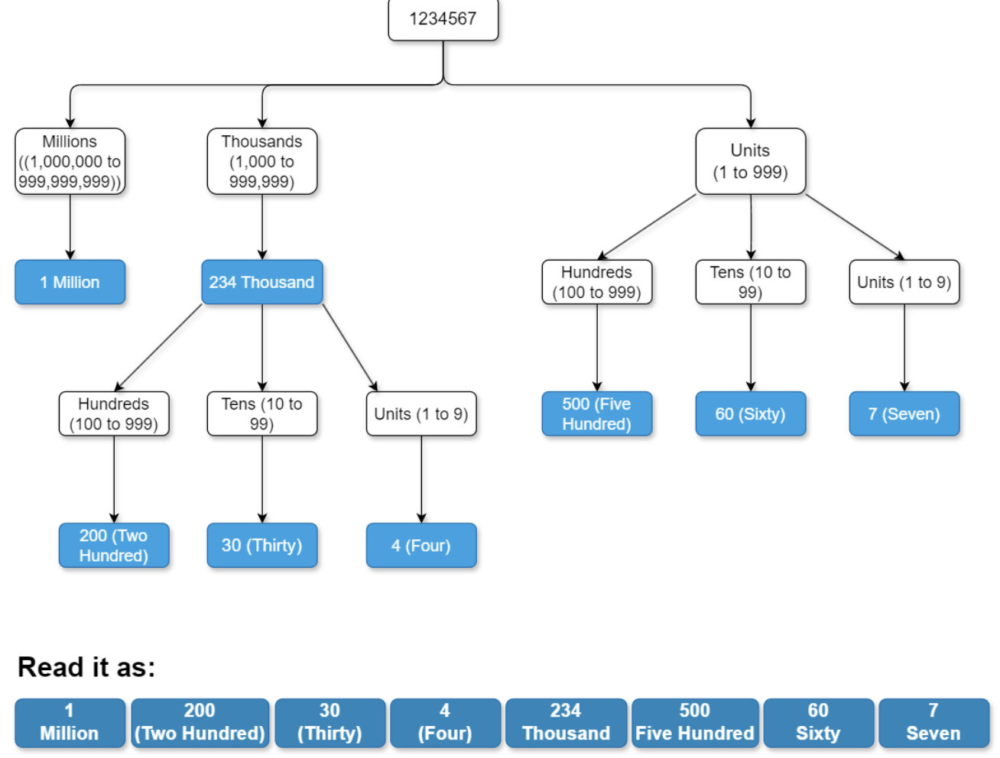

### Recursive Approach

In the recursive approach, we break down the number into smaller parts based on place values such as ones, tens,
hundreds, thousands, millions, and so on.

We start with the largest place value and proceed downward. For example, with the number 1234567, we first handle the
millions part (1 Million).

We use a helper function that recursively breaks down the number. If the number is less than 10, we return the
corresponding word from a predefined list (belowTen). For numbers less than 20, we use another list (belowTwenty) due to
their unique names.

For numbers below 100, we combine the word for the tens place (from belowHundred) with the word for the ones place, using
further recursive calls. For numbers below 1000, we break the number into hundreds and the remainder, processing each part
recursively.

For larger numbers like 1234567, the function handles the millions part (1 Million), then the thousands (234 Thousand),
and finally the hundreds and smaller units (567). Each chunk is processed using recursive calls, building the final
English representation from smallest to largest units.

The recursive function works as follows:

1. Base Case: For numbers less than 10, the function directly maps to a word using belowTen. For numbers between 10 and
   19, belowTwenty handles these unique cases. For numbers between 20 and 99, it combines words from belowHundred for 
   tens and recursively processes the remainder for units.
2. Recursive Case: For numbers 100 and above, the function processes hundreds, thousands, millions, and billions by
   breaking the number into smaller parts. For example, for 1234567, it processes the millions part (1 Million), then
   the thousands part (234 Thousand), and finally the remainder (567). Each part is processed recursively to ensure 
   accurate conversion.

After processing each chunk, we combine the results, handling the hierarchical structure from the smallest unit up to
the largest (like billions), ensuring that each segment is correctly represented in English.

Here is the algorithm step by step:

1. Initialize arrays to store words for different ranges of numbers:
   - `belowTen` for numbers 1-9. 
   - `belowTwenty` for numbers 10-19. 
   - `belowHundred` for multiples of ten from 20-90.
2. Define the main function numberToWords to handle the conversion:
   - If the number is zero, return "Zero". 
   - Otherwise, call the helper function convertToWords to start the conversion process.
3. Implement the helper function convertToWords to convert numbers to words recursively:
   - Base Case 1: Numbers less than 10:
     - Return the corresponding word from belowTen.
   - Base Case 2: Numbers less than 20:
     - Return the corresponding word from belowTwenty.
   - Numbers from 20 to 99:
     - Combine the word for the tens place from belowHundred with the recursive result for the units place.
   - Numbers from 100 to 999:
     - Combine the recursive result for the hundreds place with "Hundred", and the recursive result for the remaining part.
   - Numbers from 1000 to 999,999:
     - Combine the recursive result for thousands with "Thousand", and the recursive result for the remaining part.
   - Numbers from 1,000,000 to 999,999,999:
     - Combine the recursive result for millions with "Million", and the recursive result for the remaining part.
   - Numbers 1,000,000,000 and above:
     - Combine the recursive result for billions with "Billion", and the recursive result for the remaining part.


#### Complexity Analysis

Let N be the number

##### Time Complexity

`O(log10(N))` because the number of recursive calls is proportional to the number of digits in the number, which grows
logarithmically with the size of the number.

#### Space Complexity

The space complexity is `O(log10(N))`, mainly because of the recursion stack. Each recursive call adds a frame to the
stack until the base case is reached, leading to space usage proportional to the number of digits in the number.

### Recursive Approach 2


To solve this problem, we need to understand the different types of words that can appear in the word representation of
a number, which depend on three factors:

1. **Digits**: There are ten digits ranging from 0 to 9. 
2. **Number of digits**: In our case, the maximum number of digits could be 10 because the input number, num, will be in the
   range [0, 2147483647].
3. **Positional values**: The positional value, also known as place value, of a digit can be ones (units), tens, hundreds,
   thousands, ten thousands, hundred thousands, millions, ten millions, hundred millions, or billions.

Based on these factors, numbers in different ranges have specific word representations. Here’s a general workflow for
converting numbers to their word representation:

1. **Numbers from 0 to 19**: The numbers in the range [0,19] have unique word representations.
2. **Numbers from 20 to 99**: The numbers in the range [20,99] are represented using two words except for the tens, which
   are represented using one word. In the case of two words, the first word represents the digit at the tens place, and
   the second represents the digit at the units place.
3. **Numbers from 100 to 999**: The numbers in the range [100,999] are represented by the hundreds place digit followed by
   the word “Hundred.” The remaining two digits are represented as performed in steps 1 and 2.
4. **Numbers 1000 and above**: The numbers greater than 1000 are broken down into segments of thousands and represented
   using words like “Thousand,” “Million,” “Billion,” and so on.

Using the workflow above, the solution can be implemented as follows:

1. If num is 0, return “Zero.”
2. Store the word representations of the numbers from 1 to 19 in a list below20.
3. Store the word representations of tens numbers (20,30,...,90) in a list tens.
4. Store the word representations of thousands numbers in a list thousands. Specifically, store “”, “Thousand,”
   “Million,” and “Billion.”
   > Because the input number, num, will be in the range [0,2147483647], the largest thousand-word number could be “Billion.”
5. Define a function, represent, that receives a three-digit number, n, as a parameter and performs the following steps:
   - If it’s in the range [1,19], its word representation can be retrieved as below20[n-1].
   - If it’s in the range [20,99], its word representation is formed by combining the appropriate word from tens with
     the word for the units digit from below20.
   - If it’s in the range [100,999], represent the hundreds digit using below20 followed by “Hundred,” and the remaining
     two digits are represented using steps I and II.
6. Initialize an empty string, result.
7. For each string t in thousands:
   - If the last three digits of num are not zero, convert these digits to their word representation using the represent
     function and append the corresponding t (such as “Million,” “Thousand,” etc.). Concatenate this string to the front
     of the current result string.
   - Divide num by 1000 and update num with the quotient.
8. Return the result string.

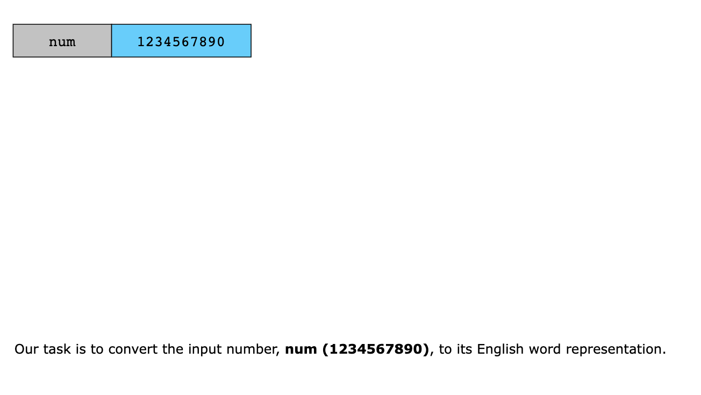
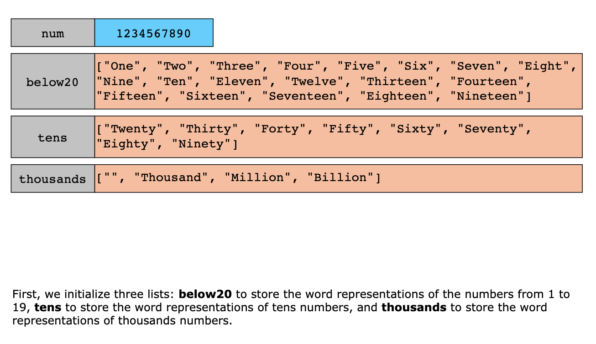
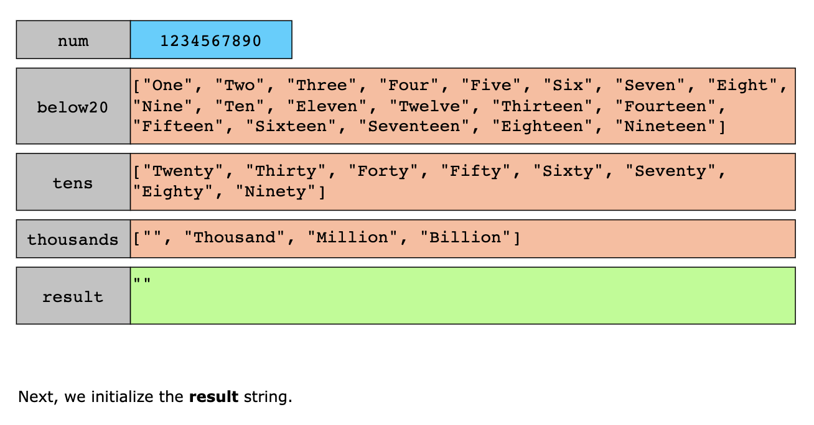
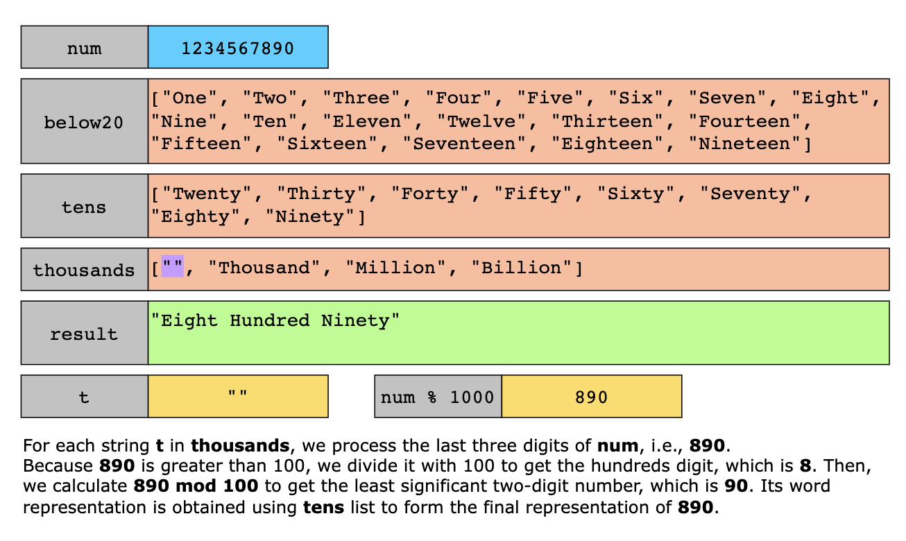
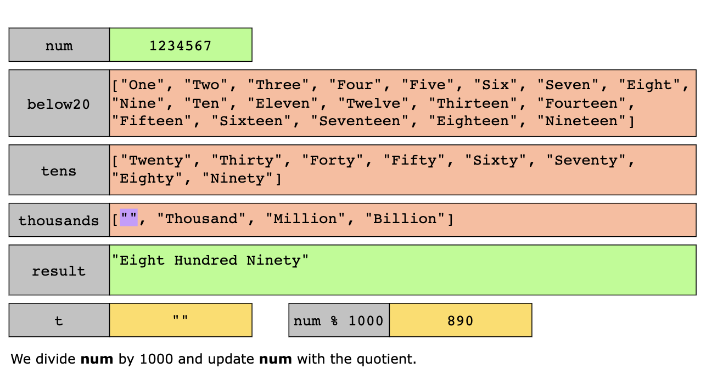
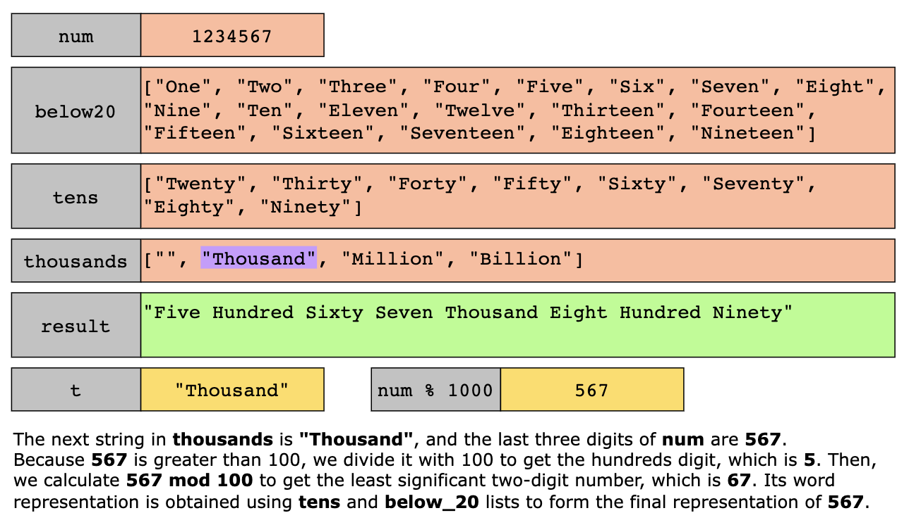
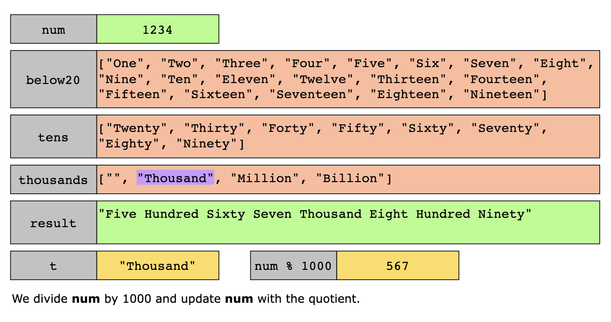
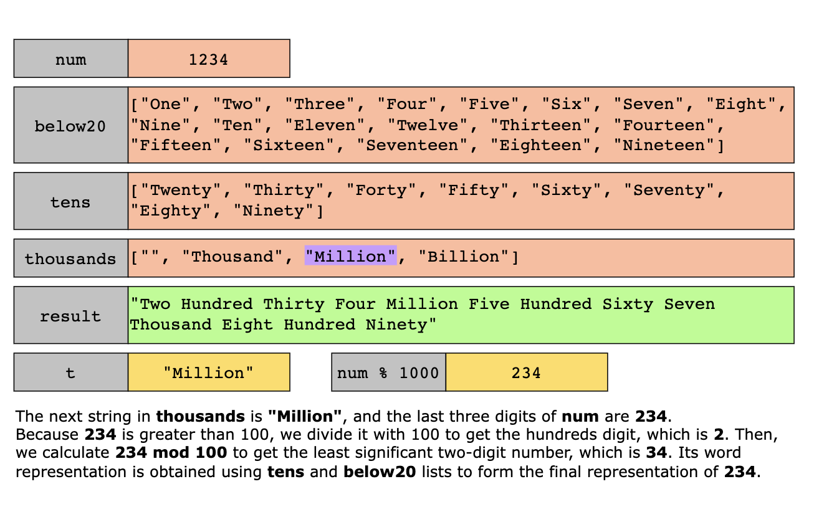

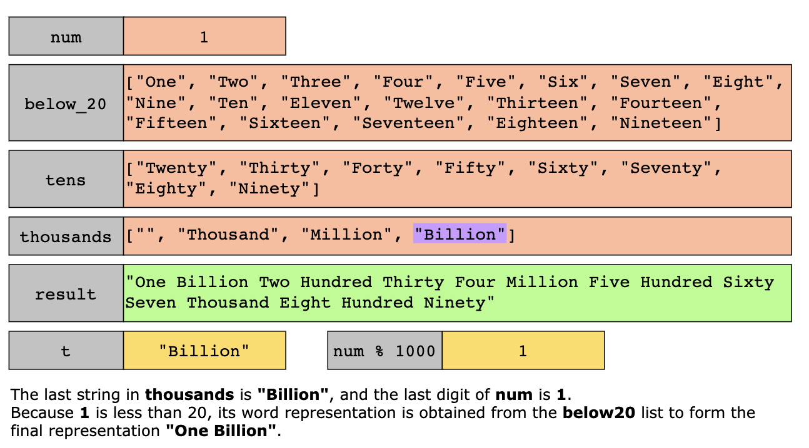
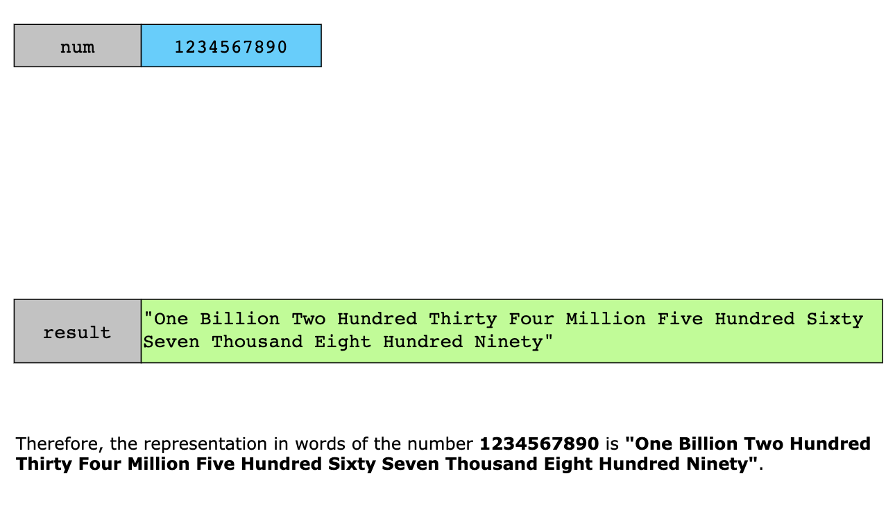

#### Complexity Analysis

##### Time Complexity

The algorithm’s time complexity is `O(log(n))`, where n is the input number num.

##### Space Complexity

The algorithm’s space complexity is `O(1)`.

### Iterative Approach

In the iterative approach, we convert a number into English words by processing it in chunks of three digits,
corresponding to thousands, millions, billions, etc.

We initialize arrays for place value words (like thousand, million, billion) and for digit and tens names. A loop
processes the number from the least significant chunk (ones, tens, hundreds) to the most significant chunk (thousands,
millions, billions).

For instance, with the number 1234567, we repeatedly use the modulus operation % 1000 to extract chunks of three digits.
We start by using 1234567 % 1000 to get 567, then 1234 % 1000 to get 234, and finally 1 % 1000 to get 1. Each chunk is
then converted to English words."

To convert each chunk:

1. Handle the hundreds place if present (e.g., 567 becomes "Five Hundred").
2. Process the tens and ones (e.g., 67 becomes "Sixty-Seven").
3. Append the appropriate scale word (e.g., thousand, million) based on the chunk's position (e.g., 234 becomes "Two
   Hundred Thirty-Four Thousand"). 
4. We track the scale by using an index (groupIndex) that increments with each chunk processed. This index is used to
   fetch the correct scale word (thousand, million, billion) from the thousands array. For example:

- `groupIndex = 0`: No scale word (ones place).
- `groupIndex = 1`: "Thousand".
- `groupIndex = 2`: "Million".
- `groupIndex = 3`: "Billion".

We build the final result by concatenating the words for each chunk, starting from the least significant chunk and
moving to the most significant. This ensures the correct placement of scale words and produces the final English
representation of the entire number.

The algorithm is as below:

- Handle the special case where the number is zero by returning "Zero".
- Initialize arrays to store words for single digits, tens, and thousands:
  - ones for numbers 1-19. 
  - tens for multiples of ten from 20-90. 
  - thousands for scales ("Thousand", "Million", "Billion").
- Process the number in chunks of 1000.
  - Extract the last three digits of the number and handle hundreds, tens, and units:
    - Handle hundreds place by adding the corresponding word from ones and "Hundred".
    - Handle tens and units place by combining the word from tens and ones.
  - Append the scale ("Thousand", "Million", "Billion") for the current group.
  - Insert the group result at the beginning of the final result.
- Move to the next chunk of 1000 by dividing the number by 1000.
- Return the result after removing trailing spaces.

#### Complexity Analysis

Let `N` be the number.

##### Time Complexity

`O(log 10(N))`, because the number is divided by 1000 in each iteration, making the number of iterations proportional
to the number of chunks, which is logarithmic.

##### Space Complexity

`O(1)`, constant space. The space used is independent of the number's size, as it involves only a few string builders and
arrays.

### Pair-Based Approach

In the pair-based approach, we use a predefined list of numeric values and their corresponding English words to convert
a number. We process the number by matching it against these pairs from largest to smallest, dividing the number, and
converting each part recursively.

We start by defining a list of pairs where each pair consists of a numeric value and its English word, such as
1000000000 for "Billion", 1000000 for "Million", and down to 1 for "One". This list facilitates conversion by
identifying which value fits into the current number.

For a number like 1234567, we iterate through the list from the largest value to the smallest. We check if the number is
greater than or equal to each value. If it is:

- **Divide the Number**: Determine how many times the value fits into the number (the quotient) and calculate the remainder.
  For 1234567, we match 1 Million, resulting in "One Million", and then process the remainder (234567).
- **Recursive Conversion**: Convert the quotient to words and recursively process the remainder using the same list of pairs.

We concatenate the word for the current pair with the results from the recursive call for the remainder. This process
builds the final English word representation from the largest units (like billion) to the smallest (like one), ensuring
an accurate representation of every part of the number.

The algorithm steps:

- Initialize a pair numberToWordsMap that maps numeric values to their corresponding English words:
  - Includes large scales ("Billion", "Million", "Thousand", "Hundred") and individual numbers (1-19, and multiples of
    ten from 20 to 90).
- Handle the special case where the number is zero by returning "Zero".
- Call the function numberToWords to convert the number to English words:
  - Iterate over the numberToWordsMap:
    - For each pair (value, word) in numberToWordsMap, check if the number num is greater than or equal to value.
      - If num is greater than or equal to value:
        - Compute the prefix:
          - If num is 100 or greater, recursively convert the quotient (num / value) to words and append " " (a space).
            If num is less than 100, set prefix to an empty string.
        - Get the unit as the current word from numberToWordsMap.
        - Compute the suffix:
          - If the remainder (num % value) is zero, set suffix to an empty string. Otherwise, recursively convert the
            remainder to words and prepend " " (a space).
        - Return the combined result: prefix + unit + suffix.
- If the number is not zero, the function will return the complete English representation by combining the prefix, unit,
  and suffix.

#### Complexity Analysis

Let `K` be the number of pairs in numberToWordsMap and `N` be the number.

##### Time Complexity

The time complexity is `O(K)` because the loop iterates through the pairs until it finds a match. This complexity is
linear with respect to the number of pairs, which is constant in practice as the number of pairs is fixed.

##### Space Complexity

`O(log10(N))`, mainly due to the recursion stack in the convert function. The space used is proportional to the number
of recursive calls made.
