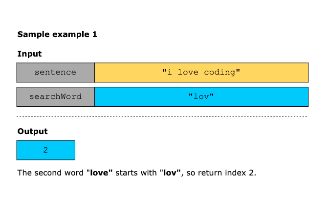
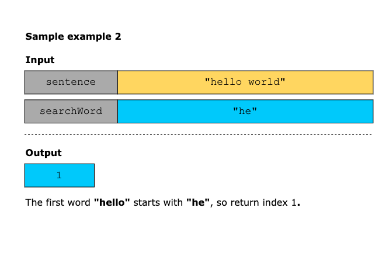
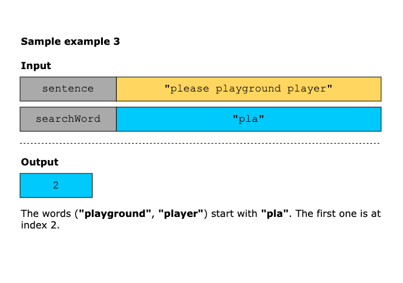
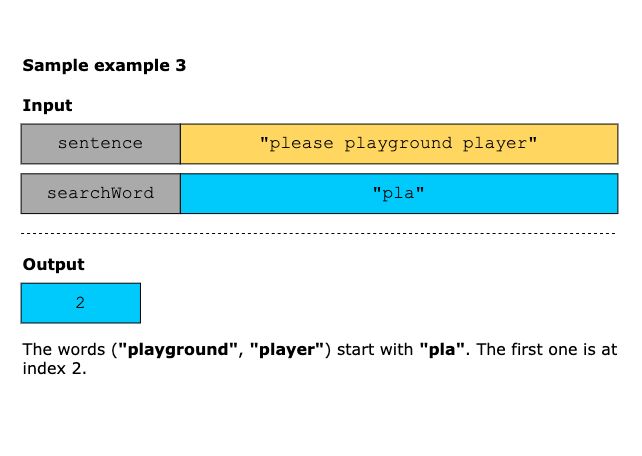

# Check if a Word is a Prefix of Any Word in a Sentence

You are given a sentence containing words separated by single spaces and a searchWord. Your task is to determine whether 
searchWord is a prefix of any word in the sentence.
Return the 1-based index of the first word in which searchWord appears as a prefix.

- If searchWord is a prefix of multiple words, return the index of the earliest such word. 
- If no word starts with searchWord, return −1

> A prefix of a string is any contiguous substring that begins at the first character.

Constraints:

- 1 <= sentence.length <= 100
- 1 <= search_word.length <= 10 
- The sentence consists of lowercase English letters and spaces. 
- search_word consists of lowercase English letters.

## Examples

