# Find the Lexicographically Largest String From Box

You are given a string, word, and an integer numFriends, representing the number of friends participating in a game 
organized by Alice.

The game consists of multiple rounds, and in each round:
- The string word is split into exactly numFriends non-empty substrings.
- The split must be unique; no previous round has produced the same sequence of splits.
- All resulting substrings from the split are placed into a box.

When all rounds are over and all possible unique splits have been performed, determine the lexicographically largest 
string among all the substrings in the box.

> A string `a` is considered lexicographically larger than a string `b` if:
> - At the first position where `a` and `b` differ, the character in `a` comes later than the corresponding character in 
`b` in the alphabet.
> - If `a` is a prefix of `b`, the longer string is considered larger.
 
**Constraints**

- 1 ≤ `word.length` ≤ 10^3
- `word` consists only of lowercase English letters.
- 1 ≤ `numFriends` ≤ `word.length`

## Examples


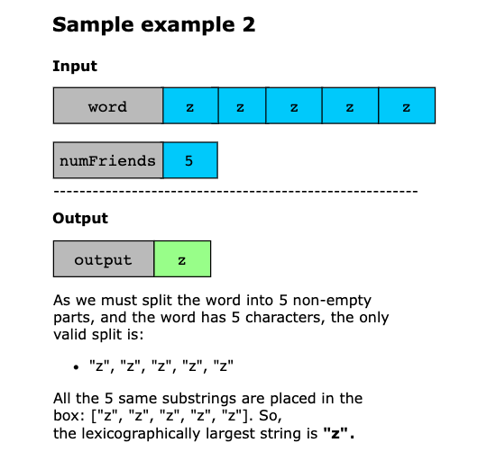
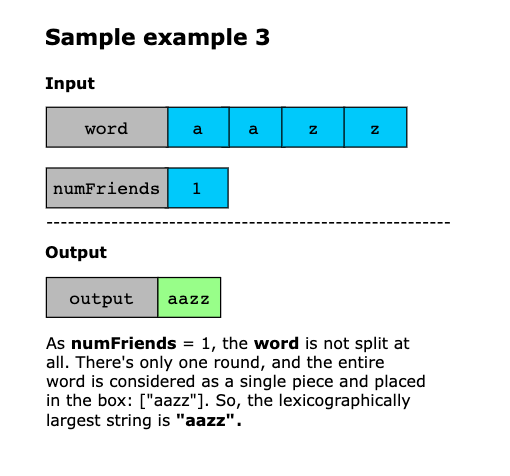
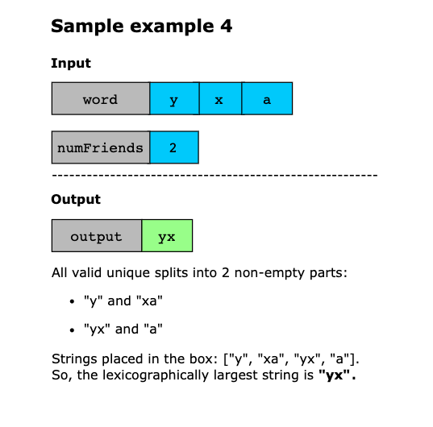

## Solution

In the game, each round splits the string into `num` non-empty parts. The longest possible contiguous segment 
that can appear in the box from any round can be computed as:

```text
length = len(word) - num + 1
```

We begin by observing that we don’t need to collect all substrings from all game rounds. Instead, we only care about 
substrings of this specific length, as those are the longest possible segments that can be added to the box. A 
straightforward approach would be to generate all substrings of this length, compare them individually, and return the 
lexicographically largest. However, this method would be inefficient for longer strings.

We use the two pointers technique to scan the string in a single pass to improve this. This allows us to track and 
update the best candidate substring on the fly without explicitly generating every possible option.

The algorithm is based on the principle that lexicographical order is determined by the first differing character 
between two substrings. It begins by handling a simple case: if there is only one friend, no splitting is needed, and 
the entire word is returned immediately as the output.

Otherwise, the algorithm uses two pointers:
- One pointer for marking the beginning of the current best substring.
- The second pointer is for exploring potential alternatives.

To compare the two, characters from each position are examined individually. The comparison moves forward as long as the
characters match, skipping over any shared prefix. This is a key optimization: common prefixes don’t need to be 
rechecked. When a difference is found or when one of the substrings ends, the algorithm checks which substring is 
lexicographically larger. If the new candidate is better, it replaces the current best. Then, instead of resuming the 
comparison from the next character, the algorithm uses the length of the skipped prefix to jump forward, avoiding any 
redundant overlapping comparisons.

This skipping logic is important. It guarantees that no character is re-evaluated unnecessarily, making solving the 
problem in linear time possible. So, by comparing character-by-character and skipping ahead, the algorithm identifies 
the lexicographically largest substring of the required length.

Now, let’s look at the solution steps below:

1. We handle the edge case where `num == 1`. The entire string is returned in this case because no splitting is 
   necessary.
2. We initialize two pointers: i = 0 marks the starting index of the current best substring, and j = 1 is the starting 
index of the candidate substring.
3. We also use k = 0 to compare characters one by one.
4. While j is within bounds of the string, we compare characters at positions i + k and j + k:
   - If they are equal, we increment k by 1 to continue the comparison.
   - If the character at j + k is greater, it means the candidate substring is better. So, store the value of i in a 
    temporary variable tempIndex, update i = j, and shift j forward using j = max(j + 1, tempIndex + k + 1).
   - If the character at i + k is greater, we skip past the common prefix using j = j + k + 1 to avoid redundant 
    comparisons.
5. After finishing all comparisons, the best substring starts at the index i and has a length of `len(word) - num + 1.`
6. We return the best final substring as the result.

Let’s look at the following illustration to get a better understanding of the solution:

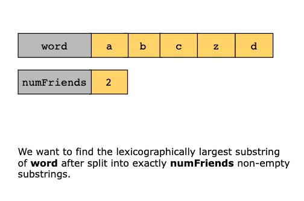
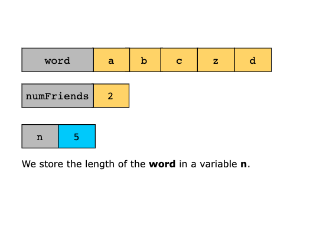
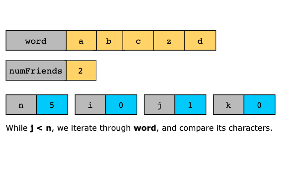
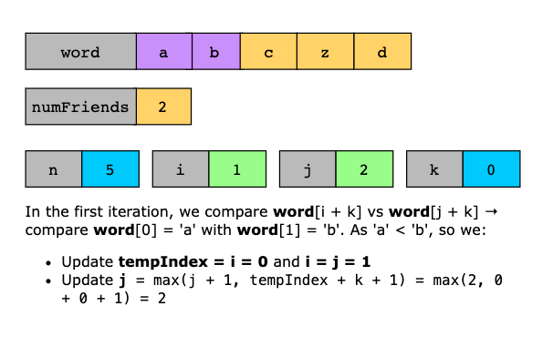
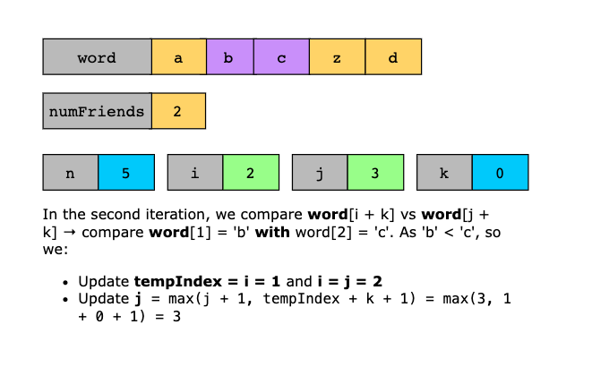
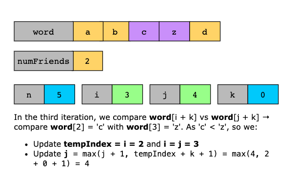
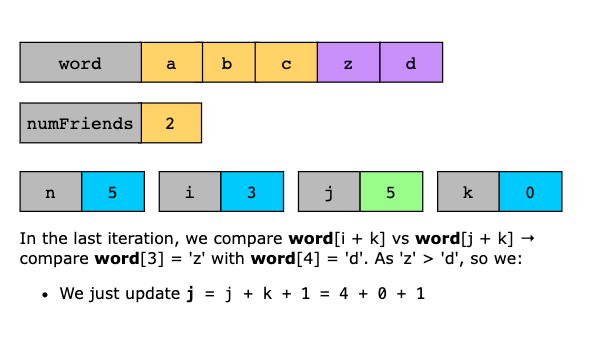
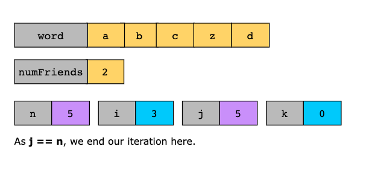
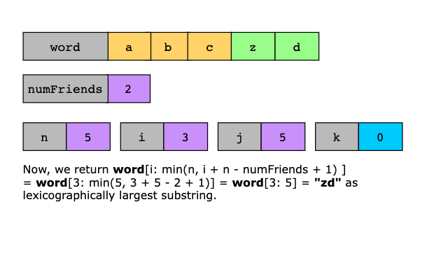

## Time Complexity

The overall time complexity of the solution is `O(n)`because:
- The string is scanned using two pointers (`i` and `j`) and an offset pointer (`k`) for character comparisons. 
- Each character is compared at most a constant number of times. 
- The `j` pointer skips over redundant regions, ensuring linear traversal. 
- Total comparisons across the entire string remain linear in `n`.

## Space Complexity

The space complexity of the solution is `O(1)`because a constant space is used for pointer variables only.
