# Longest Common Prefix

Given an array of strin `strs`, write a function to find the longest common prefix string in `strs`. If there is 
no common prefix, return an empty string, "".

Constraints

* 1 ≤ `strs.length` ≤ 200
* 0 ≤ `strs[i].length` ≤ 200
* `strs[i]` consists of only lowercase English letters.

## Solution

The intuition behind the trie-based approach lies in efficiently organizing and searching for common prefixes. When 
dealing with a group of strings, comparing them character by character can become inefficient, especially with large 
datasets. A trie offers a natural structure for handling prefixes by grouping common prefixes under shared nodes. This 
allows us to insert all words into the trie and easily identify the longest common prefix through traversal. By 
leveraging the trie, we avoid repeated comparisons and improve the search for the shared prefix among all strings.

To solve the problem of finding the longest common prefix among an array of strings, we will use a trie (prefix tree) 
for efficient searching. Searching for the longest common prefix could be costly using data structures like arrays or 
linked lists, but a Trie offers an optimized approach. By storing all words in a trie, we can efficiently identify the 
longest common prefix all strings share.

### Storing words in the trie

We start by inserting each word in the trie, as follows:

1. We begin with the root node for each word and insert its characters individually.
   - If the character does not already exist as a child of the current node, a new TrieNode is created.
   - If the character exists, we move to the corresponding child node.

2. Once we insert the final character of a word, we mark the node as the end of that word. This helps differentiate 
   between partial and complete words stored in the trie.

By inserting all the words, we create a shared structure in the trie where common prefixes are naturally grouped under 
the same path.

### Finding the longest common prefix

After building the trie, we traverse it to find the longest common prefix:

1. We start from the root and traverse down the trie.
2. As long as there is exactly one child at a node, and it’s not the end of a word, we append that character to the 
   prefix. This ensures that we only collect characters that are common to all words.
   - If we encounter a node with multiple children, or if the current node is marked as the end of a word, we stop, as 
    this indicates a divergence or the completion of a word.

3. The characters we collect during this traversal form the longest common prefix.

For the input `["carpenter", "car", "carpet"]`:

- We first insert all three words into the trie.
- When traversing the trie, we find that the common path is `"carpe"` because both "carpenter" and `"carpet"` share this 
  prefix, and `"car"` diverges after `"car"`.

By leveraging the trie, we efficiently capture the longest common prefix without repeatedly comparing strings. This 
approach reduces search time complexity and handles the task efficiently, especially when dealing with larger datasets.

The slides below illustrate the steps of the solution in detail:

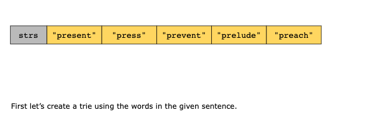
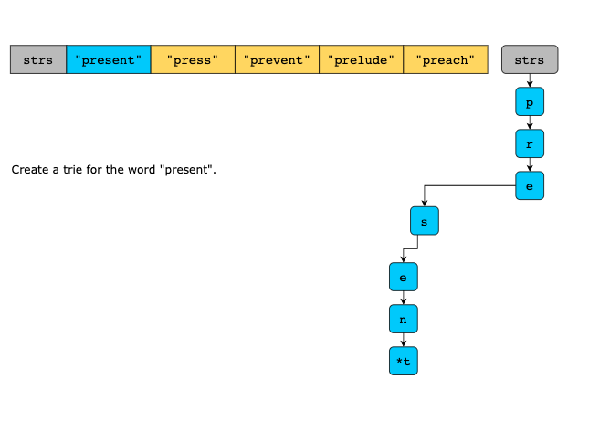
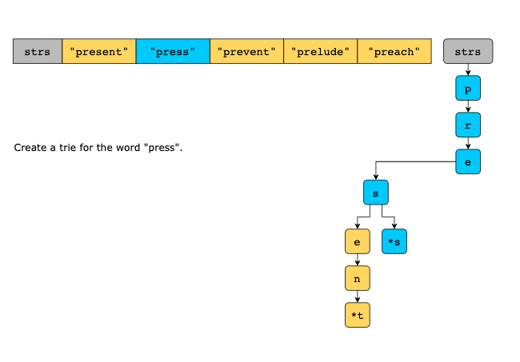
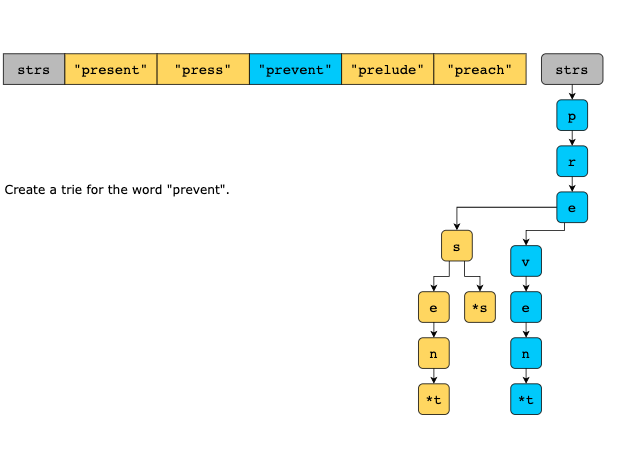
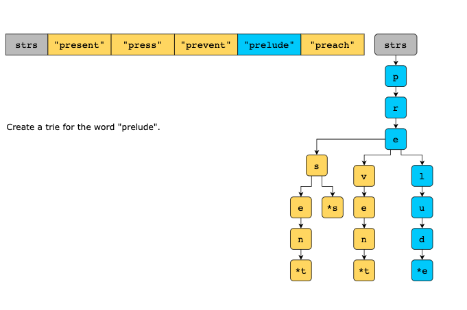
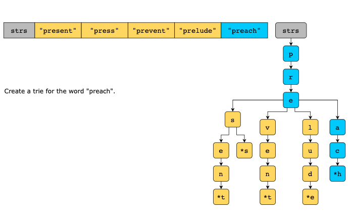
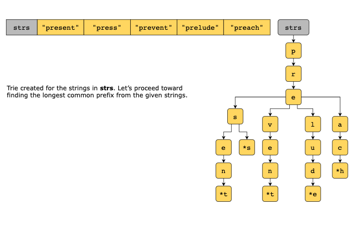
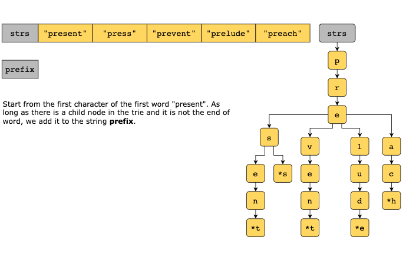
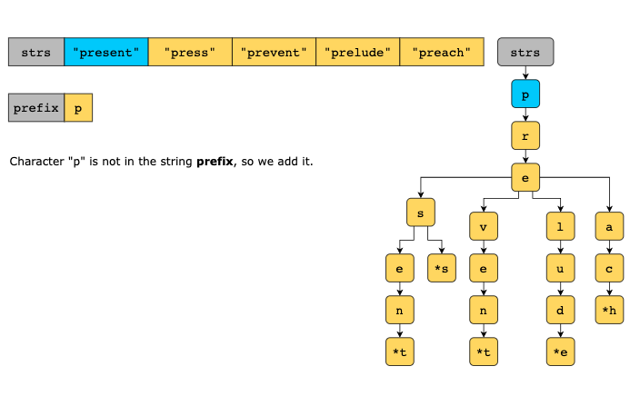
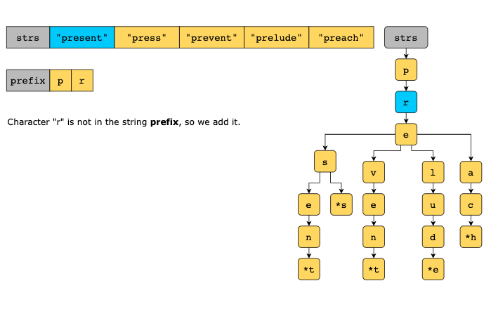
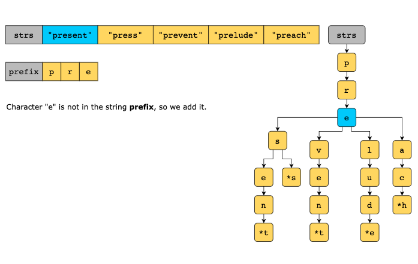
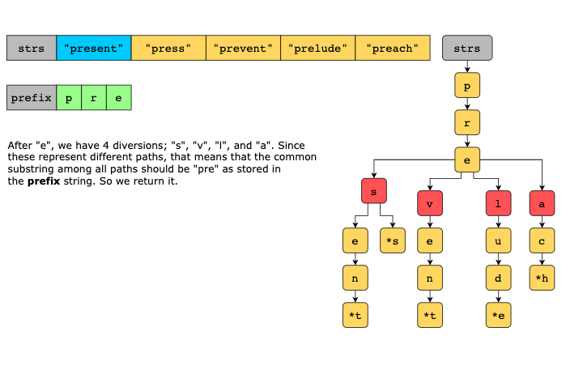

### Time Complexity

The time complexity of the given solution is O(n⋅m), where n is the number of strings and m is the average length of 
the strings.

### Space Complexity

The space complexity of the given solution is O(S), where `S` is the total number of characters in the input array of 
strings.
