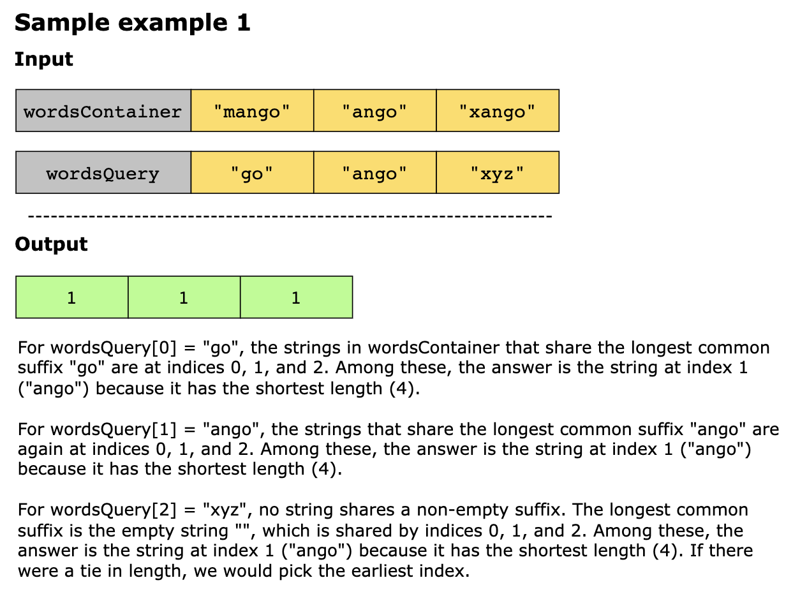
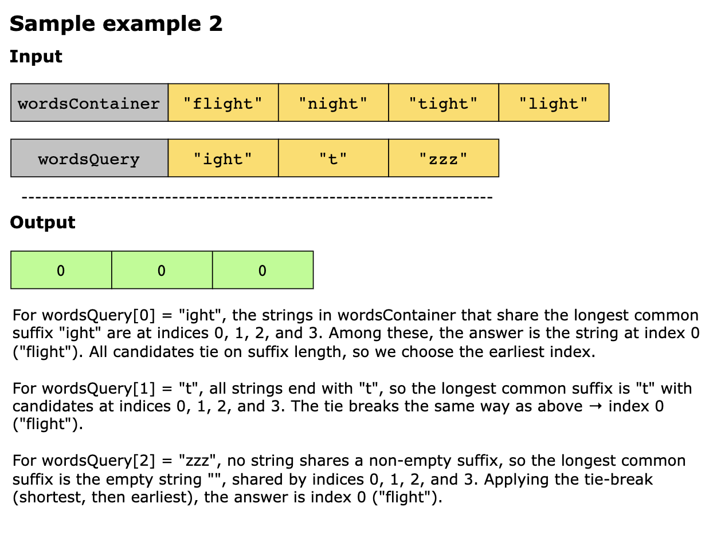
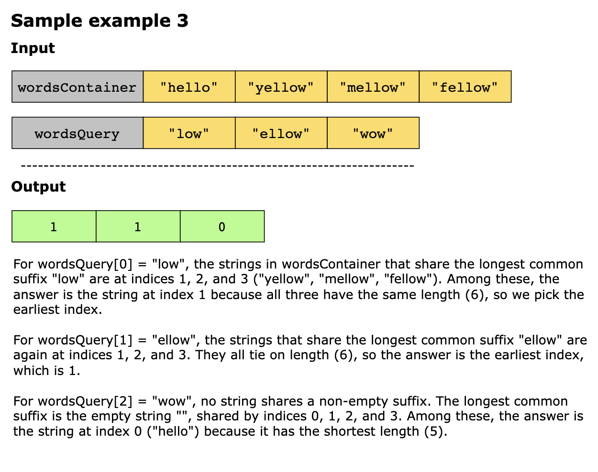
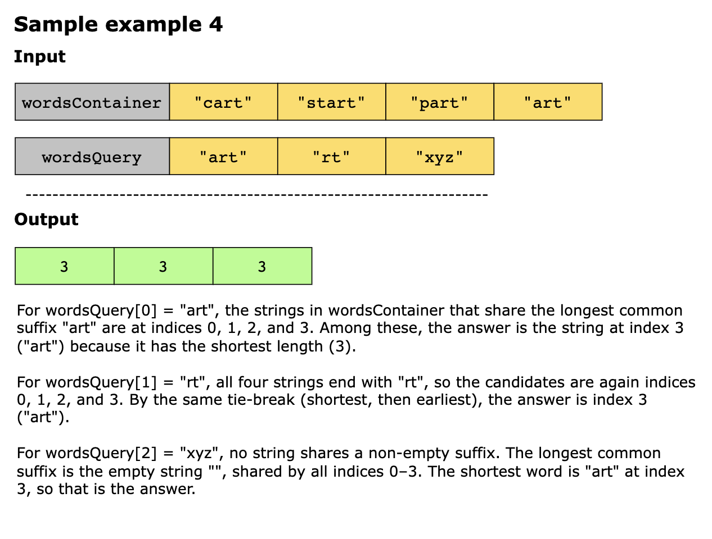
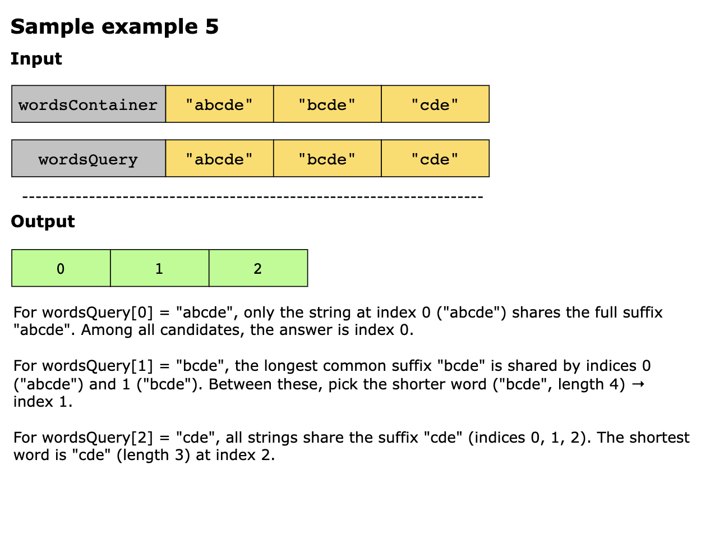

# Longest Common Suffix Queries

You are given two arrays of strings, wordsContainer and wordsQuery.
For each string wordsQuery[i], find the string in wordsContainer that shares the longest common suffix with it.
- If multiple strings in wordsContainer share the same longest suffix, choose the one with the smallest length.
- If two or more such strings have the same smallest length, choose the string that appears earliest in wordsContainer.

Return an array of integers ans, where ans[i] is the index of the chosen string in wordsContainer for the query 
wordsQuery[i].

Constraints

- 1 ≤ wordsContainer.length, wordsQuery.length ≤ 10^4
- 1 ≤ wordsContainer[i].length ≤ 5 * 10 ^ 3
- 1 ≤ wordsQuery[i].length ≤ 5 * 10^3
- wordsContainer[i] consists only of lowercase English letters.
- wordsQuery[i] consists only of lowercase English letters.
- Sum of wordsContainer[i].length is, at most 5 * 10^5
- Sum of wordsQuery[i].length is, at most 5 * 10^5
 
## Examples

