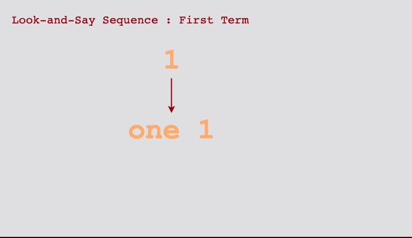
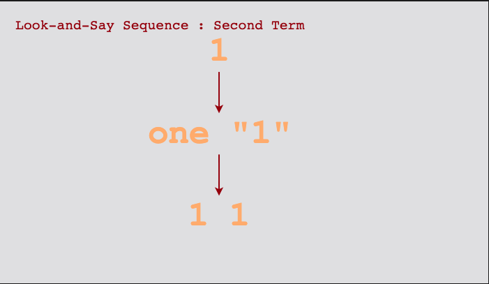
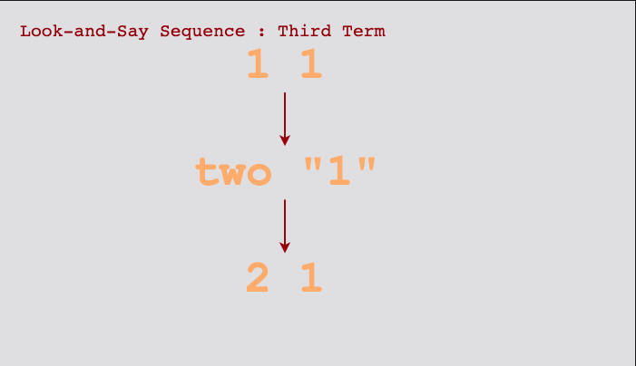
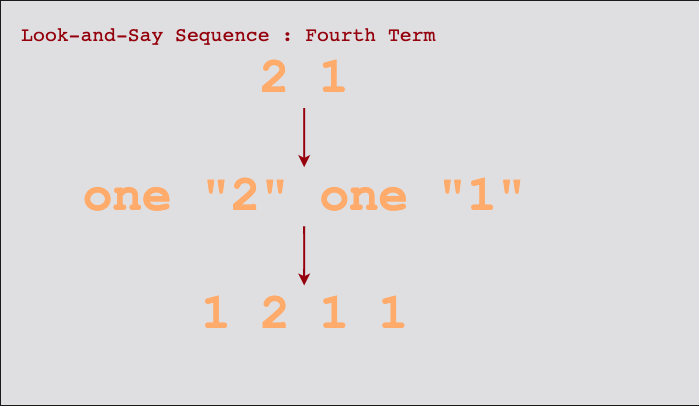
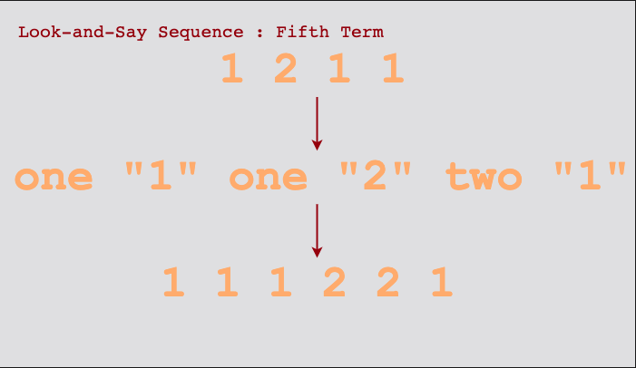

# Look-and-Say Sequence

The first few terms of the sequence are:

```plain
1, 11, 21, 1211, 111221, 312211, 13112221, 1113213211, ...
```

To generate a member of the sequence from the previous member, read off the digits of the previous member and record the
count of the number of digits in groups of the same digit.

For example, 1 is read off as one 1 which implies that the count of 1 is one. As 1 is read off as “one 1”, the next 
sequence will be written as 11 where 1 replaces one. Now 11 is read off as “two 1s” as the count of “1” is two in this term. Hence, the next term in the sequence becomes 21.

Look at the below images to see how we generate this sequence up to the fifth term:







Now, you can easily guess the sixth term. There you go:

```plain
111221 is read off as "three 1s, two 2s, then one 1" or 312211.
```

