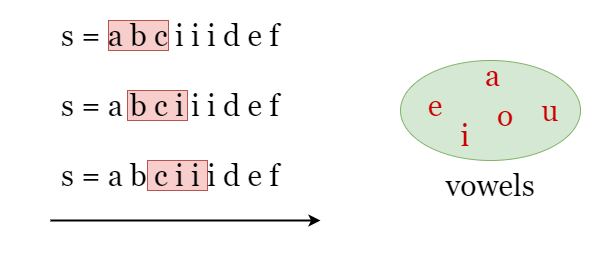
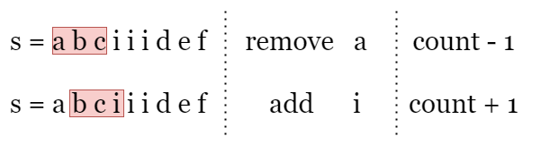

# Maximum Number of Vowels in a Substring of Given Length

Given a string s and an integer k, return the maximum number of vowel letters in any substring of s with length k.

Vowel letters in English are 'a', 'e', 'i', 'o', and 'u'.

```plain

Example 1:

Input: s = "abciiidef", k = 3
Output: 3
Explanation: The substring "iii" contains 3 vowel letters.
Example 2:

Input: s = "aeiou", k = 2
Output: 2
Explanation: Any substring of length 2 contains 2 vowels.
Example 3:

Input: s = "leetcode", k = 3
Output: 2
Explanation: "lee", "eet" and "ode" contain 2 vowels.
```

## Related Topics

- String
- Sliding Window

## Solution

### Approach: Sliding Window

#### Intuition

We can use a sliding window to solve this problem. The term "subarray of length k" in the problem is actually equivalent
to "window of length k". Since the length of the window (substring) is fixed as k, we only need to create a window at
the leftmost side of the string s, and move it one character to the right each time. This way, the window can cover all
subarrays of length k. Then, we simply count the number of vowels in each window and record the maximum count according
to the requirement. As shown in the picture below, the window of length 3 is represented by the red box.



The problem is that if we count the number of vowels in each window by iteration every time, it would result in a time
complexity of _O(length_of_s⋅k)_ which could be expensive. However, by
observation, we can see that two adjacent windows only differ by two characters. When we move the index of the right
boundary of the window from i - 1 to i, only one character is added to the window while one is removed, Therefore, we
can represent the new window by keeping track of the changes between adjacent windows

> Let `count` be the number of vowels in the current window [i - k, i - 1]. If we move the window one character to the
> right as [i - k + 1, i]:
> - If the newly added character s[i] is a vowel, we increase count by 1.
> - If the newly removed character s[i - k] is a vowel, we reduce count by 1.



That's it. While moving the window, we keep track of the changes between adjacent windows and count the number of vowels
count in the current window as shown above, and update answer as the maximum count we have encountered.

#### Complexity Analysis

Let `n` be the length of the input string `s`.

- Time complexity: `O(n)`
    - We apply 1 iteration over s.
    - At each step in the iteration, we check if the newly added character and the removed character are in vowels,
      which
      takes constant time.
    - To sum up, the time complexity is O(n).

- Space complexity: `O(1)`
    - We need to record several parameters, count and answer, which takes (1) space.
    - The set vowels contains 5 vowel letters which takes O(1) space.
