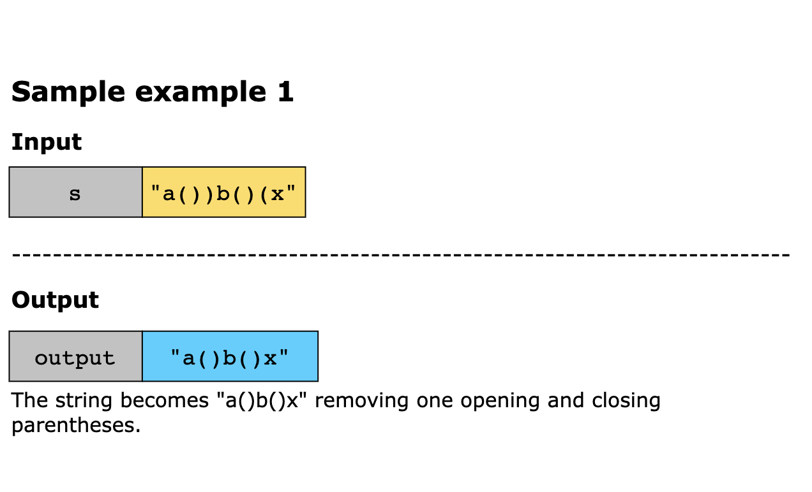
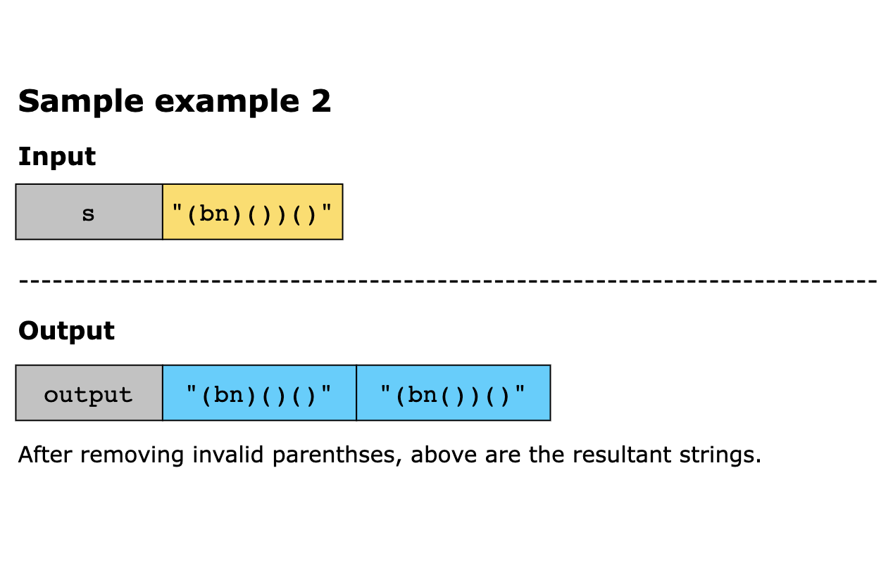
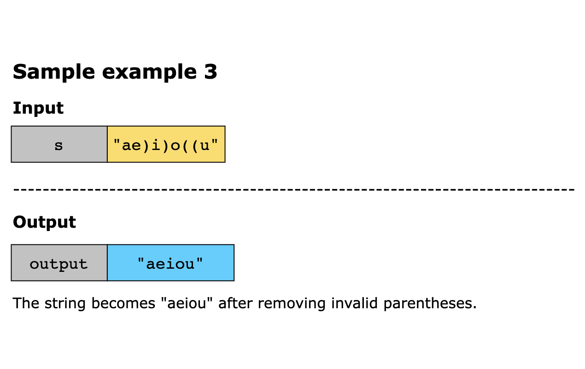
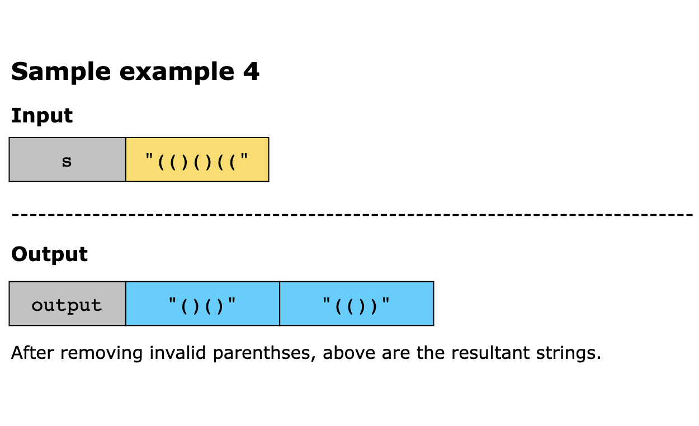

# Remove Invalid Parentheses

You are given a string, `s`, that contains:
- Lowercase English letters
- Opening '(' and closing ')' parentheses

A string is considered valid if:

1. All opening parentheses '(' are closed properly by a matching ')'.
2. The parentheses are in the correct order and nesting. 
3. Letters can appear anywhere and do not affect validity.

Return all possible valid strings that can be formed by removing the minimum number of invalid parentheses. The answer 
must be a list of unique strings, in any order.

**Constraints**

- 1 ≤ `s.length` ≤ 25
- `s` consists of lowercase English letters and parentheses `'('` and `')'`. 
- There will be at most `20` parentheses in `s`.

## Examples

## Solution

The algorithm aims to generate all possible valid strings by removing the minimum number of invalid parentheses. It 
starts with a preprocessing step to determine how many opening and closing parentheses need to be removed. As it scans 
the string, it increments a counter for each opening parenthesis. For each closing parenthesis, it tries to match it 
with an opening one. If no match is found, it marks the closing parenthesis as unmatched. This ensures the algorithm 
knows the minimum number of each type of parenthesis to remove.

Once the number of invalid parentheses is known, the algorithm uses recursive backtracking to explore all valid 
combinations. It processes the string one character at a time and considers several choices:

- If the character is an opening parenthesis (, the algorithm considers two choices: skip it to reduce the number of 
  unmatched openings, or add it to the expression and increase the open count.

- If it’s a closing parenthesis ), it can be skipped to reduce unmatched closings, or added to the expression—but only 
  if more opening parentheses are already added, to keep the expression balanced.

- If it’s a non-parenthesis character, it is always added to the current expression.

The recursion continues until the end of the string is reached. At that point, if the number of opening and closing 
parentheses is equal (i.e., the expression is balanced) and no more removals are needed, the expression is added to a 
result set to ensure uniqueness. After exploring all possibilities, the algorithm returns all unique valid expressions 
as a list.

The steps of the algorithm are as follows:

1. Count the minimum invalid parentheses to remove:
   - Initialize two counters, `left_to_remove` (Number of extra '(' to remove) and `right_to_remove` (Number of extra 
     `')'` to remove).
   - Iterate through the string:
     - If the character is `'('`, increment `left_to_remove`.
     - If the character is `')'`:
       - If `left_to_remove` > 0, a matching '(' exists, so decrement `left_to_remove`.
       - Else, increment `right_to_remove` (unmatched right parenthesis).

2. We define a recursive helper function, `backtrack(index, open_count, close_count, path, left_remain, right_remain)` 
   to explore all valid combinations of the input string. index is the current position in the string. `open_count` and 
   `close_count` track the number of '(' and ')' in the current path to maintain balance. path holds the built string 
so far. `left_remain` and `right_remain` indicate how many `'('` and `')'` can still be removed to form a valid expression.

   - When the end of the string is reached (i.e., `index == len(s)`), check if no removals remain (`left_remain == 0` and 
   `right_remain == 0`) and the parentheses are balanced (`open_count == close_count`). If so, add the current path to 
     the result set.
   - Recursive case: At each character `char = s[index]`:
     - If `char == '('`:
       - Option to remove it (if `left_remain > 0`):
         - Recurse without adding '(', decrementing `left_remain`.
       - Option to keep it:
         - Recurse adding `'('` to path, incrementing `open_count`.
     - If `char == ')'`:
       - Option to remove it (if `right_remain > 0`):
         - Recurse without adding `')'`, decrementing `right_remain`. 
       - Option to keep it:
         - Only if `close_count < open_count` (to ensure balance). 
         - Recurse adding `')'`, incrementing `close_count`.

     - If char is not a parenthesis:
       - Always keep it and recurse with the character added to `path`.

3. Call `backtrack(0, 0, 0, '', left_to_remove, right_to_remove)` to begin from index 0 and an empty path.
4. Convert the result set `result` to a list and return it.

### Time Complexity

At each step of the algorithm, a parenthesis can either be removed or kept, which results in two choices per parenthesis. 
Therefore, for a string with `n` parentheses, the total number of combinations explored by the backtracking algorithm 
can grow exponentially, leading to a branching factor of `O(2^n)`. Since letters are always included without affecting 
the decision tree, they do not contribute to the branching complexity. As a result, the overall time complexity of the 
algorithm in the worst case is `O(2^n)`.

### Space Complexity

The space complexity of the above solution is `O(n)`, where `n` is the length of the input string because the recursive 
call stack in the backtracking algorithm can reach a depth of `n`.
