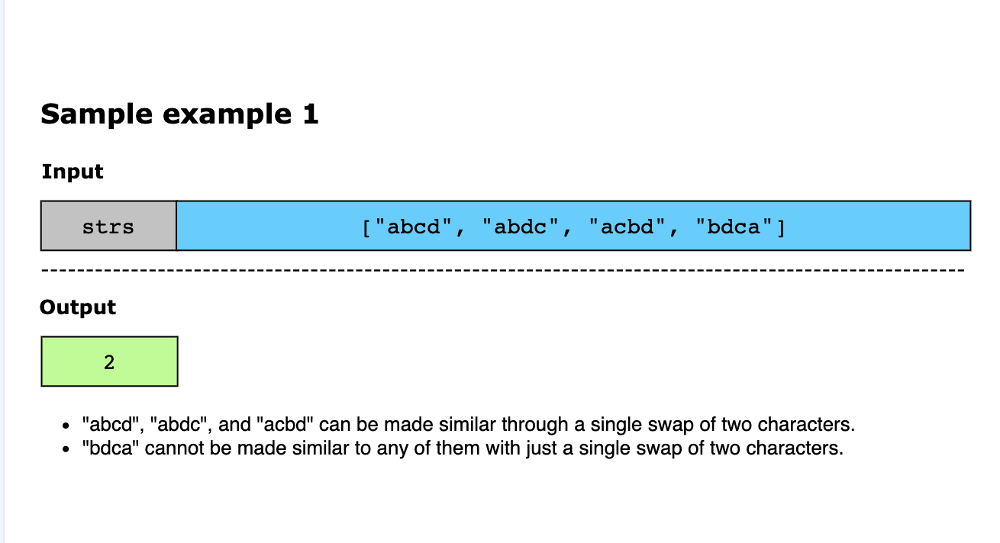
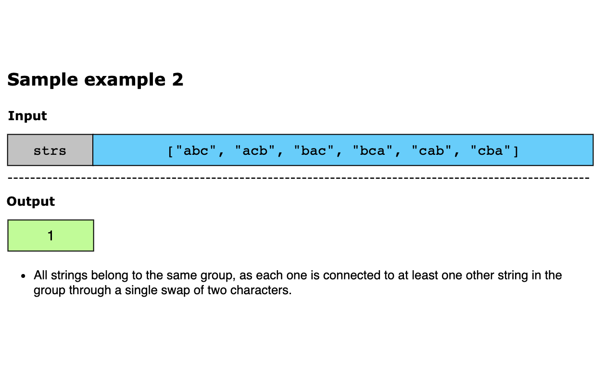
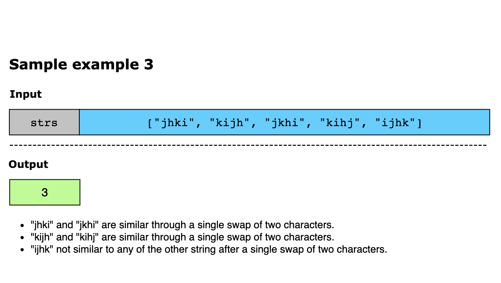
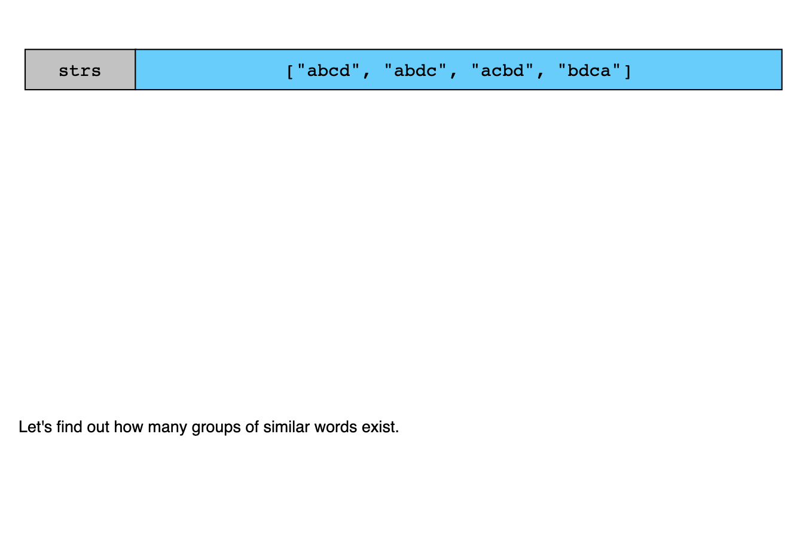
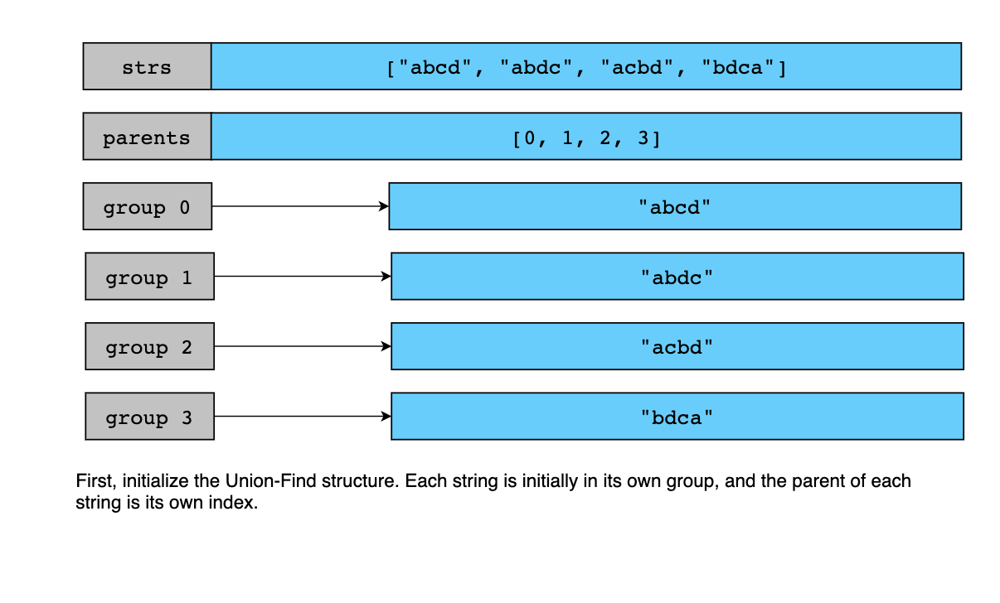
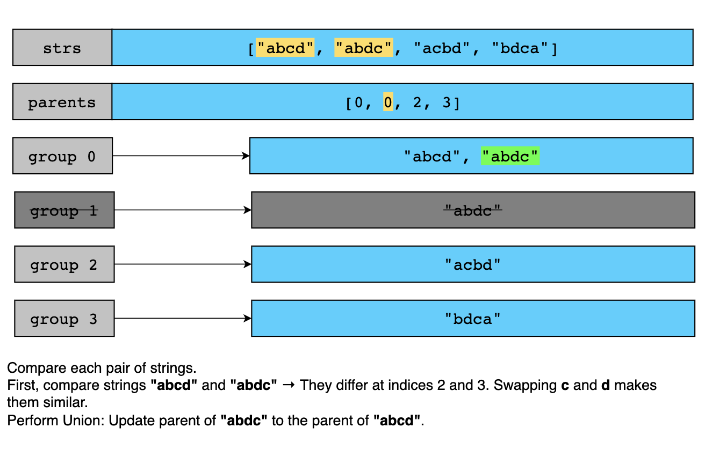
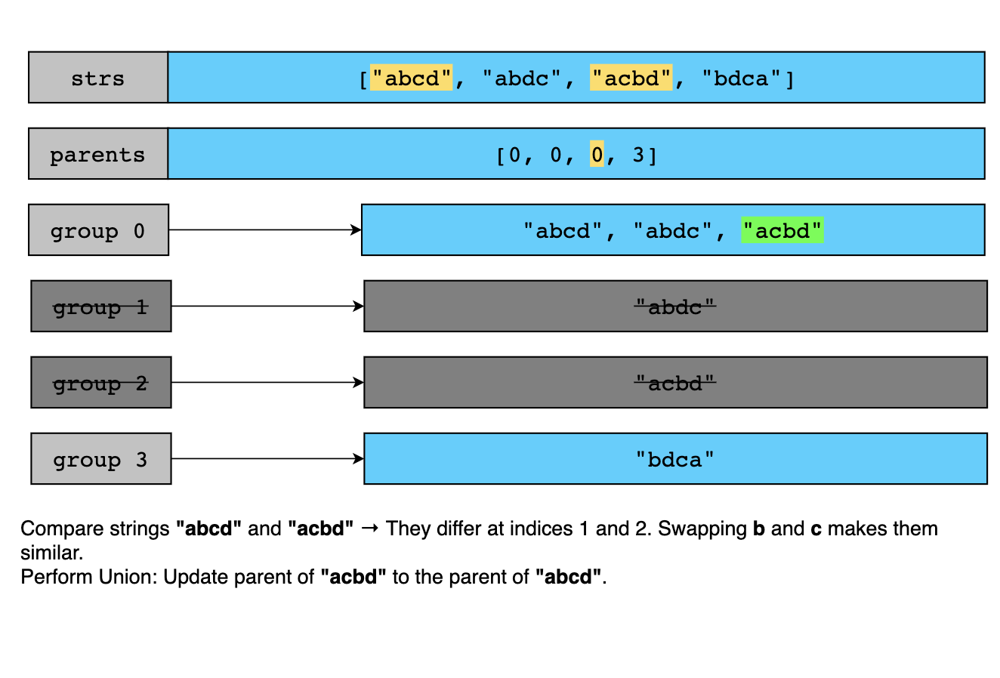
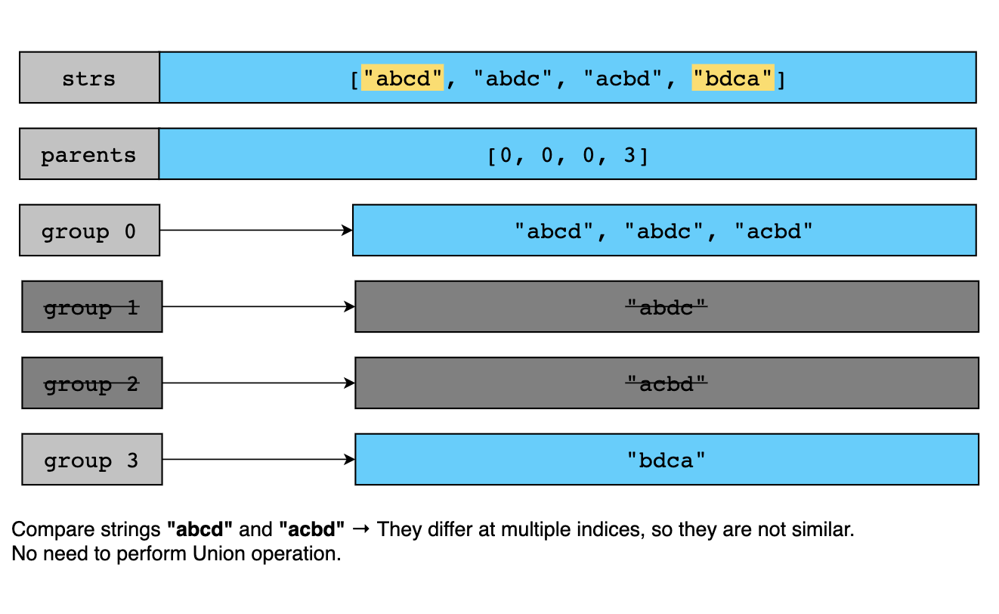
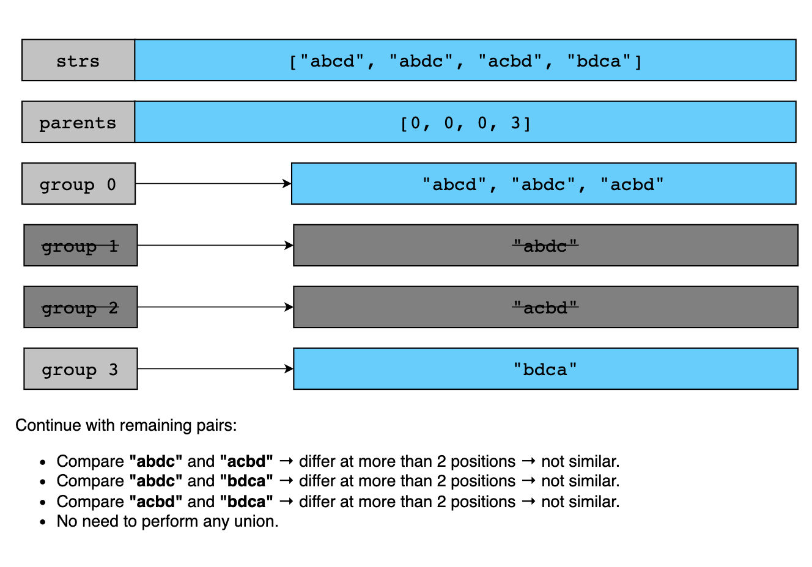
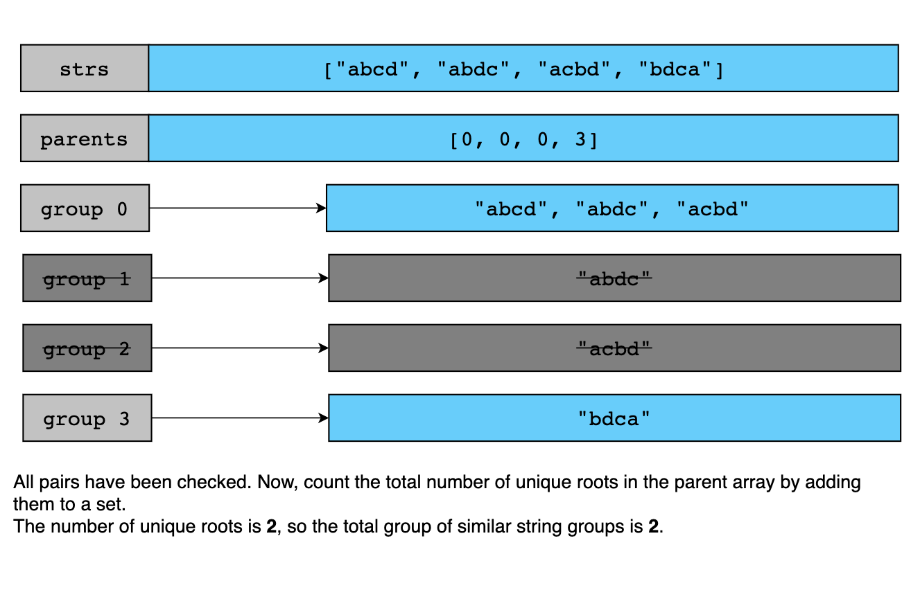

# Similar String Groups

Two strings x and y are considered similar if they are either exactly the same or can be made identical by swapping at 
most two different characters in string x.

We define a similarity group as a set of strings where each string is similar to at least one other string in the group. 
A string doesn't need to be directly similar to every other string in the group — it just needs to be connected to them 
through a chain of similarities.

Given a list of strings strs, where each string is an anagram of the others, your task is to determine how many such 
similarity groups exist in the list.

Constraints:

- 1 ≤  strs.length ≤ 300
- 1 ≤ strs[i].length ≤ 300
- strs[i] consists of lowercase letters only.
- All words in strs have the same length and are anagrams of each other.

---

## Examples

---

## Solution

This problem can be seen as a graph connectivity challenge. Each string is a node, and an edge exists between two nodes 
if their corresponding strings are similar. Our goal is to count how many connected groups (components) exist in this 
graph.

We solve this problem using the Union-Find (Disjoint Set Union) data structure to efficiently group similar strings. 
Initially, each string is placed in its own group. We then iterate over all possible pairs of strings. For each pair at 
indexes i and j, we check whether the two strings are similar — that is, either exactly the same or differ at exactly 
two positions (meaning one swap can make them equal). If they are similar and currently belong to different groups 
(i.e., their roots in the Union-Find structure are different), we perform a union operation to merge their groups. 
Repeating this across all string pairs gradually reduces the number of distinct groups. Finally, we count the number of 
unique roots in the Union-Find structure, which represents the number of similar string groups.

Here’s the step-by-step explanation of the solution:

1. Initialize n = len(strs).
2. Create a Union-Find (DSU) structure with n elements, where each element is its own parent.
3. Define a function areSimilar(s1, s2) that returns TRUE if both strings s1 and s2 are similar according to the given 
   condition:
   - Initialize an empty list diff = [] to track differences. 
   - Loop through both strings in parallel using zip. 
     - If characters differ at any position, record the mismatch in diff.
     - Early exit if more than 2 differences and return FALSE.
    - After the loop is completed, evaluate the result:
      - len(diff) == 0 means the strings are identical. 
      - len(diff) == 2 and diff[0] == diff[1][::-1] means there are exactly two differences and the character pairs are 
        mirror images of each other.

4. Loop over all pairs (i, j) such that 0 ≤ i < j < n. 
5. For each pair, use the areSimilar function to check if strs[i] and strs[j] are similar. 
6. If similar, use find(i) and find(j) to get their root parents. 
7. If the roots differ, merge them using union(i, j). 
8. After processing all pairs, iterate over all indexes i from 0 to n - 1 and find their root parents using find(i). 
9. Add each root to a set to track unique groups. 
10. Return the size of the set as the number of similarity groups.

Let’s look at the following illustration to get a better understanding of the solution:

### Time Complexity
Let's break the time complexity down into two major components:

#### **Comparing all pairs of strings**

To check if two strings are similar, we compare them character by character, which takes _O(m)_ where m is the length 
of each string. Given there are n strings and we compare all possible pairs of strings, there are O(n²) comparisons. 
Therefore, the total time spent on comparisons is O(n²∗m).

#### **Union-Find operations (find and union)**

For each similar pair, we perform a find and possibly a union operation. With path compression, each operation takes 
O(α(n)) time, where α(n) is nearly constant in practice. Since there are up to O(n²) similar pairs, the total time for 
Union-Find operations is O(n²∗α(n)).

The comparison step dominates the time complexity, as m (the string length) is typically much larger than α(n), which 
grows very slowly. Therefore, the overall time complexity is O(n²∗m).

### Space Complexity

The space complexity of the algorithm comes from the following components:

#### **Union-Find parent array**: 

Requires O(n) space to store the parent of each node (one per string).

#### **Temporary storage in areSimilar() function**: 

Uses O(1) space — a constant-sized list to track the positions where the two strings differ. Since at most 2 differences 
are allowed, space usage remains constant.

#### **Set to store unique groups (roots)**: 

Requires O(n) space in the worst case, when all strings are in separate groups and each has a unique root.

The total space complexity is O(n), as all other components (e.g., temporary storage and sets) do not exceed linear 
space relative to the input size.
